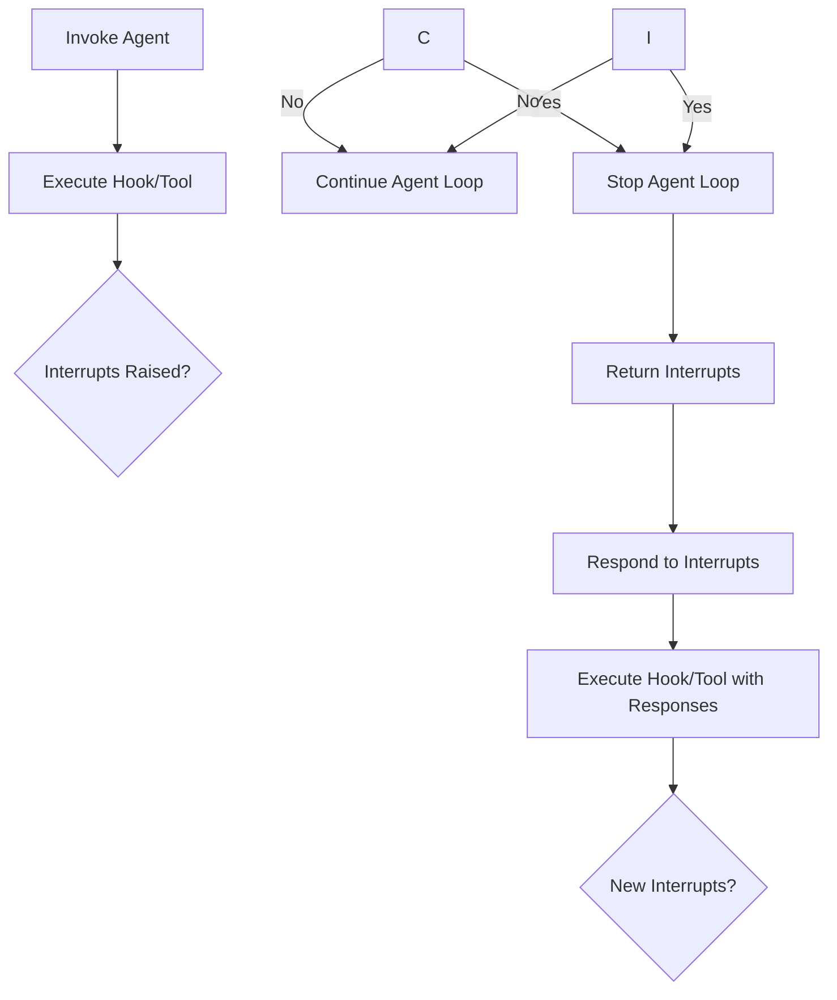

Interrupt related type definitions for human-in-the-loop workflows.

Interrupt Flow:



**Example**:

```Python
from typing import Any

from strands import Agent, tool
from strands.hooks import BeforeToolCallEvent, HookProvider, HookRegistry


@tool
def delete_tool(key: str) -> bool:
    print("DELETE_TOOL | deleting")
    return True


class ToolInterruptHook(HookProvider):
    def register_hooks(self, registry: HookRegistry, **kwargs: Any) -> None:
        registry.add_callback(BeforeToolCallEvent, self.approve)

    def approve(self, event: BeforeToolCallEvent) -> None:
        if event.tool_use["name"] != "delete_tool":
            return

        approval = event.interrupt("for_delete_tool", reason="APPROVAL")
        if approval != "A":
            event.cancel_tool = "approval was not granted"

agent = Agent(
    hooks=[ToolInterruptHook()],
    tools=[delete_tool],
    system_prompt="You delete objects given their keys.",
    callback_handler=None,
)
result = agent(f"delete object with key 'X'")

if result.stop_reason == "interrupt":
    responses = []
    for interrupt in result.interrupts:
        if interrupt.name == "for_delete_tool":
            responses.append(\{"interruptResponse": \{"interruptId": interrupt.id, "response": "A"})

    result = agent(responses)

...
```

Details:

-   User raises interrupt on their hook event by calling `event.interrupt()`.
-   User can raise one interrupt per hook callback.
-   Interrupts stop the agent event loop.
-   Interrupts are returned to the user in AgentResult.
-   User resumes by invoking agent with interrupt responses.
-   Second call to `event.interrupt()` returns user response.
-   Process repeats if user raises additional interrupts.
-   Interrupts are session managed in-between return and user response.

## \_Interruptible

```python
class _Interruptible(Protocol)
```

Defined in: [src/strands/types/interrupt.py:79](https://github.com/strands-agents/sdk-python/blob/main/src/strands/types/interrupt.py#L79)

Interface that adds interrupt support to hook events and tools.

#### interrupt

```python
def interrupt(name: str, reason: Any = None, response: Any = None) -> Any
```

Defined in: [src/strands/types/interrupt.py:82](https://github.com/strands-agents/sdk-python/blob/main/src/strands/types/interrupt.py#L82)

Trigger the interrupt with a reason.

Args: name: User defined name for the interrupt. Must be unique across hook callbacks. reason: User provided reason for the interrupt. response: Preemptive response from user if available.

**Returns**:

The response from a human user when resuming from an interrupt state.

**Raises**:

-   `InterruptException` - If human input is required.
-   `RuntimeError` - If agent instance attribute not set.

## InterruptResponse

```python
class InterruptResponse(TypedDict)
```

Defined in: [src/strands/types/interrupt.py:126](https://github.com/strands-agents/sdk-python/blob/main/src/strands/types/interrupt.py#L126)

User response to an interrupt.

**Attributes**:

-   `interruptId` - Unique identifier for the interrupt.
-   `response` - User response to the interrupt.

## InterruptResponseContent

```python
class InterruptResponseContent(TypedDict)
```

Defined in: [src/strands/types/interrupt.py:138](https://github.com/strands-agents/sdk-python/blob/main/src/strands/types/interrupt.py#L138)

Content block containing a user response to an interrupt.

**Attributes**:

-   `interruptResponse` - User response to an interrupt event.