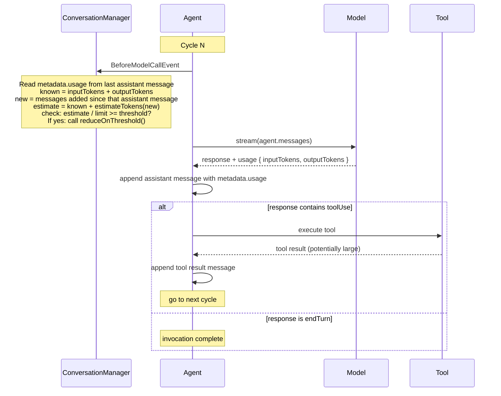

# Proactive Context Compression

**Status**: Proposed

**Date**: 2026-04-08

**Issue**: [#555: Proactive Context Compression](https://github.com/strands-agents/sdk-python/issues/555)

**Dependencies**:
- [#1295: Context Limit Property on Model](https://github.com/strands-agents/sdk-python/issues/1295) (in progress)
- [#2125: Message metadata for stateful context tracking](https://github.com/strands-agents/sdk-python/pull/2125) (merged)

**Related**:
- [#790: Track agent.messages token size](https://github.com/strands-agents/sdk-typescript/pull/790)
- [#2031: Token estimation via tiktoken](https://github.com/strands-agents/sdk-python/pull/2031)

**Scope**: TypeScript SDK. A parallel Python design will follow.

## Context

Context compression in Strands is entirely reactive. The `ConversationManager` base class hooks into `AfterModelCallEvent` and only calls `reduce()` after a `ContextWindowOverflowError` has already occurred:

```typescript
// conversation-manager.ts (current behavior)
initAgent(agent: LocalAgent): void {
  agent.addHook(AfterModelCallEvent, async (event) => {
    if (event.error instanceof ContextWindowOverflowError) {
      if (await this.reduce({ agent: event.agent, model: event.model, error: event.error })) {
        event.retry = true
      }
    }
  })
}
```

The agent operates at maximum context capacity until the model rejects the request. Three problems follow.

1. **Output token starvation.** Model context windows are shared between input and output tokens. When input tokens approach the limit, the model has insufficient capacity to generate meaningful responses, even if it does not throw an overflow error.

2. **Wasted round-trips.** The overflow-retry pattern sends a full request that the model rejects, then reduces context, then retries. The rejected request wastes latency and cost.

3. **No proactive path.** `SlidingWindowConversationManager` trims after each invocation via `AfterInvocationEvent`, but this is window-size-based, not token-aware. No mechanism exists to trigger compression based on actual input token counts relative to the model's context limit.

This design proposes proactive context compression: triggering context reduction before the model call when input token usage exceeds a configurable threshold.

### Terminology

- **`inputTokens`**: the number of input tokens reported by the model provider after a model call. This includes all messages, system prompt, and tool definitions sent in that request. It does not include output tokens generated by the model.
- **`outputTokens`**: the number of tokens the model generated in its response. These tokens become part of the next call's input when the assistant message is appended to `agent.messages`.
- **`contextWindowLimit`**: the maximum token capacity for a model, shared between input and output. Configured by the user or looked up from a per-provider table.
- **threshold check**: comparing estimated next-call input tokens against `contextWindowLimit`. The default threshold (0.7) implicitly reserves headroom for the model to generate output.

## Decision

We add proactive compression to the `ConversationManager` base class. When a `threshold` is configured, the base class registers a `BeforeModelCallEvent` hook that runs the token counting strategy and calls a new `reduceOnThreshold()` method on the subclass. Each built-in manager implements `reduceOnThreshold()` with its own strategy.

```typescript
// Usage
new SlidingWindowConversationManager({ windowSize: 50, threshold: 0.7 })
new SummarizingConversationManager({ threshold: 0.7 })
```

The base class handles the threshold check. Subclasses only need to implement `reduceOnThreshold()` to opt in:

```typescript
// conversation-manager.ts (base class addition)
abstract class ConversationManager {
  /**
   * Called when estimated input tokens exceed the configured threshold.
   * Subclasses implement this to proactively reduce context before the
   * model call. Return true if context was reduced.
   */
  reduceOnThreshold?(options: { agent: LocalAgent; model: Model }): boolean | Promise<boolean>
}
```

Because `BeforeModelCallEvent` fires before every model call, including calls within a tool-use cycle, this naturally provides in-loop context management ([#298](https://github.com/strands-agents/sdk-python/issues/298)). If an agent makes five tool calls in a single invocation and context grows past the threshold between calls three and four, the base class triggers `reduceOnThreshold()` before call four.

The following diagram shows the cycle of the agent loop and where each token signal becomes available:



After the model call, the framework attaches `usage` (containing `inputTokens` and `outputTokens`) to the assistant message as metadata ([#2125](https://github.com/strands-agents/sdk-python/pull/2125)). This metadata is part of the message itself, so it survives session persistence and restore. At the start of the next cycle, the base class reads it directly from `agent.messages`:

- **Known**: `inputTokens + outputTokens` from the last assistant message's metadata. This is the exact token count for everything the model saw, plus everything it generated (which is now part of the messages).
- **Unknown**: any messages appended after that assistant message, primarily tool results. These need to be estimated.

### Token Counting Strategy

The base class reads `inputTokens` and `outputTokens` from the last assistant message's metadata, then estimates any new messages added after it:

```
lastAssistant = last assistant message in agent.messages
usage         = lastAssistant.metadata.usage

if usage is available:
    knownBaseline = usage.inputTokens + usage.outputTokens
    newMessages   = messages after lastAssistant (tool results, etc.)
    if no new messages:
        tokenCount = knownBaseline
    else:
        tokenCount = knownBaseline + estimateTokens(newMessages)
else:
    // Cold start or no metadata: estimate everything
    tokenCount = estimateTokens(agent.messages)

if tokenCount / contextWindowLimit >= threshold:
    reduceOnThreshold()
```

This approach uses known values wherever possible and only estimates what it does not know. In the common case (no tool results between calls), no estimation runs at all. When tool results are appended, only those new messages are estimated, not the entire history.

Because message metadata survives session persistence ([#2125](https://github.com/strands-agents/sdk-python/pull/2125)), the known baseline is available even after session restore. The cold-start fallback (estimating everything) only applies when no assistant message with metadata exists in the history.

### SDK Changes Required

This feature requires changes to the `ConversationManager` base class and the two built-in managers.

**Context window limit on Model ([#1295](https://github.com/strands-agents/sdk-python/issues/1295)).** The threshold check needs to know the model's context window size. [#1295](https://github.com/strands-agents/sdk-python/issues/1295) adds an optional `contextWindowLimit` to `BaseModelConfig` with per-provider lookup tables. Users can always override:

```typescript
const model = new BedrockModel({
  modelId: 'anthropic.claude-sonnet-4-20250514',
  contextWindowLimit: 200_000,
})
```

**Message metadata ([#2125](https://github.com/strands-agents/sdk-python/pull/2125), [#815](https://github.com/strands-agents/sdk-typescript/pull/815)).** The token counting strategy reads `inputTokens` and `outputTokens` from the last assistant message's metadata. This is merged in both the Python SDK ([#2125](https://github.com/strands-agents/sdk-python/pull/2125)) and the TypeScript SDK ([#815](https://github.com/strands-agents/sdk-typescript/pull/815)).

**Token estimation.** The `Model` base class exposes an `estimateTokens(messages: Message[])` method. Each model provider should implement this using its native token counting API (for example, Anthropic's `count_tokens()` or OpenAI's `tiktoken`). All TypeScript SDK providers have access to native counting APIs, so provider-level implementations are the expected default. The base class provides a heuristic fallback (`chars / 4` for text, `chars / 2` for JSON) for providers that do not implement native counting. Users can also pass a custom estimator via the `tokenEstimator` config option to override any provider's implementation:

```typescript
const model = new BedrockModel({
  modelId: 'anthropic.claude-sonnet-4-20250514',
  tokenEstimator: (messages) => myCustomCount(messages),
})
```

**`ConversationManager` base class.** Add optional `threshold` to the base config. When set, the base class registers a `BeforeModelCallEvent` hook that runs the token counting strategy and calls `reduceOnThreshold()` if the subclass implements it. The existing `reduce()` method and its `error`-required contract are unchanged.

**Built-in managers.** `SlidingWindowConversationManager` and `SummarizingConversationManager` each implement `reduceOnThreshold()` using their existing reduction logic. Custom managers that do not implement `reduceOnThreshold()` are unaffected.

## Developer Experience

Proactive compression is enabled by passing `threshold` to any built-in conversation manager:

```typescript
import { Agent, SummarizingConversationManager } from '@strands-agents/sdk'

const agent = new Agent({
  model: new BedrockModel({
    modelId: 'anthropic.claude-sonnet-4-20250514',
    contextWindowLimit: 200_000,
  }),
  conversationManager: new SummarizingConversationManager({ threshold: 0.7 }),
})
```

It works the same way with `SlidingWindowConversationManager`:

```typescript
const agent = new Agent({
  model: new BedrockModel({
    modelId: 'anthropic.claude-sonnet-4-20250514',
    contextWindowLimit: 200_000,
  }),
  conversationManager: new SlidingWindowConversationManager({ windowSize: 50, threshold: 0.7 }),
})
```

Existing behavior is completely unchanged. Conversation managers without `threshold` continue to use reactive overflow recovery only:

```typescript
const agent = new Agent({
  conversationManager: new SlidingWindowConversationManager(),
})
```

## Alternatives Considered

### 1. Plugin Instead of ConversationManager

We considered implementing proactive compression as a standalone `Plugin`. A plugin would offer cleaner separation of concerns ("when to compress" in the plugin, "how to compress" in the conversation manager) and align with the Plugin architecture direction in [0001-plugins](./0001-plugins.md).

However, `ConversationManager` is the established primitive for context management. Users looking for context overflow solutions will look at conversation managers, not plugins. A plugin would also require exposing `conversationManager` on the `LocalAgent` interface so it could call `reduce()`, adding public API surface for an internal concern.

### 2. Token Estimation via Tokenizer Only

We considered using a tokenizer library as the only estimation method. However, the estimation only applies to new messages added since the last model call (the delta). The known baseline from `inputTokens + outputTokens` handles the bulk of the count. Provider-native APIs are the preferred estimation method in TypeScript since all providers have access to counting APIs. The heuristic fallback (`chars / 4` for text, `chars / 2` for JSON) exists for providers that do not implement native counting and for the `tokenEstimator` escape hatch. Users who need different behavior can override via `tokenEstimator`.

## Consequences

### What Becomes Easier

Long-running agents no longer overflow unexpectedly. Context is compressed proactively before the model rejects a request, eliminating wasted round-trips and output token starvation. The `BeforeModelCallEvent` hook fires within the agent loop, so tool-heavy workflows with many calls per invocation get in-loop compression automatically. Users enable this with a single `threshold` config on their existing conversation manager. Because the base class reads token counts from message metadata rather than internal state, it works correctly after session restore with no special handling.

### What Becomes Harder or Requires Attention

Users must set `contextWindowLimit` on their model config until we ship per-provider default lookup tables. Custom `ConversationManager` implementations must implement `reduceOnThreshold()` to opt into proactive compression. Those that do not implement it are unaffected but will not benefit from the feature.

### Migration

No breaking changes.

## Willingness to Implement

Yes.
