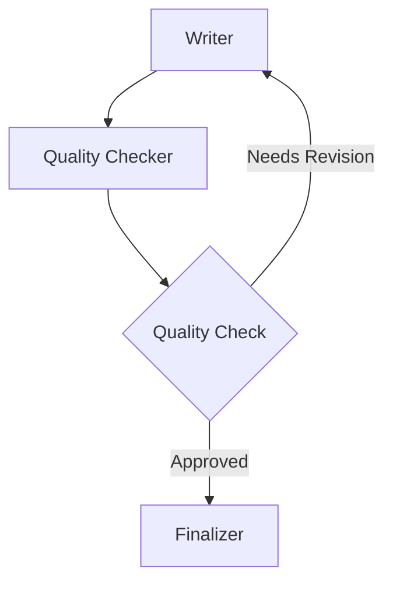

# 🔄 Graph with Loops - Multi-Agent Feedback Cycles

This [example](https://github.com/strands-agents/docs/blob/main/docs/examples/python/graph_loops_example.py) demonstrates how to create multi-agent graphs with feedback loops using the Strands Agents SDK. It showcases a write-review-improve cycle where content iterates through multiple agents until quality standards are met.

## Overview

| Feature            | Description                                |
| ------------------ | ------------------------------------------ |
| **Framework**      | Multi-Agent Graph with Loops              |
| **Complexity**     | Advanced                                   |
| **Agent Types**    | Multiple Agents + Custom Node              |
| **Interaction**    | Interactive Command Line                   |
| **Key Focus**      | Feedback Loops & Conditional Execution    |

## Usage Examples

Basic usage:
```
python graph_loops_example.py
```

Import in your code:
```python
from examples.python.graph_loops_example import create_content_loop

# Create and run a content improvement loop
graph = create_content_loop()
result = graph("Write a haiku about programming")
print(result)
```

## Graph Structure

The example creates a feedback loop:



The checker requires multiple iterations before approving content, demonstrating how conditional loops work in practice.

## Core Components

### 1. **Writer Agent** - Content Creation
Creates or improves content based on the task and any feedback from previous iterations.

### 2. **Quality Checker** - Custom Deterministic Node
A custom node that evaluates content quality without using LLMs. Demonstrates how to create deterministic business logic nodes.

### 3. **Finalizer Agent** - Content Polish
Takes approved content and adds final polish in a professional format.

## Loop Implementation

### Conditional Logic

The graph uses conditional functions to control the feedback loop:

```python
def needs_revision(state):
    # Check if content needs more work
    checker_result = state.results.get("checker")
    # Navigate nested results to get approval state
    return not approved_status

def is_approved(state):
    # Check if content is ready for finalization
    return approved_status
```

### Safety Mechanisms

```python
builder.set_max_node_executions(10)  # Prevent infinite loops
builder.set_execution_timeout(60)    # Maximum execution time
builder.reset_on_revisit(True)       # Reset state on loop back
```

### Custom Node

The `QualityChecker` shows how to create deterministic nodes:

```python
class QualityChecker(MultiAgentBase):
    async def invoke_async(self, task, invocation_state, **kwargs):
        self.iteration += 1
        approved = self.iteration >= self.approval_after
        
        # Return result with state for conditions
        return MultiAgentResult(...)
```

## Sample Execution

**Task**: "Write a haiku about programming loops"

**Execution Flow**:
```
writer -> checker -> writer -> checker -> finalizer
```

**Loop Statistics**:
- writer node executed 2 times (looped 1 time)
- checker node executed 2 times (looped 1 time)

**Final Output**:
```
# Programming Loops: A Haiku

Code circles around,
While conditions guide the path—
Logic finds its way.
```

## Interactive Usage

The example provides an interactive command-line interface:

```
🔄 Graph with Loops Example

Options:
  'demo' - Run demo with haiku task
  'exit' - Exit the program

Or enter any content creation task:
  'Write a short story about AI'
  'Create a product description for a smart watch'

> demo
Running demo task: Write a haiku about programming loops

Execution path: writer -> checker -> writer -> checker -> finalizer
Loops detected: writer (2x), checker (2x)

✨ Final Result:
# Programming Loops: A Haiku

Code circles around,
While conditions guide the path—
Logic finds its way.
```

## Real-World Applications

This feedback loop pattern is useful for:

1. **Content Workflows**: Draft → Review → Revise → Approve
2. **Code Review**: Code → Test → Fix → Merge  
3. **Quality Control**: Produce → Inspect → Fix → Re-inspect
4. **Iterative Optimization**: Measure → Analyze → Optimize → Validate

## Extending the Example

Ways to enhance this example:

1. **Multi-Criteria Checking**: Add multiple quality dimensions (grammar, style, accuracy)
2. **Parallel Paths**: Create concurrent review processes for different aspects
3. **Human-in-the-Loop**: Integrate manual approval steps
4. **Dynamic Thresholds**: Adjust quality standards based on context
5. **Performance Metrics**: Add detailed timing and quality tracking
6. **Visual Monitoring**: Create real-time loop execution visualization

This example demonstrates how to build sophisticated multi-agent workflows with feedback loops, combining AI agents with deterministic business logic for robust, iterative processes.