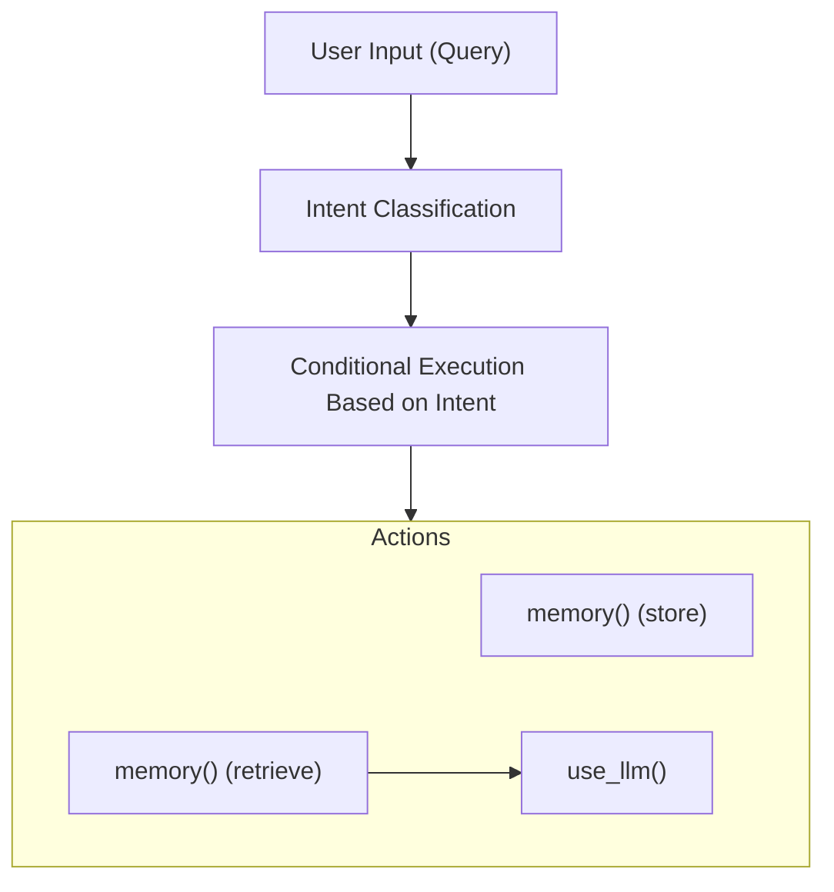

# Knowledge Base Agent - Intelligent Information Storage and Retrieval

This [example](https://github.com/strands-agents/docs/blob/main/docs/examples/python/knowledge_base_agent.py) demonstrates how to create a Strands agent that determines whether to store information to a knowledge base or retrieve information from it based on the user's query. It showcases a code-defined decision-making workflow that routes user inputs to the appropriate action.

## Setup Requirements

> **Important**: This example requires a knowledge base to be set up. You must initialize the knowledge base ID using the `STRANDS_KNOWLEDGE_BASE_ID` environment variable:
>
> ```bash
> export STRANDS_KNOWLEDGE_BASE_ID=your_kb_id
> ```
>
> This example was tested using a Bedrock knowledge base. If you experience odd behavior or missing data, verify that you've properly initialized this environment variable.

## Overview

| Feature            | Description                            |
| ------------------ | -------------------------------------- |
| **Tools Used**     | use_llm, memory                        |
| **Complexity**     | Beginner                               |
| **Agent Type**     | Single Agent with Decision Workflow    |
| **Interaction**    | Command Line Interface                 |
| **Key Focus**      | Knowledge Base Operations              |

## Tool Overview

The knowledge base agent utilizes two primary tools:

1. **memory**: Enables storing and retrieving information from a knowledge base with capabilities for:

    - Storing text content with automatic indexing
    - Retrieving information based on semantic similarity
    - Setting relevance thresholds and result limits

2. **use_llm**: Provides language model capabilities for:

    - Determining whether a user query is asking to store or retrieve information
    - Generating natural language responses based on retrieved information

## Code-Defined Agentic Workflow

This example demonstrates a workflow where the agent's behavior is explicitly defined in code rather than relying on the agent to determine which tools to use. This approach provides several advantages:



### Key Workflow Components

1. **Intent Classification Layer**
   
   The workflow begins with a dedicated classification step that uses the language model to determine user intent:

   ```python
   def determine_action(agent, query):
       """Determine if the query is a store or retrieve action."""
       result = agent.tool.use_llm(
           prompt=f"Query: {query}",
           system_prompt=ACTION_SYSTEM_PROMPT
       )
       
       # Clean and extract the action
       action_text = str(result).lower().strip()
       
       # Default to retrieve if response isn't clear
       if "store" in action_text:
           return "store"
       else:
           return "retrieve"
   ```

   This classification is performed with a specialized system prompt that focuses solely on distinguishing between storage and retrieval intents, making the classification more deterministic.

2. **Conditional Execution Paths**

   Based on the classification result, the workflow follows one of two distinct execution paths:

   ```python
   if action == "store":
       # Store path
       agent.tool.memory(action="store", content=query)
       print("\nI've stored this information.")
   else:
       # Retrieve path
       result = agent.tool.memory(action="retrieve", query=query, min_score=0.4, max_results=9)
       # Generate response from retrieved information
       answer = agent.tool.use_llm(prompt=f"User question: \"{query}\"\n\nInformation from knowledge base:\n{result_str}...",
                             system_prompt=ANSWER_SYSTEM_PROMPT)
   ```

3. **Tool Chaining for Retrieval**

   The retrieval path demonstrates tool chaining, where the output from one tool becomes the input to another:

   ```mermaid
   flowchart LR
       A["User Query"] --> B["memory() Retrieval"]
       B --> C["use_llm()"]
       C --> D["Response"]
   ```

   This chaining allows the agent to:

   1. First retrieve relevant information from the knowledge base
   2. Then process that information to generate a natural, conversational response

## Implementation Benefits

### 1. Deterministic Behavior

Explicitly defining the workflow in code ensures deterministic agent behavior rather than probabilistic outcomes. The developer precisely controls which tools are executed and in what sequence, eliminating the non-deterministic variability that occurs when an agent autonomously selects tools based on natural language understanding.

### 2. Optimized Tool Usage

Direct tool calls allow for precise parameter tuning:

```python
# Optimized retrieval parameters
result = agent.tool.memory(
    action="retrieve", 
    query=query,
    min_score=0.4,  # Set minimum relevance threshold
    max_results=9   # Limit number of results
)
```

These parameters can be fine-tuned based on application needs without relying on the agent to discover optimal values.

### 3. Specialized System Prompts

The code-defined workflow enables the use of highly specialized system prompts for each task:

- A focused classification prompt for intent determination
- A separate response generation prompt for creating natural language answers

This specialization improves performance compared to using a single general-purpose prompt.

## Example Interactions

**Interaction 1**: Storing Information

```
> Remember that my birthday is on July 25

Processing...

I've stored this information.
```

**Interaction 2**: Retrieving Information

```
> What day is my birthday?

Processing...

Your birthday is on July 25.
```

## Extending the Example

Here are some ways to extend this knowledge base agent:

1. **Multi-Step Reasoning**: Add capabilities for complex queries requiring multiple retrieval steps
2. **Information Updating**: Implement functionality to update existing information
3. **Multi-Modal Storage**: Add support for storing and retrieving images or other media
4. **Knowledge Organization**: Implement categorization or tagging of stored information
