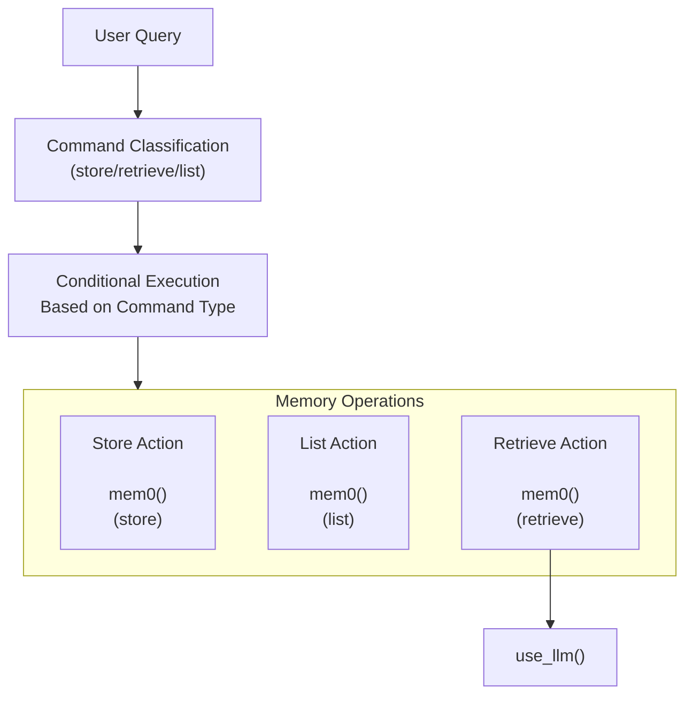
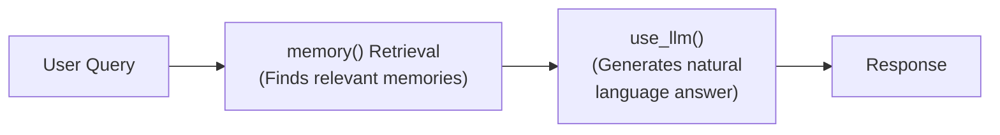

# 🧠 Mem0 Memory Agent - Personalized Context Through Persistent Memory

This [example](https://github.com/strands-agents/docs/blob/main/docs/examples/python/memory_agent.py) demonstrates how to create a Strands agent that leverages [mem0.ai](https://mem0.ai) to maintain context across conversations and provide personalized responses. It showcases how to store, retrieve, and utilize memories to create more intelligent and contextual AI interactions.

## Overview

| Feature            | Description                                |
| ------------------ | ------------------------------------------ |
| **Tools Used**     | mem0_memory, use_llm                       |
| **Complexity**     | Intermediate                               |
| **Agent Type**     | Single agent with Memory Management        |
| **Interaction**    | Command Line Interface                     |
| **Key Focus**      | Memory Operations & Contextual Responses   |

## Tool Overview

The memory agent utilizes two primary tools:

1. **memory**: Enables storing and retrieving information with capabilities for:

    - Storing user-specific information persistently
    - Retrieving memories based on semantic relevance
    - Listing all stored memories for a user
    - Setting relevance thresholds and result limits

2. **use_llm**: Provides language model capabilities for:

    - Generating conversational responses based on retrieved memories
    - Creating natural, contextual answers using memory context

## Memory-Enhanced Response Generation Workflow

This example demonstrates a workflow where memories are used to generate contextually relevant responses:



### Key Workflow Components

1. **Command Classification Layer**

   The workflow begins by classifying the user's input to determine the appropriate memory operation:

   ```python
   def process_input(self, user_input: str) -> str:
       # Check if this is a memory storage request
       if user_input.lower().startswith(("remember ", "note that ", "i want you to know ")):
           content = user_input.split(" ", 1)[1]
           self.store_memory(content)
           return f"I've stored that information in my memory."

       # Check if this is a request to list all memories
       if "show" in user_input.lower() and "memories" in user_input.lower():
           all_memories = self.list_all_memories()
           # ... process and return memories list ...

       # Otherwise, retrieve relevant memories and generate a response
       relevant_memories = self.retrieve_memories(user_input)
       return self.generate_answer_from_memories(user_input, relevant_memories)
   ```

   This classification examines patterns in the user's input to determine whether to store new information, list existing memories, or retrieve relevant memories to answer a question.

2. **Memory Retrieval and Response Generation**

   The workflow's most powerful feature is its ability to retrieve relevant memories and use them to generate contextual responses:

   ```python
   def generate_answer_from_memories(self, query: str, memories: List[Dict[str, Any]]) -> str:
       # Format memories into a string for the LLM
       memories_str = "\n".join([f"- {mem['memory']}" for mem in memories])

       # Create a prompt that includes user context
       prompt = f"""
   User ID: {self.user_id}
   User question: "{query}"

   Relevant memories for user {self.user_id}:
   {memories_str}

   Please generate a helpful response using only the memories related to the question.
   Try to answer to the point.
   """

       # Use the LLM to generate a response based on memories
       response = self.agent.tool.use_llm(
           prompt=prompt,
           system_prompt=ANSWER_SYSTEM_PROMPT
       )

       return str(response['content'][0]['text'])
   ```

   This two-step process:
   1. First retrieves the most semantically relevant memories using the memory tool
   2. Then feeds those memories to an LLM to generate a natural, conversational response

3. **Tool Chaining for Enhanced Responses**

   The retrieval path demonstrates tool chaining, where memory retrieval and LLM response generation work together:



   This chaining allows the agent to:
   1. First retrieve memories that are semantically relevant to the user's query
   2. Then process those memories to generate a natural, conversational response that directly addresses the query

## Implementation Benefits

### 1. Object-Oriented Design

The Memory Agent is implemented as a class, providing encapsulation and clean organization of functionality:

```python
class MemoryAssistant:
    def __init__(self, user_id: str = "demo_user"):
        self.user_id = user_id
        self.agent = Agent(
            system_prompt=MEMORY_SYSTEM_PROMPT,
            tools=[mem0_memory, use_llm],
        )

    def store_memory(self, content: str) -> Dict[str, Any]:
        # Implementation...

    def retrieve_memories(self, query: str, min_score: float = 0.3, max_results: int = 5) -> List[Dict[str, Any]]:
        # Implementation...

    def list_all_memories(self) -> List[Dict[str, Any]]:
        # Implementation...

    def generate_answer_from_memories(self, query: str, memories: List[Dict[str, Any]]) -> str:
        # Implementation...

    def process_input(self, user_input: str) -> str:
        # Implementation...
```

This design provides:
- Clear separation of concerns
- Reusable components
- Easy extensibility
- Clean interface for interacting with memory operations

### 2. Specialized System Prompts

The code uses specialized system prompts for different tasks:

1. **Memory Agent System Prompt**: Focuses on general memory operations
   ```python
   MEMORY_SYSTEM_PROMPT = """You are a memory specialist agent. You help users store, 
   retrieve, and manage memories. You maintain context across conversations by remembering
   important information about users and their preferences...
   ```

2. **Answer Generation System Prompt**: Specialized for generating responses from memories
   ```python
   ANSWER_SYSTEM_PROMPT = """You are an assistant that creates helpful responses based on retrieved memories.
   Use the provided memories to create a natural, conversational response to the user's question...
   ```

This specialization improves performance by focusing each prompt on a specific task rather than using a general-purpose prompt.

### 3. Explicit Memory Structure

The agent initializes with structured memories to demonstrate memory capabilities:

```python
def initialize_demo_memories(self) -> None:
    init_memories = "My name is Alex. I like to travel and stay in Airbnbs rather than hotels. I am planning a trip to Japan next spring. I enjoy hiking and outdoor photography as hobbies. I have a dog named Max. My favorite cuisine is Italian food."
    self.store_memory(init_memories)
```

These memories provide:
- Examples of what can be stored
- Demonstration data for retrieval operations
- A baseline for testing functionality

## Important Requirements

The memory tool requires either a `user_id` or `agent_id` for most operations:

1. **Required for**:
   - Storing new memories
   - Listing all memories
   - Retrieving memories via semantic search

2. **Not required for**:
   - Getting a specific memory by ID
   - Deleting a specific memory
   - Getting memory history

This ensures that memories are properly associated with specific users or agents and maintains data isolation between different users.

## Example Interactions

**Interaction 1**: Storing Information

```
> Remember that I prefer window seats on flights

I've stored that information in my memory.
```

**Interaction 2**: Retrieving Information

```
> What do you know about my travel preferences?

Based on my memory, you prefer to travel and stay in Airbnbs rather than hotels instead of traditional accommodations. You're also planning a trip to Japan next spring. Additionally, you prefer window seats on flights for your travels.
```

**Interaction 3**: Listing All Memories

```
> Show me all my memories

Here's everything I remember:
1. My name is Alex. I like to travel and stay in Airbnbs rather than hotels. I am planning a trip to Japan next spring. I enjoy hiking and outdoor photography as hobbies. I have a dog named Max. My favorite cuisine is Italian food.
2. I prefer window seats on flights
```

## Extending the Example

Here are some ways to extend this memory agent:

1. **Memory Categories**: Implement tagging or categorization of memories for better organization
2. **Memory Prioritization**: Add importance levels to memories to emphasize critical information
3. **Memory Expiration**: Implement time-based relevance for memories that may change over time
4. **Multi-User Support**: Enhance the system to manage memories for multiple users simultaneously
5. **Memory Visualization**: Create a visual interface to browse and manage memories
6. **Proactive Memory Usage**: Have the agent proactively suggest relevant memories in conversations

For more advanced memory management features and detailed documentation, visit [Mem0 documentation](https://docs.mem0.ai).
