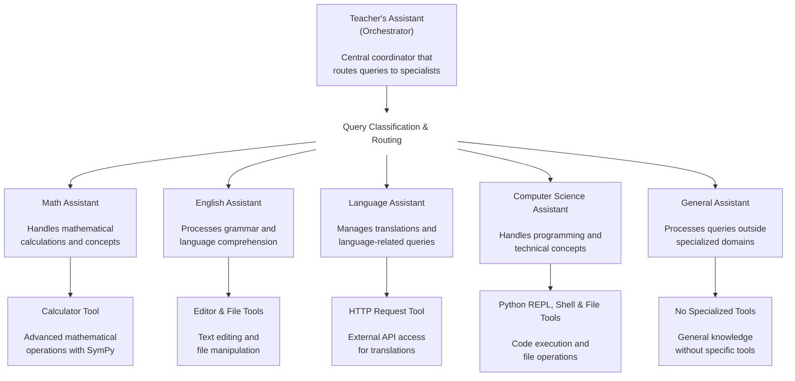

# Teacher's Assistant - Strands Multi-Agent Architecture Example

This [example](https://github.com/strands-agents/docs/blob/main/docs/examples/python/multi_agent_example/teachers_assistant.py) demonstrates how to implement a multi-agent architecture using Strands Agents, where specialized agents work together under the coordination of a central orchestrator. The system uses natural language routing to direct queries to the most appropriate specialized agent based on subject matter expertise.

## Overview

| Feature            | Description                                  |
| ------------------ | -------------------------------------------- |
| **Tools Used**     | calculator, python_repl, shell, http_request, editor, file operations |
| **Agent Structure**| Multi-Agent Architecture                     |
| **Complexity**     | Intermediate                                 |
| **Interaction**    | Command Line Interface                       |
| **Key Technique**  | Dynamic Query Routing                        |


## Tools Used Overview

The multi-agent system utilizes several tools to provide specialized capabilities:

1. `calculator`: Advanced mathematical tool powered by SymPy that provides comprehensive calculation capabilities including expression evaluation, equation solving, differentiation, integration, limits, series expansions, and matrix operations.

2. `python_repl`: Executes Python code in a REPL environment with interactive PTY support and state persistence, allowing for running code snippets, data analysis, and complex logic execution.

3. `shell`: Interactive shell with PTY support for real-time command execution that supports single commands, multiple sequential commands, parallel execution, and error handling with live output.

4. `http_request`: Makes HTTP requests to external APIs with comprehensive authentication support including Bearer tokens, Basic auth, JWT, AWS SigV4, and enterprise authentication patterns.

5. `editor`: Advanced file editing tool that enables creating and modifying code files with syntax highlighting, precise string replacements, and code navigation capabilities.

6. `file operations`: Tools such as `file_read` and `file_write` for reading and writing files, enabling the agents to access and modify file content as needed.

## Architecture Diagram



## How It Works and Component Implementation

This example implements a multi-agent architecture where specialized agents work together under the coordination of a central orchestrator. Let's explore how this system works and how each component is implemented.

### 1. Teacher's Assistant (Orchestrator)

The `teacher_assistant` acts as the central coordinator that analyzes incoming natural language queries, determines the most appropriate specialized agent, and routes queries to that agent. All of this is accomplished through instructions outlined in the [TEACHER_SYSTEM_PROMPT](https://github.com/strands-agents/docs/blob/main/docs/examples/python/multi_agent_example/teachers_assistant.py#L51) for the agent. Furthermore, each specialized agent is part of the tools array for the orchestrator agent. 

**Implementation:**

```
teacher_agent = Agent(
    system_prompt=TEACHER_SYSTEM_PROMPT,
    callback_handler=None,
    tools=[math_assistant, language_assistant, english_assistant, 
           computer_science_assistant, general_assistant],
)
```

- The orchestrator suppresses its intermediate output by setting `callback_handler` to `None`. Without this suppression, the default [`PrintingStreamHandler`](../../../api-reference/python/handlers/callback_handler.md#strands.handlers.callback_handler.PrintingCallbackHandler) would print all outputs to stdout, creating a cluttered experience with duplicate information from each agent's thinking process and tool calls.

### 2. Specialized Agents

Each specialized agent is implemented as a Strands tool using the with domain-specific capabilities. This type of architecture allows us to initialize each agent with focus on particular domains, have specialized knowledge, and use specific tools to process queries within their expertise. For example:


**For Example:** 

The Math Assistant handles mathematical calculations, problems, and concepts using the calculator tool.

**Implementation:**

```python
@tool
def math_assistant(query: str) -> str:
    """
    Process and respond to math-related queries using a specialized math agent.
    """
    # Format the query for the math agent with clear instructions
    formatted_query = f"Please solve the following mathematical problem, showing all steps and explaining concepts clearly: {query}"
    
    try:
        print("Routed to Math Assistant")
        # Create the math agent with calculator capability
        math_agent = Agent(
            system_prompt=MATH_ASSISTANT_SYSTEM_PROMPT,
            tools=[calculator],
        )
        response = math_agent(formatted_query)
        
        # Extract and return the response text
        # (response processing code)
        
    except Exception as e:
        return f"Error processing your mathematical query: {str(e)}"
```
Each specialized agent has a distinct system prompt, and tools in its inventory, and follows this general pattern.

  - [Language Assistant](https://github.com/strands-agents/docs/blob/main/docs/examples/python/multi_agent_example/language_assistant.py) specializes in queries related to translation into different languages.
  - [Computer Science Assistant](https://github.com/strands-agents/docs/blob/main/docs/examples/python/multi_agent_example/computer_science_assistant.py) specializes in queries related to writing, editing, running, code and explaining computer science concepts.
  - [English Assistant](https://github.com/strands-agents/docs/blob/main/docs/examples/python/multi_agent_example/english_assistant.py) specializes in queries related to grammar, and english comprehension.
  - [General Assistant](https://github.com/strands-agents/docs/blob/main/docs/examples/python/multi_agent_example/no_expertise.py) is a no specialty agent that aims to answer queries outside of the specific domains the agents are specialized in.

### 3. Agent as Tool Pattern

This example demonstrates the ["Agent as Tool Pattern"](../../../user-guide/concepts/multi-agent/agent-to-agent.md) where Strands agents are wrapped as tools. These tools are then provided to another agent (the Teacher's Assistant), creating a system where agents can use other agents as tools.


### Sample Interactions

**Example 1: Mathematics Question**

```
> Solve the quadratic equation x^2 + 5x + 6 = 0

Routed to Math Assistant

To solve the quadratic equation x² + 5x + 6 = 0, I'll use the quadratic formula:

x = (-b ± √(b² - 4ac)) / 2a

Where a = 1, b = 5, and c = 6

Step 1: Calculate the discriminant b² - 4ac
Discriminant = 5² - 4(1)(6)
Discriminant = 25 - 24
Discriminant = 1

Step 2: Apply the quadratic formula
x = (-5 ± √1) / 2(1)
x = (-5 ± 1) / 2

Step 3: Find both solutions
x₁ = (-5 + 1) / 2 = -4/2 = -2
x₂ = (-5 - 1) / 2 = -6/2 = -3

Therefore, the solutions to the equation x² + 5x + 6 = 0 are x = -2 and x = -3.

You can verify these solutions by substituting them back into the original equation:
For x = -2: (-2)² + 5(-2) + 6 = 4 - 10 + 6 = 0 ✓
For x = -3: (-3)² + 5(-3) + 6 = 9 - 15 + 6 = 0 ✓
```

**Example 2: Computer Science Question**

```
> Write a Python function to check if a string is a palindrome

Routed to Computer Science Assistant

Here's a Python function to check if a string is a palindrome:

def is_palindrome(text):
    """
    Check if a string is a palindrome.
    
    A palindrome is a string that reads the same forward and backward,
    ignoring case, punctuation, and spaces.
    
    Args:
        text (str): The string to check
        
    Returns:
        bool: True if the string is a palindrome, False otherwise
    """
    # Convert to lowercase and remove non-alphanumeric characters
    cleaned_text = ''.join(char.lower() for char in text if char.isalnum())
    
    # Check if the cleaned string equals its reverse
    return cleaned_text == cleaned_text[::-1]

# Example usage
test_strings = [
    "racecar",
    "A man, a plan, a canal: Panama",
    "hello world",
    "Madam, I'm Adam"
]

for string in test_strings:
    result = is_palindrome(string)
    print(f"'{string}' is a palindrome: {result}")
```
**Example 3: Language Translation Request**

```
> Translate "Hello, how are you?" to Spanish

Routed to Language Assistant

The Spanish translation of "Hello, how are you?" is:

"Hola, ¿cómo estás?"

Some notes on this translation:

1. "Hola" is the Spanish equivalent of "Hello"
2. "¿cómo estás?" means "how are you?" Note that Spanish uses inverted question marks (¿) at the beginning of questions
3. This translation uses the informal "tú" form (estás). If you need to be formal or are speaking to someone you don't know well, you would say "¿cómo está usted?"

If you're speaking to multiple people, you would say "¿cómo están ustedes?" (or "¿cómo estáis?" in Spain).
```

## Extending the Example

Here are some ways you can extend this multi-agent example:

1. **Add Memory**: Implement session memory so the system remembers previous interactions
2. **Add More Specialists**: Create additional specialized agents for other domains
3. **Implement Agent Collaboration**: Enable multiple agents to collaborate on complex queries
4. **Create a Web Interface**: Build a simple web UI for the teacher's assistant
5. **Add Evaluation**: Implement a system to evaluate and improve routing accuracy
