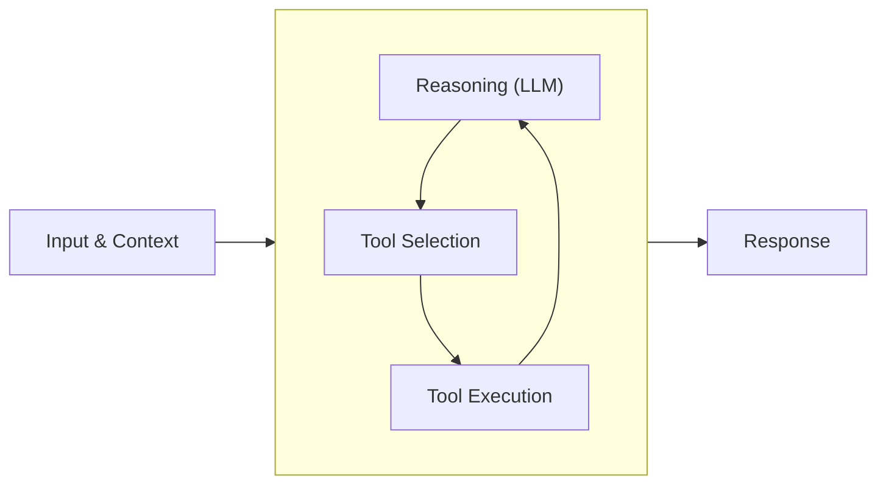

# Agent Loop

A language model can answer questions. An agent can *do things*. The agent loop is what makes that difference possible.

When a model receives a request it cannot fully address with its training alone, it needs to reach out into the world: read files, query databases, call APIs, execute code. The agent loop is the orchestration layer that enables this. It manages the cycle of reasoning and action that allows a model to tackle problems requiring multiple steps, external information, or real-world side effects.

This is the foundational concept in Strands. Everything else builds on top of it.

## How the Loop Works

The agent loop operates on a simple principle: invoke the model, check if it wants to use a tool, execute the tool if so, then invoke the model again with the result. Repeat until the model produces a final response.

The diagram shows the recursive structure at the heart of the loop. The model reasons, selects a tool, the tool executes, and the result feeds back into the model for another round of reasoning. This cycle continues until the model decides it has enough information to respond.

What makes this powerful is the accumulation of context. Each iteration through the loop adds to the conversation history. The model sees not just the original request, but every tool it has called and every result it has received. This accumulated context enables sophisticated multi-step reasoning.

## A Concrete Example

Consider a request to analyze a codebase for security vulnerabilities. This is not something a model can do from memory. It requires an agent that can read files, search code, and synthesize findings. The agent loop handles this through successive iterations:

1. The model receives the request to analyze a codebase. It first needs to understand the structure. It requests a file listing tool with the repository root as input.

2. The model now sees the directory structure in its context. It identifies the main application entry point and requests the file reader tool to examine it.

3. The model sees the application code. It notices database queries and decides to examine the database module for potential SQL injection. It requests the file reader again.

4. The model sees the database module and identifies a vulnerability: user input concatenated directly into SQL queries. To assess the scope, it requests a code search tool to find all call sites of the vulnerable function.

5. The model sees 12 call sites in the search results. It now has everything it needs. Rather than requesting another tool, it produces a terminal response: a report detailing the vulnerability, affected locations, and remediation steps.

Each iteration followed the same pattern. The model received context, decided whether to act or respond, and either continued the loop or exited it. The key insight is that the model made these decisions autonomously based on its evolving understanding of the task.

## Messages and Conversation History

Messages flow through the agent loop with two roles: user and assistant. Each message contains content that can take different forms.

**User messages** contain the initial request and any follow-up instructions. User message content can include:

- Text input from the user
- Tool results from previous tool executions
- Media such as files, images, audio, or video

**Assistant messages** are the model's outputs. Assistant message content can include:

- Text responses for the user
- Tool use requests for the execution system
- Reasoning traces (when supported by the model)

The conversation history accumulates all three message types across loop iterations. This history is the model's working memory for the task. The conversation manager applies strategies to keep this history within the model's context window while preserving the most relevant information. See [Conversation Management](conversation-management.md) for details on available strategies.

## Tool Execution

When the model requests a tool, the execution system validates the request against the tool's schema, locates the tool in the registry, executes it with error handling, and formats the result as a tool result message.

The execution system captures both successful results and failures. When a tool fails, the error information goes back to the model as an error result rather than throwing an exception that terminates the loop. This gives the model an opportunity to recover or try alternatives.

## Loop Lifecycle

The agent loop has well-defined entry and exit points. Understanding these helps predict agent behavior and handle edge cases.

### Starting the Loop

When an agent receives a request, it initializes by registering tools, setting up the conversation manager, and preparing metrics collection. The user's input becomes the first message in the conversation history, and the loop begins its first iteration.

### Stop Reasons

Each model invocation ends with a stop reason that determines what happens next:

- **End turn**: The model has finished its response and has no further actions to take. This is the normal successful termination. The loop exits and returns the model's final message.
- **Tool use**: The model wants to execute one or more tools before continuing. The loop executes the requested tools, appends the results to the conversation history, and invokes the model again.
- **Max tokens**: The model's response was truncated because it hit the token limit. This is unrecoverable within the current loop. The model cannot continue from a partial response, and the loop terminates with an error.
- **Stop sequence**: The model encountered a configured stop sequence. Like end turn, this terminates the loop normally.
- **Content filtered**: The response was blocked by safety mechanisms.
- **Guardrail intervention**: A guardrail policy stopped generation.

Both content filtered and guardrail intervention terminate the loop and should be handled according to application requirements.

### Extending the Loop

The agent emits lifecycle events at key points: before and after each invocation, before and after each model call, and before and after each tool execution. These events enable observation, metrics collection, and behavior modification without changing the core loop logic. See [Hooks](hooks.md) for details on subscribing to these events.

## Common Problems

### Context Window Exhaustion

Each loop iteration adds messages to the conversation history. For complex tasks requiring many tool calls, this history can exceed the model's context window. When this happens, the agent cannot continue.

Symptoms include errors from the model provider about input length, or degraded model performance as the context fills with less relevant earlier messages.

Solutions:

- Reduce tool output verbosity. Return summaries or relevant excerpts rather than complete data.
- Simplify tool schemas. Deeply nested schemas consume tokens in both the tool configuration and the model's reasoning.
- Configure a conversation manager with appropriate strategies. The default sliding window strategy works for many applications, but summarization or custom approaches may be needed for long-running tasks. See [Conversation Management](conversation-management.md) for available options.
- Decompose large tasks into subtasks, each handled with a fresh context.

### Inappropriate Tool Selection

When the model consistently picks the wrong tool, the problem is usually ambiguous tool descriptions. Review the descriptions from the model's perspective. If two tools have overlapping descriptions, the model has no basis for choosing between them. See [Tools Overview](../tools/index.md) for guidance on writing effective descriptions.

### MaxTokensReachedException

When the model's response exceeds the configured token limit, the loop raises a `MaxTokensReachedException`. This typically occurs when:

- The model attempts to generate an unusually long response
- The context window is nearly full, leaving insufficient space for the response
- Tool results push the conversation close to the token limit

Handle this exception by reducing context size, increasing the token limit, or breaking the task into smaller steps.

## What Comes Next

The agent loop is the execution primitive. Higher-level patterns build on top of it:

- [Conversation Management](conversation-management.md) strategies that maintain coherent long-running interactions
- [Hooks](hooks.md) for observing, modifying, and extending agent behavior
- Multi-agent architectures where agents coordinate through shared tools or message passing
- Evaluation frameworks that assess agent performance on complex tasks

Understanding the loop deeply makes these advanced patterns more approachable. The same principles apply at every level: clear tool contracts, accumulated context, and autonomous decision-making within defined boundaries.
