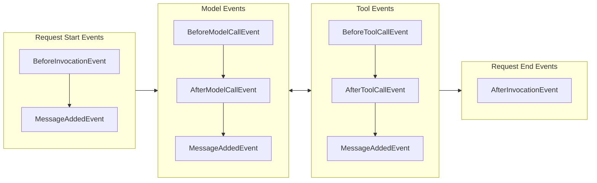

# Hooks

Hooks are a composable extensibility mechanism for extending agent functionality by subscribing to events throughout the agent lifecycle. The hook system enables both built-in components and user code to react to or modify agent behavior through strongly-typed event callbacks.

## Overview

The hooks system is a composable, type-safe system that supports multiple subscribers per event type. 

A **Hook Event** is a specific event in the lifecycle that callbacks can be associated with. A **Hook Callback** is a callback function that is invoked when the hook event is emitted.

Hooks enable use cases such as:

- Monitoring agent execution and tool usage
- Modifying tool execution behavior
- Adding validation and error handling

## Basic Usage

Hook callbacks are registered against specific event types and receive strongly-typed event objects when those events occur during agent execution. Each event carries relevant data for that stage of the agent lifecycle - for example, `BeforeInvocationEvent` includes agent and request details, while `BeforeToolCallEvent` provides tool information and parameters.

### Registering Individual Hook Callbacks

You can register callbacks for specific events using `agent.hooks` after the fact:

=== "Python"

    ```python
    agent = Agent()

    # Register individual callbacks
    def my_callback(event: BeforeInvocationEvent) -> None:
        print("Custom callback triggered")

    agent.hooks.add_callback(BeforeInvocationEvent, my_callback)
    ```

=== "TypeScript"

    ```typescript
    --8<-- "user-guide/concepts/agents/hooks.ts:individual_callback"
    ```

### Creating a Hook Provider

The `HookProvider` protocol allows a single object to register callbacks for multiple events:

=== "Python"

    ```python
    class LoggingHook(HookProvider):
        def register_hooks(self, registry: HookRegistry) -> None:
            registry.add_callback(BeforeInvocationEvent, self.log_start)
            registry.add_callback(AfterInvocationEvent, self.log_end)

        def log_start(self, event: BeforeInvocationEvent) -> None:
            print(f"Request started for agent: {event.agent.name}")

        def log_end(self, event: AfterInvocationEvent) -> None:
            print(f"Request completed for agent: {event.agent.name}")

    # Passed in via the hooks parameter
    agent = Agent(hooks=[LoggingHook()])

    # Or added after the fact
    agent.hooks.add_hook(LoggingHook())
    ```

=== "TypeScript"

    ```typescript
    --8<-- "user-guide/concepts/agents/hooks.ts:hook_provider_class"
    ```

## Hook Event Lifecycle

The following diagram shows when hook events are emitted during a typical agent invocation where tools are invoked:




### Available Events

The hooks system provides events for different stages of agent execution:

| Event                                          | Description                                                                                                       |
|------------------------------------------------|-------------------------------------------------------------------------------------------------------------------|
| `AgentInitializedEvent`                        | Triggered when an agent has been constructed and finished initialization at the end of the agent constructor.     |
| `BeforeInvocationEvent`                        | Triggered at the beginning of a new agent invocation request |
| `AfterInvocationEvent`                         | Triggered at the end of an agent request, regardless of success or failure. Uses reverse callback ordering        |
| `MessageAddedEvent`                            | Triggered when a message is added to the agent's conversation history                                             |
| `BeforeModelCallEvent`                         | Triggered before the model is invoked for inference                                                               |
| `AfterModelCallEvent`                          | Triggered after model invocation completes. Uses reverse callback ordering                                        |
| `BeforeToolCallEvent`                          | Triggered before a tool is invoked.                                                                               |
| `AfterToolCallEvent`                           | Triggered after tool invocation completes. Uses reverse callback ordering                                         |
| `BeforeToolsEvent` <br /> **(TypeScript only)**      | Triggered before tools are executed in a batch.                                                                   |
| `AfterToolsEvent` <br /> **(TypeScript only)** | Triggered after tools are executed in a batch. Uses reverse callback ordering                                     |

## Hook Behaviors

### Event Properties

Most event properties are read-only to prevent unintended modifications. However, certain properties can be modified to influence agent behavior.

### Callback Ordering

Some events come in pairs, such as Before/After events. The After event callbacks are always called in reverse order from the Before event callbacks to ensure proper cleanup semantics.


## Advanced Usage

### Accessing Invocation State in Hooks

Hook events that involve tool execution include access to invocation state, which provides configuration and context data passed through the agent invocation. This is particularly useful for:

1. **Custom Objects**: Access database client objects, connection pools, or other Python objects
2. **Request Context**: Access session IDs, user information, settings, or request-specific data  
3. **Multi-Agent Shared State**: In multi-agent patterns, access state shared across all agents - see [Shared State Across Multi-Agent Patterns](../multi-agent/multi-agent-patterns.md#shared-state-across-multi-agent-patterns)
4. **Custom Parameters**: Pass any additional data that hooks might need

=== "Python"

    ```python
    from strands.hooks import BeforeToolCallEvent
    import logging

    def log_with_context(event: BeforeToolCallEvent) -> None:
        """Log tool invocations with context from invocation state."""
        # Access invocation state from the event
        user_id = event.invocation_state.get("user_id", "unknown")
        session_id = event.invocation_state.get("session_id")
        
        # Access non-JSON serializable objects like database connections
        db_connection = event.invocation_state.get("database_connection")
        logger_instance = event.invocation_state.get("custom_logger")
        
        # Use custom logger if provided, otherwise use default
        logger = logger_instance if logger_instance else logging.getLogger(__name__)
        
        logger.info(
            f"User {user_id} in session {session_id} "
            f"invoking tool: {event.tool_use['name']} "
            f"with DB connection: {db_connection is not None}"
        )

    # Register the hook
    agent = Agent(tools=[my_tool])
    agent.hooks.add_callback(BeforeToolCallEvent, log_with_context)

    # Execute with context including non-serializable objects
    import sqlite3
    custom_logger = logging.getLogger("custom")
    db_conn = sqlite3.connect(":memory:")

    result = agent(
        "Process the data",
        user_id="user123",
        session_id="sess456",
        database_connection=db_conn,  # Non-JSON serializable object
        custom_logger=custom_logger   # Non-JSON serializable object
    )
    ```

{{ ts_not_supported_code("This feature is not yet available in TypeScript SDK") }}

### Tool Interception

Modify or replace tools before execution:

=== "Python"

    ```python
    class ToolInterceptor(HookProvider):
        def register_hooks(self, registry: HookRegistry) -> None:
            registry.add_callback(BeforeToolCallEvent, self.intercept_tool)

        def intercept_tool(self, event: BeforeToolCallEvent) -> None:
            if event.tool_use.name == "sensitive_tool":
                # Replace with a safer alternative
                event.selected_tool = self.safe_alternative_tool
                event.tool_use["name"] = "safe_tool"
    ```

{{ ts_not_supported_code("Changing of tools is not yet available in TypeScript SDK") }}

### Result Modification

Modify tool results after execution:

=== "Python"

    ```python
    class ResultProcessor(HookProvider):
        def register_hooks(self, registry: HookRegistry) -> None:
            registry.add_callback(AfterToolCallEvent, self.process_result)

        def process_result(self, event: AfterToolCallEvent) -> None:
            if event.tool_use.name == "calculator":
                # Add formatting to calculator results
                original_content = event.result["content"][0]["text"]
                event.result["content"][0]["text"] = f"Result: {original_content}"
    ```

{{ ts_not_supported_code("Changing of tool results is not yet available in TypeScript SDK") }}

## Best Practices

### Composability

Design hooks to be composable and reusable:

=== "Python"

    ```python
    class RequestLoggingHook(HookProvider):
        def register_hooks(self, registry: HookRegistry) -> None:
            registry.add_callback(BeforeInvocationEvent, self.log_request)
            registry.add_callback(AfterInvocationEvent, self.log_response)
            registry.add_callback(BeforeToolCallEvent, self.log_tool_use)

        ...
    ```

{{ ts_not_supported_code("Changing of tools is not yet available in TypeScript SDK") }}

### Event Property Modifications

When modifying event properties, log the changes for debugging and audit purposes:

=== "Python"

    ```python
    class ResultProcessor(HookProvider):
        def register_hooks(self, registry: HookRegistry) -> None:
            registry.add_callback(AfterToolCallEvent, self.process_result)

        def process_result(self, event: AfterToolCallEvent) -> None:
            if event.tool_use.name == "calculator":
                original_content = event.result["content"][0]["text"]
                logger.info(f"Modifying calculator result: {original_content}")
                event.result["content"][0]["text"] = f"Result: {original_content}"
    ```

{{ ts_not_supported_code("Changing of tools is not yet available in TypeScript SDK") }}

## Cookbook

This section contains practical hook implementations for common use cases.

### Fixed Tool Arguments

Useful for enforcing security policies, maintaining consistency, or overriding agent decisions with system-level requirements. This hook ensures specific tools always use predetermined parameter values regardless of what the agent specifies.

=== "Python"

    ```python
    from typing import Any
    from strands.hooks import HookProvider, HookRegistry, BeforeToolCallEvent

    class ConstantToolArguments(HookProvider):
        """Use constant argument values for specific parameters of a tool."""

        def __init__(self, fixed_tool_arguments: dict[str, dict[str, Any]]):
            """
            Initialize fixed parameter values for tools.
        
            Args:
                fixed_tool_arguments: A dictionary mapping tool names to dictionaries of 
                    parameter names and their fixed values. These values will override any 
                    values provided by the agent when the tool is invoked.
            """
            self._tools_to_fix = fixed_tool_arguments

        def register_hooks(self, registry: HookRegistry, **kwargs: Any) -> None:
            registry.add_callback(BeforeToolCallEvent, self._fix_tool_arguments)

        def _fix_tool_arguments(self, event: BeforeToolCallEvent):
            # If the tool is in our list of parameters, then use those parameters
            if parameters_to_fix := self._tools_to_fix.get(event.tool_use["name"]):
                tool_input: dict[str, Any] = event.tool_use["input"]
                tool_input.update(parameters_to_fix)
    ```

{{ ts_not_supported_code("Changing of tools is not yet available in TypeScript SDK") }}

For example, to always force the `calculator` tool to use precision of 1 digit:

=== "Python"

    ```python
    fix_parameters = ConstantToolArguments({
        "calculator": {
            "precision": 1,
        }
    })

    agent = Agent(tools=[calculator], hooks=[fix_parameters])
    result = agent("What is 2 / 3?")
    ```

{{ ts_not_supported_code("Changing of tools is not yet available in TypeScript SDK") }}

### Limit Tool Counts

Useful for preventing runaway tool usage, implementing rate limiting, or enforcing usage quotas. This hook tracks tool invocations per request and replaces tools with error messages when limits are exceeded.

=== "Python"

    ```python
    from strands import tool
    from strands.hooks import HookRegistry, HookProvider, BeforeToolCallEvent, BeforeInvocationEvent
    from threading import Lock

    class LimitToolCounts(HookProvider):
        """Limits the number of times tools can be called per agent invocation"""
        
        def __init__(self, max_tool_counts: dict[str, int]):
            """
            Initializer.

            Args:
                max_tool_counts: A dictionary mapping tool names to max call counts for 
                    tools. If a tool is not specified in it, the tool can be called as many
                    times as desired
            """
            self.max_tool_counts = max_tool_counts
            self.tool_counts = {}
            self._lock = Lock()

        def register_hooks(self, registry: HookRegistry) -> None:
            registry.add_callback(BeforeInvocationEvent, self.reset_counts)
            registry.add_callback(BeforeToolCallEvent, self.intercept_tool)

        def reset_counts(self, event: BeforeInvocationEvent) -> None:
            with self._lock:
                self.tool_counts = {}

        def intercept_tool(self, event: BeforeToolCallEvent) -> None:
            tool_name = event.tool_use["name"]
            with self._lock:
                max_tool_count = self.max_tool_counts.get(tool_name)
                tool_count = self.tool_counts.get(tool_name, 0) + 1
                self.tool_counts[tool_name] = tool_count

            if max_tool_count and tool_count > max_tool_count:
                event.cancel_tool = (
                    f"Tool '{tool_name}' has been invoked too many and is now being throttled. "
                    f"DO NOT CALL THIS TOOL ANYMORE "
                )
    ```

{{ ts_not_supported_code("This feature is not yet available in TypeScript SDK") }}

For example, to limit the `sleep` tool to 3 invocations per invocation:

=== "Python"

    ```python
    limit_hook = LimitToolCounts(max_tool_counts={"sleep": 3})

    agent = Agent(tools=[sleep], hooks=[limit_hook])

    # This call will only have 3 successful sleeps
    agent("Sleep 5 times for 10ms each or until you can't anymore")
    # This will sleep successfully again because the count resets every invocation
    agent("Sleep once")
    ```

{{ ts_not_supported_code("This feature is not yet available in TypeScript SDK") }}
