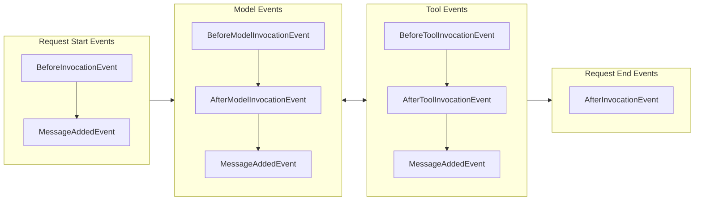

# Hooks

Hooks are a composable extensibility mechanism for extending agent functionality by subscribing to events throughout the agent lifecycle. The hook system enables both built-in components and user code to react to or modify agent behavior through strongly-typed event callbacks.

## Overview

The hooks system is an evolution of the callback_handler approach with a more composable, type-safe system that supports multiple subscribers per event type. 

A **Hook Event** is a specific event in the lifecycle that callbacks can be associated with. A **Hook Callback** is a callback function that is invoked when the hook event is emitted.

Hooks enable use cases such as:

- Monitoring agent execution and tool usage
- Modifying tool execution behavior
- Adding validation and error handling

## Basic Usage

Hook callbacks are registered against specific event types and receive strongly-typed event objects when those events occur during agent execution. Each event carries relevant data for that stage of the agent lifecycle - for example, `BeforeInvocationEvent` includes agent and request details, while `BeforeToolInvocationEvent` provides tool information and parameters.

### Registering Individual Hook Callbacks

You can register callbacks for specific events using `add_callback`:

```python
agent = Agent()

# Register individual callbacks
def my_callback(event: BeforeInvocationEvent) -> None:
    print("Custom callback triggered")

agent.hooks.add_callback(BeforeInvocationEvent, my_callback)
```

### Creating a Hook Provider

The `HookProvider` protocol allows a single object to register callbacks for multiple events:

```python
class LoggingHook(HookProvider):
    def register_hooks(self, registry: HookRegistry) -> None:
        registry.add_callback(BeforeInvocationEvent, self.log_start)
        registry.add_callback(AfterInvocationEvent, self.log_end)

    def log_start(self, event: BeforeInvocationEvent) -> None:
        print(f"Request started for agent: {event.agent.name}")

    def log_end(self, event: AfterInvocationEvent) -> None:
        print(f"Request completed for agent: {event.agent.name}")

# Passed in via the hooks parameter
agent = Agent(hooks=[LoggingHook()])

# Or added after the fact
agent.hooks.add_hook(LoggingHook())
```

## Hook Event Lifecycle

The following diagram shows when hook events are emitted during a typical agent invocation where tools are invoked:




### Available Events

The hooks system provides events for different stages of agent execution:

| Event                  | Description                                                                                                  |
|------------------------|--------------------------------------------------------------------------------------------------------------|
| `AgentInitializedEvent` | Triggered when an agent has been constructed and finished initialization at the end of `Agent.__init__`. |
| `BeforeInvocationEvent` | Triggered at the beginning of a new agent request (`__call__`, `stream_async`, or `structured_output`) |
| `AfterInvocationEvent` | Triggered at the end of an agent request, regardless of success or failure. Uses reverse callback ordering   |
| `MessageAddedEvent`    | Triggered when a message is added to the agent's conversation history                                        |

Additional *experimental events* are also available:

!!! note "Experimental events are subject to change"

    These events are exposed experimentally in order to gather feedback and refine the public contract. Because they are experimental, they are subject to change between releases. 

| Experimental Event           | Description |
|------------------------------|-------------|
| `BeforeModelInvocationEvent` | Triggered before the model is invoked for inference |
| `AfterModelInvocationEvent`  | Triggered after model invocation completes. Uses reverse callback ordering |
| `BeforeToolInvocationEvent`  | Triggered before a tool is invoked. |
| `AfterToolInvocationEvent`   | Triggered after tool invocation completes. Uses reverse callback ordering |

## Hook Behaviors

### Event Properties

Most event properties are read-only to prevent unintended modifications. However, certain properties can be modified to influence agent behavior. For example, `BeforeToolInvocationEvent.selected_tool` allows you to change which tool gets executed, while `AfterToolInvocationEvent.result` enables modification of tool results.

### Callback Ordering

Some events come in pairs, such as Before/After events. The After event callbacks are always called in reverse order from the Before event callbacks to ensure proper cleanup semantics.


## Advanced Usage

### Fixed Tool Arguments

Enforce specific arguments for tools, ensuring they always use particular values regardless of what the agent specifies:

```python
from typing import Any
from strands.hooks import HookProvider, HookRegistry
from strands.experimental.hooks import BeforeToolInvocationEvent

class ConstantToolArguments(HookProvider):
    """Use constant argument values for specific parameters of a tool."""

    def __init__(self, fixed_tool_arguments: dict[str, dict[str, Any]]):
        """
        Initialize fixed parameter values for tools.
    
        Args:
            fixed_tool_arguments: A dictionary mapping tool names to dictionaries of 
                parameter names and their fixed values. These values will override any 
                values provided by the agent when the tool is invoked.
        """
        self._tools_to_fix = fixed_tool_arguments

    def register_hooks(self, registry: HookRegistry, **kwargs: Any) -> None:
        registry.add_callback(BeforeToolInvocationEvent, self._fix_tool_arguments)

    def _fix_tool_arguments(self, event: BeforeToolInvocationEvent):
        # If the tool is in our list of parameters, then use those parameters
        if parameters_to_fix := self._tools_to_fix.get(event.tool_use["name"]):
            tool_input: dict[str, Any] = event.tool_use["input"]
            tool_input.update(parameters_to_fix)
```

For example, to always force the `calculator` tool to use use precision of 1 digit:

```python
fix_parameters = ConstantToolArguments({
    "calculator": {
        "precision": 1,
    }
})

agent = Agent(tools=[calculator], hooks=[fix_parameters])
result = agent("What is 2 / 3?")
```

### Tool Interception

Modify or replace tools before execution:

```python
class ToolInterceptor(HookProvider):
    def register_hooks(self, registry: HookRegistry) -> None:
        registry.add_callback(BeforeToolInvocationEvent, self.intercept_tool)

    def intercept_tool(self, event: BeforeToolInvocationEvent) -> None:
        if event.tool_use.name == "sensitive_tool":
            # Replace with a safer alternative
            event.selected_tool = self.safe_alternative_tool
            event.tool_use["name"] = "safe_tool"
```

### Result Modification

Modify tool results after execution:

```python
class ResultProcessor(HookProvider):
    def register_hooks(self, registry: HookRegistry) -> None:
        registry.add_callback(AfterToolInvocationEvent, self.process_result)

    def process_result(self, event: AfterToolInvocationEvent) -> None:
        if event.tool_use.name == "calculator":
            # Add formatting to calculator results
            original_content = event.result["content"][0]["text"]
            event.result["content"][0]["text"] = f"Result: {original_content}"
```

## Best Practices

### Performance Considerations

Keep hook callbacks lightweight since they execute synchronously:

```python
class AsyncProcessor(HookProvider):
    def register_hooks(self, registry: HookRegistry) -> None:
        registry.add_callback(AfterInvocationEvent, self.queue_processing)

    def queue_processing(self, event: AfterInvocationEvent) -> None:
        # Queue heavy processing for background execution
        self.background_queue.put(event.agent.messages[-1])
```

### Composability

Design hooks to be composable and reusable:

```python
class RequestLoggingHook(HookProvider):
    def register_hooks(self, registry: HookRegistry) -> None:
        registry.add_callback(BeforeInvocationEvent, self.log_request)
        registry.add_callback(AfterInvocationEvent, self.log_response)
        registry.add_callback(BeforeToolInvocationEvent, self.log_tool_use)

    ...
```

### Event Property Modifications

When modifying event properties, log the changes for debugging and audit purposes:

```python
class ResultProcessor(HookProvider):
    def register_hooks(self, registry: HookRegistry) -> None:
        registry.add_callback(AfterToolInvocationEvent, self.process_result)

    def process_result(self, event: AfterToolInvocationEvent) -> None:
        if event.tool_use.name == "calculator":
            original_content = event.result["content"][0]["text"]
            logger.info(f"Modifying calculator result: {original_content}")
            event.result["content"][0]["text"] = f"Result: {original_content}"
```
