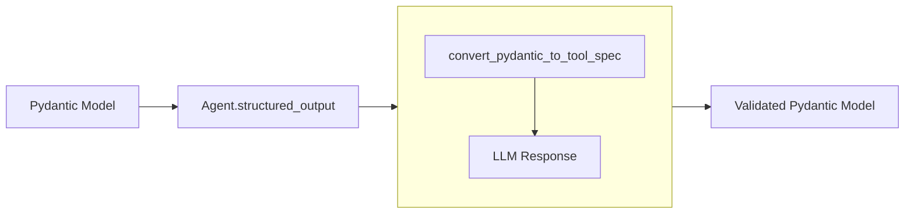

# Structured Output

Structured output enables you to get type-safe, validated responses from language models using Pydantic models. Instead of receiving raw text that you need to parse, you can define the exact structure you want and receive a validated Python object that matches your schema. This transforms unstructured LLM outputs into reliable, program-friendly data structures that integrate seamlessly with your application's type system and validation rules.

## What is Structured Output?

Structured output allows you to constrain language model responses to follow a specific schema defined by a [Pydantic](https://docs.pydantic.dev/latest/concepts/models/) model. This ensures responses are properly formatted, validated, and type-safe, eliminating the need for manual parsing of text responses.



*The conversion to tool spec happens behind the scenes*

Key benefits:

- **Type Safety**: Get typed Python objects instead of raw strings
- **Automatic Validation**: Pydantic validates responses against your schema
- **Clear Documentation**: Schema serves as documentation of expected output
- **IDE Support**: IDE type hinting from LLM-generated responses
- **Error Prevention**: Catch malformed responses early

## How It Works

The structured output system converts your Pydantic models into tool specifications that guide the language model to produce correctly formatted responses. Various model providers supported in Strands Agents sdk-python can work with these specifications, with some supporting Pydantic `BaseModel` directly.

Strands handles this through the [`Agent.structured_output()`](../../../api-reference/agent.md#strands.agent.agent.Agent.structured_output) method, which manages the conversion, validation, and response processing automatically.

## Usage

Define your desired output structure using Pydantic models:

```python
from pydantic import BaseModel, Field
from typing import Optional, List

class WeatherForecast(BaseModel):
    """Complete weather forecast information."""
    location: str = Field(description="The location for this forecast")
    current_time: str = Field(description="Current time in HH:MM format")
    current_weather: str = Field(description="Current weather conditions")
    temperature: Optional[float] = Field(default=None, description="Temperature in Celsius")
    forecast_days: List[str] = Field(default_factory=list, description="Multi-day forecast")
```

Then use the `Agent.structured_output()` method:

### Basic Usage

Extract structured information from text:

```python
from pydantic import BaseModel
from strands import Agent

class PersonInfo(BaseModel):
    name: str
    age: int
    occupation: str

agent = Agent()
result = agent.structured_output(
    PersonInfo, 
    "John Smith is a 30-year-old software engineer"
)

print(f"Name: {result.name}")      # "John Smith"
print(f"Age: {result.age}")        # 30
print(f"Job: {result.occupation}") # "software engineer"
```

### Using Conversation History

Structured output can work with existing conversation context:

```python
agent = Agent()

# Build up conversation context
agent("What do you know about Paris, France?")
agent("Tell me about the weather there in spring.")

# Extract structured information with a prompt
class CityInfo(BaseModel):
    city: str
    country: str
    population: Optional[int] = None
    climate: str

# Uses existing conversation context with a prompt
result = agent.structured_output(CityInfo, "Extract structured information about Paris")
```

### Complex Nested Models

Handle sophisticated data structures:

```python
from typing import List
from pydantic import BaseModel, Field

class Address(BaseModel):
    street: str
    city: str
    country: str
    postal_code: Optional[str] = None

class Contact(BaseModel):
    email: Optional[str] = None
    phone: Optional[str] = None

class Person(BaseModel):
    """Complete person information."""
    name: str = Field(description="Full name of the person")
    age: int = Field(description="Age in years")
    address: Address = Field(description="Home address")
    contacts: List[Contact] = Field(default_factory=list, description="Contact methods")
    skills: List[str] = Field(default_factory=list, description="Professional skills")

agent = Agent()
result = agent.structured_output(
    Person,
    "Extract info: Jane Doe, a systems admin, 28, lives at 123 Main St, New York, NY. Email: jane@example.com"
)

print(result.name)                    # "Jane Doe"
print(result.address.city)            # "New York"
print(result.contacts[0].email)       # "jane@example.com"
print(result.skills)                  # ["systems admin"]
```

Refer to Pydantic documentation for details on:

- [Models and schema definition](https://docs.pydantic.dev/latest/concepts/models/)
- [Field types and constraints](https://docs.pydantic.dev/latest/concepts/fields/)
- [Custom validators](https://docs.pydantic.dev/latest/concepts/validators/)

### Error Handling

```python
from pydantic import ValidationError

try:
    result = agent.structured_output(MyModel, prompt)
except ValidationError as e:
    print(f"Validation failed: {e}")
    # Handle appropriately - options include:
    # 1. Retry with a more specific prompt
    # 2. Fall back to a simpler model
    # 3. Extract partial information from the error
```


## Best Practices

- **Keep models focused**: Define specific models for clear purposes
- **Use descriptive field names**: Include helpful descriptions with `Field`
- **Handle errors gracefully**: Implement proper error handling strategies with fallbacks
- **Extract key data at conversation completion**: Use structured output at the end of agent workflows to distill conversations into actionable data structures
