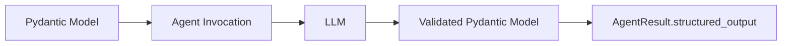

# Structured Output


{{ ts_not_supported() }}

## Introduction

Structured output enables you to get type-safe, validated responses from language models using [Pydantic](https://docs.pydantic.dev/latest/concepts/models/) models. Instead of receiving raw text that you need to parse, you can define the exact structure you want and receive a validated Python object that matches your schema. This transforms unstructured LLM outputs into reliable, program-friendly data structures that integrate seamlessly with your application's type system and validation rules.



Key benefits:

- **Type Safety**: Get typed Python objects instead of raw strings
- **Automatic Validation**: Pydantic validates responses against your schema
- **Clear Documentation**: Schema serves as documentation of expected output
- **IDE Support**: IDE type hinting from LLM-generated responses
- **Error Prevention**: Catch malformed responses early


## Basic Usage

Define an output structure using a Pydantic model. Then, assign the model to the `structured_output_model` parameter when invoking the [`agent`](../../../api-reference/python/agent/agent.md#strands.agent.agent). Then, access the Structured Output from the [`AgentResult`](../../../api-reference/python/agent/agent_result.md#strands.agent.agent_result).

=== "Python"

    ```python
    from pydantic import BaseModel, Field
    from strands import Agent

    # 1) Define the Pydantic model
    class PersonInfo(BaseModel):
        """Model that contains information about a Person"""
        name: str = Field(description="Name of the person")
        age: int = Field(description="Age of the person")
        occupation: str = Field(description="Occupation of the person")

    # 2) Pass the model to the agent
    agent = Agent()
    result = agent(
        "John Smith is a 30 year-old software engineer",
        structured_output_model=PersonInfo
    )

    # 3) Access the `structured_output` from the result
    person_info: PersonInfo = result.structured_output
    print(f"Name: {person_info.name}")      # "John Smith"
    print(f"Age: {person_info.age}")        # 30
    print(f"Job: {person_info.occupation}") # "software engineer"
    ```

{{ ts_not_supported_code() }}

???+ tip "Async Support"
    Structured Output is supported with async via the `invoke_async` method:

    === "Python"

        ```python
        import asyncio
        agent = Agent()
        result = asyncio.run(
            agent.invoke_async(
                "John Smith is a 30 year-old software engineer",
                structured_output_model=PersonInfo
            )
        )
        ```

    === "TypeScript"
        ```typescript
        // Not supported in TypeScript
        ```

## More Information

### How It Works

The structured output system converts your Pydantic models into tool specifications that guide the language model to produce correctly formatted responses. All of the model providers supported in Strands can work with Structured Output.

Strands handles this by accepting the `structured_output_model` parameter in [`agent`](../../../api-reference/python/agent/agent.md#strands.agent.agent) invocations, which manages the conversion, validation, and response processing automatically. The validated result is available in the `AgentResult.structured_output` field.


### Error Handling

In the event there is an issue with parsing the structured output, Strands will throw a custom `StructuredOutputException` that can be caught and handled appropriately:

=== "Python"

    ```python
    from pydantic import ValidationError
    from strands.types.exceptions import StructuredOutputException

    try:
        result = agent(prompt, structured_output_model=MyModel)
    except StructuredOutputException as e:
        print(f"Structured output failed: {e}")
    ```

{{ ts_not_supported_code() }}

### Migration from Legacy API

!!! warning "Deprecated API"
    The `Agent.structured_output()` and `Agent.structured_output_async()` methods are deprecated. Use the new `structured_output_model` parameter approach instead.

#### Before (Deprecated)

=== "Python"

    ```python
    # Old approach - deprecated
    result = agent.structured_output(PersonInfo, "John is 30 years old")
    print(result.name)  # Direct access to model fields
    ```

{{ ts_not_supported_code() }}

#### After (Recommended)

=== "Python"

    ```python
    # New approach - recommended
    result = agent("John is 30 years old", structured_output_model=PersonInfo)
    print(result.structured_output.name)  # Access via structured_output field
    ```

{{ ts_not_supported_code() }}

### Best Practices

- **Keep models focused**: Define specific models for clear purposes
- **Use descriptive field names**: Include helpful descriptions with `Field`
- **Handle errors gracefully**: Implement proper error handling strategies with fallbacks

### Related Documentation

#### After (Recommended)

```python
# New approach - recommended
result = agent("John is 30 years old", structured_output_model=PersonInfo)
print(result.structured_output.name)  # Access via structured_output field
```

### Best Practices

- **Keep models focused**: Define specific models for clear purposes
- **Use descriptive field names**: Include helpful descriptions with `Field`
- **Handle errors gracefully**: Implement proper error handling strategies with fallbacks

### Related Documentation

Refer to Pydantic documentation for details on:

- [Models and schema definition](https://docs.pydantic.dev/latest/concepts/models/)
- [Field types and constraints](https://docs.pydantic.dev/latest/concepts/fields/)
- [Custom validators](https://docs.pydantic.dev/latest/concepts/validators/)

## Cookbook

### Auto Retries with Validation

Automatically retry validation when initial extraction fails due to field validators:

=== "Python"

    ```python
    from strands.agent import Agent
    from pydantic import BaseModel, field_validator


    class Name(BaseModel):
        first_name: str

        @field_validator("first_name")
        @classmethod
        def validate_first_name(cls, value: str) -> str:
            if not value.endswith('abc'):
                raise ValueError("You must append 'abc' to the end of my name")
            return value


    agent = Agent()
    result = agent("What is Aaron's name?", structured_output_model=Name)
    ```

{{ ts_not_supported_code() }}

### Streaming Structured Output

Stream structured output progressively while maintaining type safety and validation:

=== "Python"

    ```python
    from strands import Agent
    from pydantic import BaseModel, Field

    class WeatherForecast(BaseModel):
        """Weather forecast data."""
        location: str
        temperature: int
        condition: str
        humidity: int
        wind_speed: int
        forecast_date: str

    streaming_agent = Agent()

    async for event in streaming_agent.stream_async(
        "Generate a weather forecast for Seattle: 68°F, partly cloudy, 55% humidity, 8 mph winds, for tomorrow",
        structured_output_model=WeatherForecast
    ):
        if "data" in event:
            print(event["data"], end="", flush=True)
        elif "result" in event:
            print(f'The forecast for today is: {event["result"].structured_output}')
    ```

{{ ts_not_supported_code() }}

### Combining with Tools

Combine structured output with tool usage to format tool execution results:

=== "Python"

    ```python
    from strands import Agent
    from strands_tools import calculator
    from pydantic import BaseModel, Field

    class MathResult(BaseModel):
        operation: str = Field(description="the performed operation")
        result: int = Field(description="the result of the operation")

    tool_agent = Agent(
        tools=[calculator]
    )
    res = tool_agent("What is 42 + 8", structured_output_model=MathResult)
    ```

{{ ts_not_supported_code() }}

### Multiple Output Types

Reuse a single agent instance with different structured output models for varied extraction tasks:

=== "Python"

    ```python
    from strands import Agent
    from pydantic import BaseModel, Field
    from typing import Optional

    class Person(BaseModel):
        """A person's basic information"""
        name: str = Field(description="Full name")
        age: int = Field(description="Age in years", ge=0, le=150)
        email: str = Field(description="Email address")
        phone: Optional[str] = Field(description="Phone number", default=None)

    class Task(BaseModel):
        """A task or todo item"""
        title: str = Field(description="Task title")
        description: str = Field(description="Detailed description")
        priority: str = Field(description="Priority level: low, medium, high")
        completed: bool = Field(description="Whether task is completed", default=False)


    agent = Agent()
    person_res = agent("Extract person: John Doe, 35, john@test.com", structured_output_model=Person)
    task_res = agent("Create task: Review code, high priority, completed", structured_output_model=Task)
    ```

{{ ts_not_supported_code() }}

### Using Conversation History

Extract structured information from prior conversation context without repeating questions:

=== "Python"

    ```python
    from strands import Agent
    from pydantic import BaseModel
    from typing import Optional

    agent = Agent()

    # Build up conversation context
    agent("What do you know about Paris, France?")
    agent("Tell me about the weather there in spring.")

    class CityInfo(BaseModel):
        city: str
        country: str
        population: Optional[int] = None
        climate: str

    # Extract structured information from the conversation
    result = agent(
        "Extract structured information about Paris from our conversation",
        structured_output_model=CityInfo
    )

    print(f"City: {result.structured_output.city}")     # "Paris"
    print(f"Country: {result.structured_output.country}") # "France"
    ```

{{ ts_not_supported_code() }}


### Agent-Level Defaults

You can also set a default structured output model that applies to all agent invocations:

=== "Python"

    ```python
    class PersonInfo(BaseModel):
        name: str
        age: int
        occupation: str

    # Set default structured output model for all invocations
    agent = Agent(structured_output_model=PersonInfo)
    result = agent("John Smith is a 30 year-old software engineer")

    print(f"Name: {result.structured_output.name}")      # "John Smith"
    print(f"Age: {result.structured_output.age}")        # 30
    print(f"Job: {result.structured_output.occupation}") # "software engineer"
    ```

{{ ts_not_supported_code() }}

!!! note "Note"
    Since this is on the agent init level, not the invocation level, the expectation is that the agent will attempt structured output for each invocation.


### Overriding Agent Defaults

Even when you set a default `structured_output_model` at the agent initialization level, you can override it for specific invocations by passing a different `structured_output_model` during the agent invocation:

=== "Python"

    ```python
    class PersonInfo(BaseModel):
        name: str
        age: int
        occupation: str

    class CompanyInfo(BaseModel):
        name: str
        industry: str
        employees: int

    # Agent with default PersonInfo model
    agent = Agent(structured_output_model=PersonInfo)

    # Override with CompanyInfo for this specific call
    result = agent(
        "TechCorp is a software company with 500 employees",
        structured_output_model=CompanyInfo
    )

    print(f"Company: {result.structured_output.name}")      # "TechCorp"
    print(f"Industry: {result.structured_output.industry}") # "software"
    print(f"Size: {result.structured_output.employees}")    # 500
    ```

{{ ts_not_supported_code() }}
