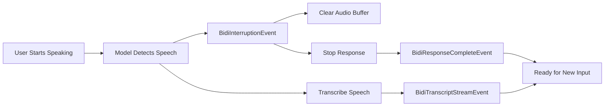

# Interruptions [Experimental]

{{ experimental_feature_warning() }}

One of the features of `BidiAgent` is its ability to handle real-time interruptions. When a user starts speaking while the model is generating a response, the agent automatically detects this and stops the current response, allowing for natural, human-like conversations.

## How Interruptions Work

Interruptions are detected through Voice Activity Detection (VAD) built into the model providers:



## Handling Interruptions

The interruption flow: Model's VAD detects user speech → `BidiInterruptionEvent` sent → Audio buffer cleared → Response terminated → User's speech transcribed → Model ready for new input.

### Automatic Handling (Default)

When using `BidiAudioIO`, interruptions are handled automatically:

```python
import asyncio
from strands.experimental.bidi import BidiAgent, BidiAudioIO
from strands.experimental.bidi.models import BidiNovaSonicModel

model = BidiNovaSonicModel()
agent = BidiAgent(model=model)
audio_io = BidiAudioIO()

async def main():
    # Interruptions handled automatically
    await agent.run(
        inputs=[audio_io.input()],
        outputs=[audio_io.output()]
    )

asyncio.run(main())
```

The `BidiAudioIO` output automatically clears the audio buffer, stops playback immediately, and resumes normal operation for the next response.

### Manual Handling

For custom behavior, process interruption events manually:

```python
import asyncio
from strands.experimental.bidi import BidiAgent
from strands.experimental.bidi.models import BidiNovaSonicModel
from strands.experimental.bidi.types.events import (
    BidiInterruptionEvent,
    BidiResponseCompleteEvent
)

model = BidiNovaSonicModel()
agent = BidiAgent(model=model)

async def main():
    await agent.start()
    await agent.send("Tell me a long story")
    
    async for event in agent.receive():
        if isinstance(event, BidiInterruptionEvent):
            print(f"Interrupted: {event.reason}")
            # Custom handling:
            # - Update UI to show interruption
            # - Log analytics
            # - Clear custom buffers
            
        elif isinstance(event, BidiResponseCompleteEvent):
            if event.stop_reason == "interrupted":
                print("Response was interrupted by user")
            break
    
    await agent.stop()

asyncio.run(main())
```

## Interruption Events

### Key Events

**BidiInterruptionEvent** - Emitted when interruption detected:
- `reason`: `"user_speech"` (most common) or `"error"`

**BidiResponseCompleteEvent** - Includes interruption status:
- `stop_reason`: `"complete"`, `"interrupted"`, `"error"`, or `"tool_use"`

## Interruption Hooks

Use hooks to track interruptions across your application:

```python
from strands.experimental.bidi import BidiAgent
from strands.experimental.bidi.hooks.events import BidiInterruptionEvent as BidiInterruptionHookEvent

class InterruptionTracker:
    def __init__(self):
        self.interruption_count = 0
    
    async def on_interruption(self, event: BidiInterruptionHookEvent):
        self.interruption_count += 1
        print(f"Interruption #{self.interruption_count}: {event.reason}")
        
        # Log to analytics
        # Update UI
        # Track user behavior

tracker = InterruptionTracker()
agent = BidiAgent(
    model=model,
    hooks=[tracker]
)
```

## Common Issues

### Interruptions Not Working

If interruptions aren't being detected:

```python
# Check VAD configuration (OpenAI)
model = BidiOpenAIRealtimeModel(
    provider_config={
        "turn_detection": {
            "type": "server_vad",
            "threshold": 0.3,  # Lower = more sensitive
            "silence_duration_ms": 300  # Shorter = faster detection
        }
    }
)

# Verify microphone is working
audio_io = BidiAudioIO(input_device_index=1)  # Specify device

# Check system permissions (macOS)
# System Preferences → Security & Privacy → Microphone
```

### Audio Continues After Interruption

If audio keeps playing after interruption:

```python
# Ensure BidiAudioIO is handling interruptions
async def __call__(self, event: BidiOutputEvent):
    if isinstance(event, BidiInterruptionEvent):
        self._buffer.clear()  # Critical!
        print("Buffer cleared due to interruption")
```

### Frequent False Interruptions

If the model is interrupted too easily:

```python
# Increase VAD threshold (OpenAI)
model = BidiOpenAIRealtimeModel(
    provider_config={
        "turn_detection": {
            "threshold": 0.7,  # Higher = less sensitive
            "prefix_padding_ms": 500,  # More context
            "silence_duration_ms": 700  # Longer silence required
        }
    }
)
```
