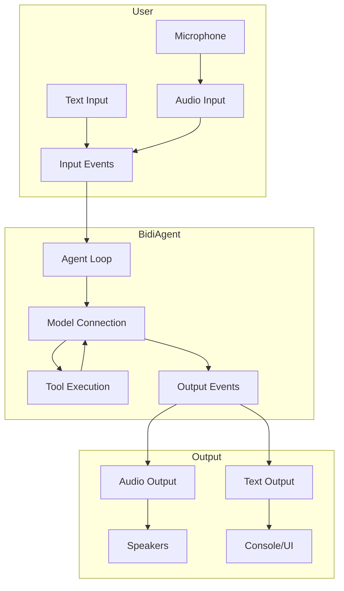
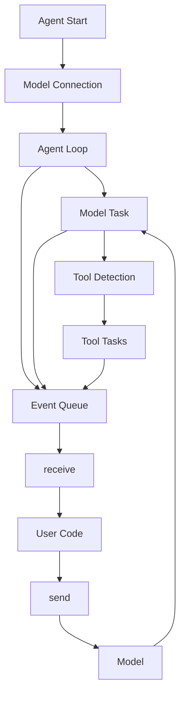
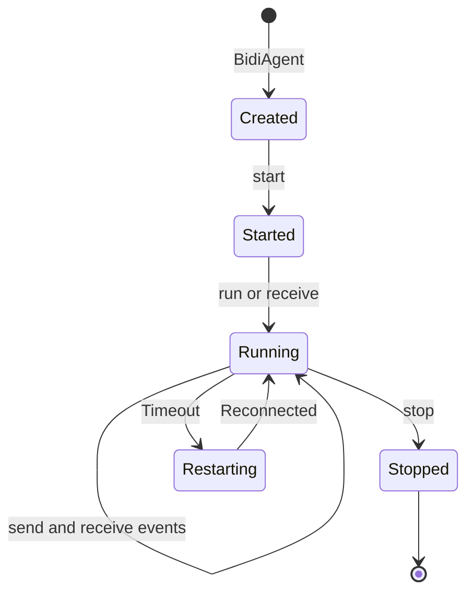

# BidiAgent [Experimental]

{{ experimental_feature_warning() }}

The `BidiAgent` is a specialized agent designed for real-time bidirectional streaming conversations. Unlike the standard `Agent` that follows a request-response pattern, `BidiAgent` maintains persistent connections that enable continuous audio and text streaming, real-time interruptions, and concurrent tool execution.




## Agent vs BidiAgent

While both `Agent` and `BidiAgent` share the same core purpose of enabling AI-powered interactions, they differ significantly in their architecture and use cases.

### Standard Agent (Request-Response)

The standard `Agent` follows a traditional request-response pattern:

```python
from strands import Agent
from strands_tools import calculator

agent = Agent(tools=[calculator])

# Single request-response cycle
result = agent("Calculate 25 * 48")
print(result.message)  # "The result is 1200"
```

**Characteristics:**

- **Synchronous interaction**: One request, one response
- **Discrete cycles**: Each invocation is independent
- **Message-based**: Operates on complete messages
- **Tool execution**: Sequential, blocking the response

### BidiAgent (Bidirectional Streaming)

`BidiAgent` maintains a persistent, bidirectional connection:

```python
import asyncio
from strands.experimental.bidi import BidiAgent, BidiAudioIO
from strands.experimental.bidi.models import BidiNovaSonicModel

model = BidiNovaSonicModel()
agent = BidiAgent(model=model, tools=[calculator])
audio_io = BidiAudioIO()

async def main():
    # Persistent connection with continuous streaming
    await agent.run(
        inputs=[audio_io.input()],
        outputs=[audio_io.output()]
    )

asyncio.run(main())
```

**Characteristics:**

- **Asynchronous streaming**: Continuous input/output
- **Persistent connection**: Single connection for multiple turns
- **Event-based**: Operates on streaming events
- **Tool execution**: Concurrent, non-blocking

### When to Use Each

**Use `Agent` when:**

- Building chatbots or CLI applications
- Processing discrete requests
- Implementing API endpoints
- Working with text-only interactions
- Simplicity is preferred

**Use `BidiAgent` when:**

- Building voice assistants
- Requiring real-time audio streaming
- Needing natural conversation interruptions
- Implementing live transcription
- Building interactive, multi-modal applications


## The Bidirectional Agent Loop

The bidirectional agent loop is fundamentally different from the standard agent loop. Instead of processing discrete messages, it continuously streams events in both directions while managing connection state and concurrent operations.

### Architecture Overview



### Event Flow

#### Startup Sequence

**Agent Initialization**

```python
agent = BidiAgent(model=model, tools=[calculator])
```

Creates tool registry, initializes agent state, and sets up hook registry.

**Connection Start**

```python
await agent.start()
```

Calls `model.start(system_prompt, tools, messages)`, establishes WebSocket/SDK connection, sends conversation history if provided, spawns background task for model communication, and enables sending capability.

**Event Processing**

```python
async for event in agent.receive():
    # Process events
```

Dequeues events from internal queue, yields to user code, and continues until stopped.

#### Tool Execution

Tools execute concurrently without blocking the conversation. When a tool is invoked:

1. The tool executor streams events as the tool runs
2. Tool events are queued to the event loop
3. Tool use and result messages are added atomically to conversation history
4. Results are automatically sent back to the model

The special `stop_conversation` tool triggers agent shutdown instead of sending results back to the model.

### Connection Lifecycle

#### Normal Operation

```
User → send() → Model → receive() → Model Task → Event Queue → receive() → User
                  ↓
              Tool Use
                  ↓
            Tool Task → Event Queue → receive() → User
                  ↓
            Tool Result → Model
```

## Configuration

`BidiAgent` supports extensive configuration to customize behavior for your specific use case.

### Basic Configuration

```python
from strands.experimental.bidi import BidiAgent
from strands.experimental.bidi.models import BidiNovaSonicModel

model = BidiNovaSonicModel()

agent = BidiAgent(
    model=model,
    tools=[calculator, weather],
    system_prompt="You are a helpful voice assistant.",
    messages=[],  # Optional conversation history
    agent_id="voice_assistant_1",
    name="Voice Assistant",
    description="A voice-enabled AI assistant"
)
```

### Model Configuration

Each model provider has specific configuration options:

```python
from strands.experimental.bidi.models import BidiNovaSonicModel

model = BidiNovaSonicModel(
    model_id="amazon.nova-sonic-v1:0",
    provider_config={
        "audio": {
            "input_rate": 16000,
            "output_rate": 16000,
            "voice": "matthew",  # or "ruth"
            "channels": 1,
            "format": "pcm"
        }
    },
    client_config={
        "boto_session": boto3.Session(),
        "region": "us-east-1"
    }
)
```

See [Model Providers](models/nova_sonic.md) for provider-specific options.

`BidiAgent` supports many of the same constructs as `Agent`:

- **[Tools](../../tools/index.md)**: Function calling works identically
- **[Hooks](hooks.md)**: Lifecycle event handling with bidirectional-specific events
- **[Session Management](session-management.md)**: Conversation persistence across sessions
- **[Tool Executors](../../tools/executors.md)**: Concurrent and custom execution patterns


## Lifecycle Management

Understanding the `BidiAgent` lifecycle is crucial for proper resource management and error handling.

### Lifecycle States



### State Transitions

#### 1. Creation

```python
agent = BidiAgent(model=model, tools=[calculator])
# Tool registry initialized, agent state created, hooks registered
# NOT connected to model yet
```

#### 2. Starting

```python
await agent.start(invocation_state={...})
# Model connection established, conversation history sent
# Background tasks spawned, ready to send/receive
```

#### 3. Running

```python
# Option A: Using run()
await agent.run(inputs=[...], outputs=[...])

# Option B: Manual send/receive
await agent.send("Hello")
async for event in agent.receive():
    # Process events - events streaming, tools executing, messages accumulating
    pass
```

#### 4. Stopping

```python
await agent.stop()
# Background tasks cancelled, model connection closed, resources cleaned up
```

### Lifecycle Patterns

#### Using run()

```python
agent = BidiAgent(model=model)
audio_io = BidiAudioIO()

await agent.run(
    inputs=[audio_io.input()],
    outputs=[audio_io.output()]
)
```

Simplest for I/O-based applications - handles start/stop automatically.

#### Context Manager

```python
agent = BidiAgent(model=model)

async with agent:
    await agent.send("Hello")
    async for event in agent.receive():
        if isinstance(event, BidiResponseCompleteEvent):
            break
```

Automatic `start()` and `stop()` with exception-safe cleanup. To pass `invocation_state`, call `start()` manually before entering the context.

#### Manual Lifecycle

```python
agent = BidiAgent(model=model)

try:
    await agent.start()
    await agent.send("Hello")
    
    async for event in agent.receive():
        if isinstance(event, BidiResponseCompleteEvent):
            break
finally:
    await agent.stop()
```

Explicit control with custom error handling and flexible timing.

### Connection Restart

When a model times out, the agent automatically restarts:

```python
async for event in agent.receive():
    if isinstance(event, BidiConnectionRestartEvent):
        print("Reconnecting...")
        # Connection restarting automatically
        # Conversation history preserved
        # Continue processing events normally
```

The restart process: Timeout detected → `BidiConnectionRestartEvent` emitted → Sending blocked → Hooks invoked → Model restarted with history → New receiver task spawned → Sending unblocked → Conversation continues seamlessly.

### Error Handling

#### Handling Errors in Events

```python
async for event in agent.receive():
    if isinstance(event, BidiErrorEvent):
        print(f"Error: {event.message}")
        # Access original exception
        original_error = event.error
        # Decide whether to continue or break
        break
```

#### Handling Connection Errors

```python
try:
    await agent.start()
    async for event in agent.receive():
        # Handle connection restart events
        if isinstance(event, BidiConnectionRestartEvent):
            print("Connection restarting, please wait...")
            continue  # Connection restarts automatically
        
        # Process other events
        pass
except Exception as e:
    print(f"Unexpected error: {e}")
finally:
    await agent.stop()
```

**Note:** Connection timeouts are handled automatically. The agent emits `BidiConnectionRestartEvent` when reconnecting.

#### Graceful Shutdown

```python
import signal

agent = BidiAgent(model=model)
audio_io = BidiAudioIO()

async def main():
    # Setup signal handler
    loop = asyncio.get_event_loop()
    
    def signal_handler():
        print("\nShutting down gracefully...")
        loop.create_task(agent.stop())
    
    loop.add_signal_handler(signal.SIGINT, signal_handler)
    loop.add_signal_handler(signal.SIGTERM, signal_handler)
    
    try:
        await agent.run(
            inputs=[audio_io.input()],
            outputs=[audio_io.output()]
        )
    except asyncio.CancelledError:
        print("Agent stopped")

asyncio.run(main())
```

### Resource Cleanup

The agent automatically cleans up background tasks, model connections, I/O channels, event queues, and invokes cleanup hooks.

### Best Practices

1. **Always Use try/finally**: Ensure `stop()` is called even on errors
2. **Prefer Context Managers**: Use `async with` for automatic cleanup
3. **Handle Restarts Gracefully**: Don't treat `BidiConnectionRestartEvent` as an error
4. **Monitor Lifecycle Hooks**: Use hooks to track state transitions
5. **Test Shutdown**: Verify cleanup works under various conditions
6. **Avoid Calling stop() During receive()**: Only call `stop()` after exiting the receive loop

## Next Steps

- [Events](events.md) - Complete guide to bidirectional streaming events
- [I/O Channels](io.md) - Building custom input/output channels
- [Model Providers](models/nova_sonic.md) - Provider-specific configuration
- [Quickstart](quickstart.md) - Getting started guide
- [API Reference](../../../../api-reference/python/experimental/bidi/agent/agent.md) - Complete API documentation