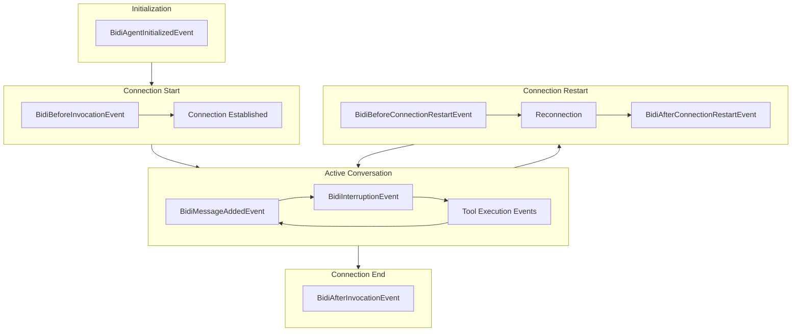

# Hooks [Experimental]

{{ experimental_feature_warning() }}

Hooks provide a composable extensibility mechanism for extending `BidiAgent` functionality by subscribing to events throughout the bidirectional streaming lifecycle. The hook system enables both built-in components and user code to react to agent behavior through strongly-typed event callbacks.

## Overview

The bidirectional streaming hooks system extends the standard agent hooks with additional events specific to real-time streaming conversations, such as connection lifecycle, interruptions, and connection restarts.

For a comprehensive introduction to the hooks concept and general patterns, see the [Hooks documentation](../../agents/hooks.md). This guide focuses on bidirectional streaming-specific events and use cases.

A **Hook Event** is a specific event in the lifecycle that callbacks can be associated with. A **Hook Callback** is a callback function that is invoked when the hook event is emitted.

Hooks enable use cases such as:

- Monitoring connection state and restarts
- Tracking interruptions and user behavior
- Logging conversation history in real-time
- Implementing custom analytics
- Managing session persistence

## Basic Usage

Hook callbacks are registered against specific event types and receive strongly-typed event objects when those events occur during agent execution.

### Creating a Hook Provider

The `HookProvider` protocol allows a single object to register callbacks for multiple events:

```python
from strands.experimental.bidi import BidiAgent
from strands.experimental.bidi.hooks.events import (
    BidiAgentInitializedEvent,
    BidiBeforeInvocationEvent,
    BidiAfterInvocationEvent,
    BidiMessageAddedEvent
)

class ConversationLogger:
    """Log all conversation events."""
    
    async def on_agent_initialized(self, event: BidiAgentInitializedEvent):
        print(f"Agent {event.agent.agent_id} initialized")
    
    async def on_before_invocation(self, event: BidiBeforeInvocationEvent):
        print(f"Starting conversation for agent: {event.agent.name}")
    
    async def on_message_added(self, event: BidiMessageAddedEvent):
        message = event.message
        role = message['role']
        content = message['content']
        print(f"{role}: {content}")
    
    async def on_after_invocation(self, event: BidiAfterInvocationEvent):
        print(f"Conversation ended for agent: {event.agent.name}")

# Register the hook provider
agent = BidiAgent(
    model=model,
    hooks=[ConversationLogger()]
)
```

### Registering Individual Callbacks

You can also register individual callbacks:

```python
from strands.experimental.bidi import BidiAgent
from strands.experimental.bidi.hooks.events import BidiMessageAddedEvent

agent = BidiAgent(model=model)

async def log_message(event: BidiMessageAddedEvent):
    print(f"Message added: {event.message}")

agent.hooks.add_callback(BidiMessageAddedEvent, log_message)
```

## Hook Event Lifecycle

The following diagram shows when hook events are emitted during a bidirectional streaming session:



### Available Events

The bidirectional streaming hooks system provides events for different stages of the streaming lifecycle:

| Event | Description |
|-------|-------------|
| `BidiAgentInitializedEvent` | Triggered when a `BidiAgent` has been constructed and finished initialization |
| `BidiBeforeInvocationEvent` | Triggered when the agent connection starts (before `model.start()`) |
| `BidiAfterInvocationEvent` | Triggered when the agent connection ends (after `model.stop()`), regardless of success or failure |
| `BidiMessageAddedEvent` | Triggered when a message is added to the agent's conversation history |
| `BidiInterruptionEvent` | Triggered when the model's response is interrupted by user speech |
| `BidiBeforeConnectionRestartEvent` | Triggered before the model connection is restarted due to timeout |
| `BidiAfterConnectionRestartEvent` | Triggered after the model connection has been restarted |

## Cookbook

This section contains practical hook implementations for common use cases.

### Tracking Interruptions

Monitor when and why interruptions occur:

```python
from strands.experimental.bidi.hooks.events import BidiInterruptionEvent
import time

class InterruptionTracker:
    def __init__(self):
        self.interruption_count = 0
        self.interruptions = []
    
    async def on_interruption(self, event: BidiInterruptionEvent):
        self.interruption_count += 1
        self.interruptions.append({
            "reason": event.reason,
            "response_id": event.interrupted_response_id,
            "timestamp": time.time()
        })
        
        print(f"Interruption #{self.interruption_count}: {event.reason}")
        
        # Log to analytics
        analytics.track("conversation_interrupted", {
            "reason": event.reason,
            "agent_id": event.agent.agent_id
        })

tracker = InterruptionTracker()
agent = BidiAgent(model=model, hooks=[tracker])
```

### Connection Restart Monitoring

Track connection restarts and handle failures:

```python
from strands.experimental.bidi.hooks.events import (
    BidiBeforeConnectionRestartEvent,
    BidiAfterConnectionRestartEvent
)

class ConnectionMonitor:
    def __init__(self):
        self.restart_count = 0
        self.restart_failures = []
    
    async def on_before_restart(self, event: BidiBeforeConnectionRestartEvent):
        self.restart_count += 1
        timeout_error = event.timeout_error
        
        print(f"Connection restarting (attempt #{self.restart_count})")
        print(f"Timeout reason: {timeout_error}")
        
        # Log to monitoring system
        logger.warning(f"Connection timeout: {timeout_error}")
    
    async def on_after_restart(self, event: BidiAfterConnectionRestartEvent):
        if event.exception:
            self.restart_failures.append(event.exception)
            print(f"Restart failed: {event.exception}")
            
            # Alert on repeated failures
            if len(self.restart_failures) >= 3:
                alert_ops_team("Multiple connection restart failures")
        else:
            print("Connection successfully restarted")

monitor = ConnectionMonitor()
agent = BidiAgent(model=model, hooks=[monitor])
```

### Conversation Analytics

Collect metrics about conversation patterns:

```python
from strands.experimental.bidi.hooks.events import *
import time

class ConversationAnalytics:
    def __init__(self):
        self.start_time = None
        self.message_count = 0
        self.user_messages = 0
        self.assistant_messages = 0
        self.tool_calls = 0
        self.interruptions = 0
    
    async def on_before_invocation(self, event: BidiBeforeInvocationEvent):
        self.start_time = time.time()
    
    async def on_message_added(self, event: BidiMessageAddedEvent):
        self.message_count += 1
        
        if event.message['role'] == 'user':
            self.user_messages += 1
        elif event.message['role'] == 'assistant':
            self.assistant_messages += 1
            
            # Check for tool use
            for content in event.message.get('content', []):
                if 'toolUse' in content:
                    self.tool_calls += 1
    
    async def on_interruption(self, event: BidiInterruptionEvent):
        self.interruptions += 1
    
    async def on_after_invocation(self, event: BidiAfterInvocationEvent):
        duration = time.time() - self.start_time
        
        # Log analytics
        analytics.track("conversation_completed", {
            "duration": duration,
            "message_count": self.message_count,
            "user_messages": self.user_messages,
            "assistant_messages": self.assistant_messages,
            "tool_calls": self.tool_calls,
            "interruptions": self.interruptions,
            "agent_id": event.agent.agent_id
        })

analytics_hook = ConversationAnalytics()
agent = BidiAgent(model=model, hooks=[analytics_hook])
```

### Session Persistence

Automatically save conversation state:

```python
from strands.experimental.bidi.hooks.events import BidiMessageAddedEvent

class SessionPersistence:
    def __init__(self, storage):
        self.storage = storage
    
    async def on_message_added(self, event: BidiMessageAddedEvent):
        # Save message to storage
        await self.storage.save_message(
            agent_id=event.agent.agent_id,
            message=event.message
        )

persistence = SessionPersistence(storage=my_storage)
agent = BidiAgent(model=model, hooks=[persistence])
```

## Accessing Invocation State

Invocation state provides context data passed through the agent invocation. You can access it in tools and use hooks to track when tools are called:

```python
from strands import tool
from strands.experimental.bidi import BidiAgent
from strands.experimental.bidi.hooks.events import BidiMessageAddedEvent

@tool
def get_user_context(invocation_state: dict) -> str:
    """Access user context from invocation state."""
    user_id = invocation_state.get("user_id", "unknown")
    session_id = invocation_state.get("session_id")
    return f"User {user_id} in session {session_id}"

class ContextualLogger:
    async def on_message_added(self, event: BidiMessageAddedEvent):
        # Log when messages are added
        logger.info(
            f"Agent {event.agent.agent_id}: "
            f"{event.message['role']} message added"
        )

agent = BidiAgent(
    model=model,
    tools=[get_user_context],
    hooks=[ContextualLogger()]
)

# Pass context when starting
await agent.start(invocation_state={
    "user_id": "user_123",
    "session_id": "session_456",
    "database": db_connection
})
```

## Best Practices

### Make Your Hook Callbacks Asynchronous

Always make your bidirectional streaming hook callbacks async. Synchronous callbacks will block the agent's communication loop, preventing real-time streaming and potentially causing connection timeouts.

```python
class MyHook:
    async def on_message_added(self, event: BidiMessageAddedEvent):
        # Can use await without blocking communications
        await self.save_to_database(event.message)
```

For additional best practices on performance considerations, error handling, composability, and advanced patterns, see the [Hooks documentation](../../agents/hooks.md).

## Next Steps

- [Agent](agent.md) - Learn about BidiAgent configuration and lifecycle
- [Session Management](session-management.md) - Persist conversations across sessions
- [Events](events.md) - Complete guide to bidirectional streaming events
- [API Reference](../../../../api-reference/python/experimental/bidi/agent/agent.md) - Complete API documentation
