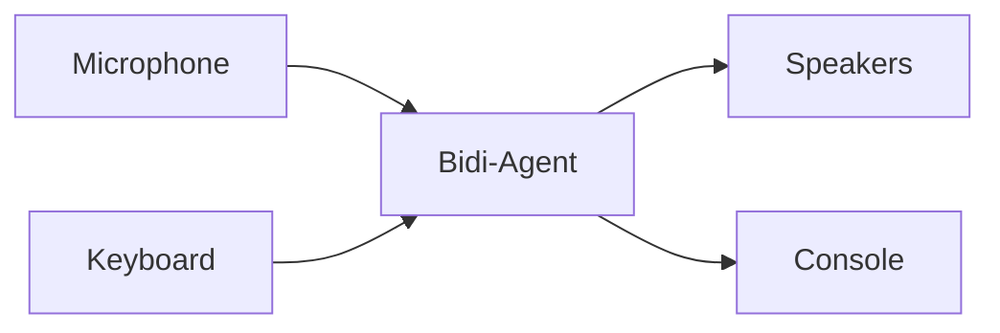

# I/O Channels [Experimental]

{{ experimental_feature_warning() }}

I/O channels handle the flow of data between your application and the bidi-agent. They manage input sources (microphone, keyboard, WebSocket) and output destinations (speakers, console, UI) while the agent focuses on conversation logic and model communication.



## I/O Interfaces

The bidi-agent uses two protocol interfaces that define how data flows in and out of conversations:

- `BidiInput`: A callable protocol for reading data from sources (microphone, keyboard, WebSocket) and converting it into `BidiInputEvent` objects that the agent can process.
- `BidiOutput`: A callable protocol for receiving `BidiOutputEvent` objects from the agent and handling them appropriately (playing audio, displaying text, sending over network).

Both protocols include optional lifecycle methods (`start` and `stop`) for resource management, allowing you to initialize connections, allocate hardware, or clean up when the conversation begins and ends.

Implementation of these protocols will look as follows:

```Python
from strands.experimental.bidi import BidiAgent
from strands.experimental.bidi.tools import stop_conversation
from strands.experimental.bidi.types.events import BidiOutputEvent
from strands.experimental.bidi.types.io import BidiInput, BidiOutput


class MyBidiInput(BidiInput):
    async def start(self, agent: BidiAgent) -> None:
        # start up input resources if required
        # extract information from agent if required

    async def __call__(self) -> BidiInputEvent:
        # await reading input data
        # format into specific BidiInputEvent

    async def stop() -> None:
        # tear down input resources if required


class MyBidiOutput(BidiOutput):
    async def start(self, agent: BidiAgent) -> None:
        # start up output resources if required
        # extract information from agent if required

    async def __call__(self, event: BidiOutputEvent) -> None:
        # extract data from event
        # await outputing data

    async def stop() -> None:
        # tear down output resources if required
```

## I/O Usage

To connect your I/O channels into the agent loop, you can pass them as arguments into the agent `run()` method.

```Python
import asyncio

from strands.experimental.bidi import BidiAgent
from strands.experimental.bidi.tools import stop_conversation


async def main():
    # stop_conversation tool allows user to verbally stop agent execution.
    agent = BidiAgent(tools=[stop_conversation])
    await agent.run(inputs=[MyBidiInput()], outputs=[MyBidiOutput()])


asyncio.run(main())
```

The `run()` method handles the startup, execution, and shutdown of both the agent and collection of I/O channels. The inputs and outpus all run concurrently to one another, allowing for a flexible mixing and matching.

## Audio I/O

Out of the box, Strands provides `BidiAudioIO` to help connect your microphone and speakers to the bidi-agent using [PyAudio](https://pypi.org/project/PyAudio/).

```python
import asyncio

from strands.experimental.bidi import BidiAgent
from strands.experimental.bidi.io import BidiAudioIO
from strands.experimental.bidi.tools import stop_conversation


async def main():
    # stop_conversation tool allows user to verbally stop agent execution.
    agent = BidiAgent(tools=[stop_conversation])
    audio_io = BidiAudioIO(input_device_index=1)

    await agent.run(
        inputs=[audio_io.input()],
        outputs=[audio_io.output()],
    )


asyncio.run(main())
```

This creates a voice-enabled agent that captures audio from your microphone, streams it to the model in real-time, and plays responses through your speakers.

### Configurations

| Parameter | Description | Example | Default |
| --------- | ----------- | ------- | ------- |
| `input_buffer_size` | Maximum number of audio chunks to buffer from microphone before dropping oldest. | `1024` | None (unbounded) |
| `input_device_index` | Specific microphone device ID to use for audio input. | `1` | None (system default) |
| `input_frames_per_buffer` | Number of audio frames to be read per input callback (affects latency and performance). | `1024` | 512 |
| `output_buffer_size` | Maximum number of audio chunks to buffer for speaker playback before dropping oldest. | `2048` | None (unbounded) |
| `output_device_index` | Specific speaker device ID to use for audio output. | `2` | None (system default) |
| `output_frames_per_buffer` | Number of audio frames to be written per output callback (affects latency and performance). | `1024` | 512 |

### Interruption Handling

`BidiAudioIO` automatically handles interruptions to create natural conversational flow where users can interrupt the agent mid-response. When an interruption occurs:

1. The agent emits a `BidiInterruptionEvent`
3. `BidiAudioIO`'s internal output buffer is cleared to stop playback
4. The agent begins responding immediately to the new user input

## Text I/O

Strands also provides `BidiTextIO` for terminal-based text input and output using [prompt-toolkit](https://pypi.org/project/prompt-toolkit/).

```python
import asyncio

from strands.experimental.bidi import BidiAgent
from strands.experimental.bidi.io import BidiTextIO
from strands.experimental.bidi.tools import stop_conversation


async def main():
    # stop_conversation tool allows user to verbally stop agent execution.
    agent = BidiAgent(tools=[stop_conversation])
    text_io = BidiTextIO(input_prompt="> You: ")

    await agent.run(
        inputs=[text_io.input()],
        outputs=[text_io.output()],
    )


asyncio.run(main())
```

This creates a text-based agent that reads user input from the terminal and prints transcripts and responses to the console.

Note, the agent provides a preview of what it is about to say before producing the final output. This preview text is prefixed with `Preview:`.

### Configurations

| Parameter | Description | Example | Default |
| --------- | ----------- | ------- | ------- |
| `input_prompt` | Prompt text displayed when waiting for user input | `"> You: "` | `""` (blank) |

## WebSocket I/O

WebSockets are a common I/O channel for bidi-agents. To learn how to setup WebSockets with `run()`, consider the following server example:

```Python
# server.py
from fastapi import FastAPI, WebSocket, WebSocketDisconnect

from strands.experimental.bidi import BidiAgent
from strands.experimental.bidi.models.openai_realtime import BidiOpenAIRealtimeModel

app = FastAPI()


@app.websocket("/text-chat")
async def text_chat(websocket: WebSocket) -> None:
    model = BidiOpenAIRealtimeModel(client_config={"api_key": "<OPENAI_API_KEY>"})
    agent = BidiAgent(model=model)

    try:
        await websocket.accept()
        await agent.run(inputs=[websocket.receive_json], outputs=[websocket.send_json])
    except* WebSocketDisconnect:
        print("client disconnected")
```

To start this server, you can run `unvicorn server:app --reload`. To interact, open a separate terminal window and run the following client script:

```Python
# client.py
import asyncio
import json

import websockets


async def main():
    websocket = await websockets.connect("ws://localhost:8000/text-chat")

    input_event = {"type": "bidi_text_input", "text": "Hello, how are you?"}
    await websocket.send(json.dumps(input_event))

    while True:
        output_event = json.loads(await websocket.recv())
        if output_event["type"] == "bidi_transcript_stream" and output_event["is_final"]:
            print(output_event["text"])
            break

    await websocket.close()


if __name__ == "__main__":
    asyncio.run(main())
```
