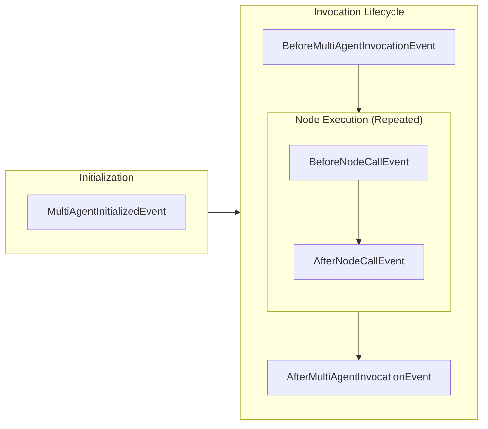

# Multi-Agent Hooks [Experimental]

{{ experimental_feature_warning() }}

Multi-agent hooks extend the [hook system](../agents/hooks.md) to multi-agent primitives, enabling monitoring, debugging, and customization of multi-agent execution workflows. These hooks allow you to observe and modify behavior across the entire multi-agent lifecycle.

## Overview

Multi-agent hooks provide event-driven extensibility for orchestrators that coordinate multiple agents. Unlike single-agent hooks that focus on individual agent execution, multi-agent hooks capture orchestration-level events such as node transitions, orchestrator initialization, and overall invocation lifecycle.

Multi-agent hooks enable use cases such as:

- Monitoring multi-agent execution flow and node transitions
- Debugging complex orchestration patterns
- Adding validation and error handling at the orchestration level
- Implementing custom logging and metrics collection

## Basic Usage

Multi-agent hook callbacks are registered against specific orchestration event types and receive strongly-typed event objects when those events occur during multi-agent execution.

### Registering Multi-Agent Hook Callbacks

You can register callbacks for specific events using `add_callback`:

```python
# Create your orchestrator (Graph or Swarm)
orchestrator = Graph(...)

# Register individual callbacks
def my_callback(event: BeforeNodeCallEvent) -> None:
    print(f"Custom callback triggered")

orchestrator.hooks.add_callback(BeforeNodeCallEvent, my_callback)
```

### Creating a Multi-Agent Hook Provider

The `HookProvider` protocol allows a single object to register callbacks for multiple events:

```python
class MultiAgentLoggingHook(HookProvider):
    def register_hooks(self, registry: HookRegistry) -> None:
        registry.add_callback(MultiAgentInitializedEvent, self.log_initialization)
        registry.add_callback(BeforeMultiAgentInvocationEvent, self.log_invocation_start)
        registry.add_callback(AfterMultiAgentInvocationEvent, self.log_invocation_end)
        registry.add_callback(BeforeNodeCallEvent, self.log_node_start)
        registry.add_callback(AfterNodeCallEvent, self.log_node_end)

    def log_initialization(self, event: MultiAgentInitializedEvent) -> None:
        print(f"Multi-agent orchestrator initialized: {type(event.source).__name__}")

    def log_invocation_start(self, event: BeforeMultiAgentInvocationEvent) -> None:
        print("Multi-agent invocation started")

    def log_invocation_end(self, event: AfterMultiAgentInvocationEvent) -> None:
        print("Multi-agent invocation completed")

    def log_node_start(self, event: BeforeNodeCallEvent) -> None:
        print(f"Starting node execution: {event.node_id}")

    def log_node_end(self, event: AfterNodeCallEvent) -> None:
        print(f"Completed node execution: {event.node_id}")

# Use with orchestrator
orchestrator = Graph(hooks=[MultiAgentLoggingHook()])
```

## Multi-Agent Hook Event Lifecycle

The following diagram shows when multi-agent hook events are emitted during orchestrator execution:



### Available Multi-Agent Events

The multi-agent hooks system provides events for different states of multi-agent orchestrator execution:

| Event                              | Description                                                                                    |
|------------------------------------|------------------------------------------------------------------------------------------------|
| `MultiAgentInitializedEvent`       | Triggered when multi-agent orchestrator is initialized                                        |
| `BeforeMultiAgentInvocationEvent`  | Triggered before orchestrator execution starts                                                |
| `AfterMultiAgentInvocationEvent`   | Triggered after orchestrator execution completes. Uses reverse callback ordering             |
| `BeforeNodeCallEvent`              | Triggered before individual node execution starts                                             |
| `AfterNodeCallEvent`               | Triggered after individual node execution completes. Uses reverse callback ordering          |

## Multi-Agent Hook Behaviors

### Event Properties

Multi-agent hook events provide access to:

- **source**: The multi-agent orchestrator instance (for example: Graph/Swarm)
- **node_id**: Identifier of the node being executed (for node-level events)
- **invocation_state**: Configuration and context data passed through the orchestrator invocation

### Callback Ordering

Similar to single-agent hooks, After events (`AfterNodeCallEvent`, `AfterMultiAgentInvocationEvent`) use reverse callback ordering to ensure proper cleanup semantics.

### Accessing Orchestrator State

Multi-agent hooks can access the orchestrator instance directly through the `source` property, enabling inspection of the orchestrator's current state, configuration, and execution context.

## Advanced Usage

### Accessing Invocation State in Hooks

Like single-agent hooks, multi-agent hooks include access to `invocation_state`, which provides configuration and context data passed through the orchestrator's lifecycle.

```python
class ContextAwareMultiAgentHook(HookProvider):
    def register_hooks(self, registry: HookRegistry) -> None:
        registry.add_callback(BeforeNodeCallEvent, self.log_with_context)

    def log_with_context(self, event: BeforeNodeCallEvent) -> None:
        # Access shared context across all agents
        user_id = event.invocation_state.get("user_id", "unknown")
        session_id = event.invocation_state.get("session_id")
        
        # Access orchestrator-specific configuration
        orchestrator_config = event.invocation_state.get("orchestrator_config", {})
        
        print(f"User {user_id} executing node {event.node_id} "
              f"in session {session_id} with config: {orchestrator_config}")

# Use with shared state
orchestrator = Graph(hooks=[ContextAwareMultiAgentHook()])
result = orchestrator(
    "Process the request",
    user_id="user123",
    session_id="sess456",
    orchestrator_config={"max_retries": 3, "timeout": 30}
)
```

### Conditional Node Execution

Implement custom logic to modify orchestration behavior:

```python
class ConditionalExecutionHook(HookProvider):
    def __init__(self, skip_conditions: dict[str, callable]):
        self.skip_conditions = skip_conditions

    def register_hooks(self, registry: HookRegistry) -> None:
        registry.add_callback(BeforeNodeCallEvent, self.check_execution_conditions)

    def check_execution_conditions(self, event: BeforeNodeCallEvent) -> None:
        node_id = event.node_id
        if node_id in self.skip_conditions:
            condition_func = self.skip_conditions[node_id]
            if condition_func(event.invocation_state):
                print(f"Skipping node {node_id} due to condition")
                # Note: Actual node skipping would require orchestrator-specific implementation
```

## Best Practices

### Performance Considerations

Keep multi-agent hook callbacks lightweight since they execute synchronously:

```python
class AsyncMultiAgentProcessor(HookProvider):
    def register_hooks(self, registry: HookRegistry) -> None:
        registry.add_callback(AfterNodeCallEvent, self.queue_node_processing)

    def queue_node_processing(self, event: AfterNodeCallEvent) -> None:
        # Queue heavy processing for background execution
        self.background_queue.put({
            'node_id': event.node_id,
            'orchestrator_type': type(event.source).__name__,
            'timestamp': time.time()
        })
```

### Orchestrator-Agnostic Design

Design hooks to work with different orchestrator types:

```python
class UniversalMultiAgentHook(HookProvider):
    def register_hooks(self, registry: HookRegistry) -> None:
        registry.add_callback(BeforeNodeCallEvent, self.handle_node_execution)

    def handle_node_execution(self, event: BeforeNodeCallEvent) -> None:
        orchestrator_type = type(event.source).__name__
        print(f"Executing node {event.node_id} in {orchestrator_type} orchestrator")
        
        # Handle orchestrator-specific logic if needed
        if orchestrator_type == "Graph":
            self.handle_graph_node(event)
        elif orchestrator_type == "Swarm":
            self.handle_swarm_node(event)

    def handle_graph_node(self, event: BeforeNodeCallEvent) -> None:
        # Graph-specific handling
        pass

    def handle_swarm_node(self, event: BeforeNodeCallEvent) -> None:
        # Swarm-specific handling
        pass
```

## Integration with Single-Agent Hooks

Multi-agent hooks complement single-agent hooks. Individual agents within the orchestrator can still have their own hooks, creating a layered monitoring and customization system:

```python
# Single-agent hook for individual agents
class AgentLevelHook(HookProvider):
    def register_hooks(self, registry: HookRegistry) -> None:
        registry.add_callback(BeforeToolCallEvent, self.log_tool_use)

    def log_tool_use(self, event: BeforeToolCallEvent) -> None:
        print(f"Agent tool call: {event.tool_use['name']}")

# Multi-agent hook for orchestrator
class OrchestratorLevelHook(HookProvider):
    def register_hooks(self, registry: HookRegistry) -> None:
        registry.add_callback(BeforeNodeCallEvent, self.log_node_execution)

    def log_node_execution(self, event: BeforeNodeCallEvent) -> None:
        print(f"Orchestrator node execution: {event.node_id}")

# Create agents with individual hooks
agent1 = Agent(tools=[tool1], hooks=[AgentLevelHook()])
agent2 = Agent(tools=[tool2], hooks=[AgentLevelHook()])

# Create orchestrator with multi-agent hooks
orchestrator = Graph(
    agents={"agent1": agent1, "agent2": agent2},
    hooks=[OrchestratorLevelHook()]
)
```

This layered approach provides comprehensive observability and control across both individual agent execution and orchestrator-level coordination.