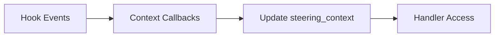
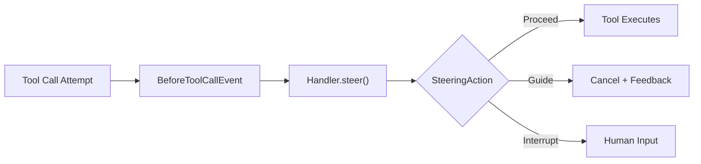
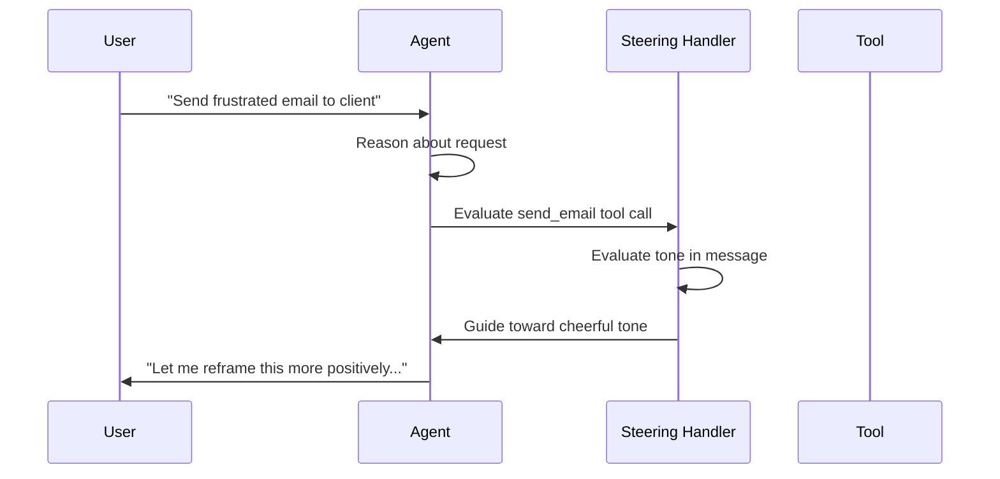

# Steering [Experimental]

{{ experimental_feature_warning() }}

Strands Steering explores new approaches to modular prompting for complex agent tasks through context-aware guidance that appears when relevant, rather than front-loading all instructions in monolithic prompts. This experimental feature enables developers to assign agents complex, multi-step tasks while maintaining effectiveness through just-in-time feedback loops.

## What Is Steering?

Developers building AI agents for complex multi-step tasks face a key prompting challenge. Traditional approaches require front-loading all instructions, business rules, and operational guidance into a single prompt. For tasks with 30+ steps, these monolithic prompts become unwieldy, leading to prompt bloat where agents ignore instructions, hallucinate behaviors, or fail to follow critical procedures.

To address this, developers often decompose these agents into graph structures with predefined nodes and edges that control execution flow. While this improves predictability and reduces prompt complexity, it severely limits the agent's adaptive reasoning capabilities that make AI valuable in the first place, and is costly to develop and maintain.

Strands Steering solves this challenge through **modular prompting with progressive disclosure**. Instead of front-loading all instructions, developers define context-aware steering handlers that provide feedback at the right moment. These handlers define the business rules that need to be followed and the lifecycle hooks where agent behavior should be validated, like before a tool call or before returning output to the user.

## Context Population

Steering handlers maintain local context that gets populated by callbacks registered for hook events:



**Context Callbacks** follow the `SteeringContextCallback` protocol and update the handler's `steering_context` dictionary based on specific events like BeforeToolCallEvent or AfterToolCallEvent.

**Context Providers** implement `SteeringContextProvider` to supply multiple callbacks for different event types. The built-in `LedgerProvider` tracks tool call history, timing, and results.

## Steering

When agents attempt tool calls, steering handlers evaluate the action and provide guidance:



**SteeringHandler** intercepts tool calls via BeforeToolCallEvent, evaluates using local `steering_context`, and returns a **SteeringAction**:

- **Proceed**: Tool executes immediately
- **Guide**: Tool cancelled, agent receives contextual feedback
- **Interrupt**: Tool execution paused for human input

## Getting Started

### Natural Language Steering

The LLMSteeringHandler enables developers to express guidance in natural language rather than formal policy languages. This approach is powerful because it can operate on any amount of context you provide and make contextual decisions based on the full steering context.

For best practices for defining the prompts, use the [Agent Standard Operating Procedures (SOP)](https://github.com/strands-agents/agent-sop) framework which provides structured templates and guidelines for creating effective agent prompts.

```python
from strands import Agent, tool
from strands.experimental.steering import LLMSteeringHandler

@tool
def send_email(recipient: str, subject: str, message: str) -> str:
    """Send an email to a recipient."""
    return f"Email sent to {recipient}"

# Create steering handler to ensure cheerful tone
handler = LLMSteeringHandler(
    system_prompt="""
    You are providing guidance to ensure emails maintain a cheerful, positive tone.
    
    Guidance:
    - Review email content for tone and sentiment
    - Suggest more cheerful phrasing if the message seems negative or neutral
    - Encourage use of positive language and friendly greetings
    
    When agents attempt to send emails, check if the message tone
    is appropriately cheerful and provide feedback if improvements are needed.
    """
)

agent = Agent(
    tools=[send_email],
    hooks=[handler]  # Steering handler integrates as a hook
)

# Agent receives guidance about email tone
response = agent("Send a frustrated email to tom@example.com, a client who keeps rescheduling important meetings at the last minute")
print(agent.messages)  # Shows "Tool call cancelled given new guidance..."
```




## Built-in Context Providers

### Ledger Provider

The `LedgerProvider` tracks comprehensive agent activity for audit trails and usage-based guidance. It automatically captures tool call history with inputs, outputs, timing, and success/failure status.

The ledger captures:

**Tool Call History**: Every tool invocation with inputs, execution time, and success/failure status. Before tool calls, it records pending status with timestamp and arguments. After tool calls, it updates with completion timestamp, final status, results, and any errors.

**Session Metadata**: Session start time and other contextual information that persists across the handler's lifecycle.

**Structured Data**: All data is stored in JSON-serializable format in the handler's `steering_context` under the "ledger" key, making it accessible to LLM-based steering decisions.

## Comparison with Other Approaches

### Steering vs. Workflow Frameworks

Workflow frameworks force you to specify discrete steps and control flow logic upfront, making agents brittle and requiring extensive developer time to define complex decision trees. When business requirements change, you must rebuild entire workflow logic. Strands Steering uses modular prompting where you define contextual guidance that appears when relevant rather than prescribing exact execution paths. This maintains the adaptive reasoning capabilities that make AI agents valuable while enabling reliable execution of complex procedures.

### Steering vs. Traditional Prompting

Traditional prompting requires front-loading all instructions into a single prompt. For complex tasks with 30+ steps, this leads to prompt bloat where agents ignore instructions, hallucinate behaviors, or fail to follow critical procedures. Strands Steering uses progressive disclosure where context-aware reminders appear at the right moment, like post-it notes that guide agents when they need specific information. This keeps context windows lean while maintaining agent effectiveness on complex tasks.
