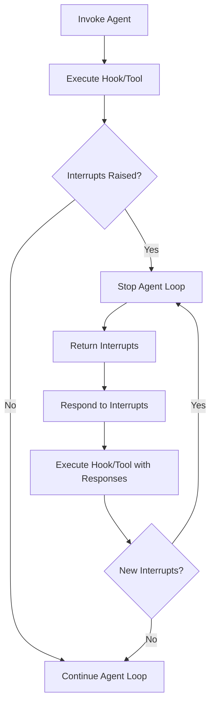

# Interrupts

The interrupt system enables human-in-the-loop workflows by allowing users to pause agent execution and request human input before continuing. When an interrupt is raised, the agent stops its loop and returns control to the user. The user in turn provides a response to the agent. The agent then continues its execution starting from the point of interruption. Users can raise interrupts from either hook callbacks or tool definitions. The general flow looks as follows:



## Hooks

Users can raise interrupts within their [hook callbacks](./agents/hooks.md) to pause agent execution at specific life-cycle events in the agentic loop. Currently, only the `BeforeToolCallEvent` is interruptible. Interrupting on a `BeforeToolCallEvent` allows users to intercept tool calls before execution to request human approval or additional inputs.

```python
import json
from typing import Any

from strands import Agent, tool
from strands.hooks import BeforeToolCallEvent, HookProvider, HookRegistry


@tool
def delete_files(paths: list[str]) -> bool:
    # Implementation here
    pass


@tool
def inspect_files(paths: list[str]) -> dict[str, Any]:
    # Implementation here
    pass


class ApprovalHook(HookProvider):
    def __init__(self, app_name: str) -> None:
        self.app_name = app_name

    def register_hooks(self, registry: HookRegistry, **kwargs: Any) -> None:
        registry.add_callback(BeforeToolCallEvent, self.approve)

    def approve(self, event: BeforeToolCallEvent) -> None:
        if event.tool_use["name"] != "delete_files":
            return

        approval = event.interrupt(f"{self.app_name}-approval", reason={"paths": event.tool_use["input"]["paths"]})
        if approval.lower() != "y":
            event.cancel_tool = "User denied permission to delete files"


agent = Agent(
    hooks=[ApprovalHook("myapp")],
    system_prompt="You delete files older than 5 days",
    tools=[delete_files, inspect_files],
    callback_handler=None,
)

paths = ["a/b/c.txt", "d/e/f.txt"]
result = agent(f"paths=<{paths}>")

while True:
    if result.stop_reason != "interrupt":
        break

    responses = []
    for interrupt in result.interrupts:
        if interrupt.name == "myapp-approval":
            user_input = input(f"Do you want to delete {interrupt.reason["paths"]} (y/N): ")
            responses.append({
                "interruptResponse": {
                    "interruptId": interrupt.id, 
                    "response": user_input
                }
            })
    
    result = agent(responses)

print(f"MESSAGE: {json.dumps(result.message)}")
```

### Components

Interrupts in Strands are comprised of the following components:

- `event.interrupt` - Raises an interrupt with a unique name and optional reason
    - The `name` must be unique across all interrupt calls configured on the `BeforeToolCallEvent`. In the example above, we demonstrate using `app_name` to namespace the interrupt call. This is particularly helpful if you plan to vend your hooks to other users.
    - You can assign additional context for raising the interrupt to the `reason` field. Note, the `reason` must be JSON-serializable. 
- `result.stop_reason` - Check if agent stopped due to "interrupt"
- `result.interrupts` - List of interrupts that were raised
    - Each `interrupt` contains the user provided name and reason, along with an instance id.
- `interruptResponse` - Content block type for configuring the interrupt responses.
    - Each `response` is uniquely identified by their interrupt's id and will be returned from the associated interrupt call when invoked the second time around. Note, the `response` must be JSON-serializable.
- `event.cancel_tool` - Cancel tool execution based on interrupt response
    - You can either set `cancel_tool` to `True` or provide a custom cancellation message.

For additional details on each of these components, please refer to the [API Reference](../../api-reference/python/types/interrupt.md#strands.types.interrupt) pages.

### Rules

Strands enforces the following rules for interrupts:

- All hooks configured on the interrupted event will execute
- All hooks configured on the interrupted event are allowed to raise an interrupt
- A single hook can raise multiple interrupts but only one at a time
    - In other words, within a single hook, you can interrupt, respond to that interrupt, and then proceed to interrupt again.
- All tools running concurrently are interruptible
- All tools running concurrently that are not interrupted will execute

## Tools

Users can also raise interrupts from their tool definitions.

```python
from typing import Any

from strands import Agent, tool
from strands.types.tools import ToolContext


class DeleteTool:
    def __init__(self, app_name: str) -> None:
        self.app_name = app_name

    @tool(context=True)
    def delete_files(self, tool_context: ToolContext, paths: list[str]) -> bool:
        approval = tool_context.interrupt(f"{self.app_name}-approval", reason={"paths": paths})
        if approval.lower() != "y":
            return False

        # Implementation here

        return True


@tool
def inspect_files(paths: list[str]) -> dict[str, Any]:
    # Implementation here
    pass


agent = Agent(
    system_prompt="You delete files older than 5 days",
    tools=[DeleteTool("myapp").delete_files, inspect_files],
    callback_handler=None,
)

...

```

> ⚠️ Interrupts are not supported in [direct tool calls](./tools/index.md#direct-method-calls) (i.e., calls such as `agent.tool.my_tool()`).

### Components

Tool interrupts work similiarly to hook interrupts with only a few notable differences:

- `tool_context`: Strands object that defines the interrupt call
    - You can learn more about `tool_context` [here](./tools/custom-tools.md#toolcontext).
- `tool_context.interrupt` - Raises an interrupt with a unique name and optional reason
    - The `name` must be unique only among interrupt calls configured in the same tool definition. It is still advisable however to namespace your interrupts so as to more easily distinguish the calls when constructing responses outside the agent.

### Rules

Strands enforces the following rules for tool interrupts:

- All tools running concurrently will execute
- All tools running concurrently are interruptible
- A single tool can raise multiple interrupts but only one at a time
    - In other words, within a single tool, you can interrupt, respond to that interrupt, and then proceed to interrupt again.

## Session Management

Users can session manage their interrupts and respond back at a later time under a new agent session. Additionally, users can session manage the responses to avoid repeated interrupts on subsequent tool calls.

```Python
##### server.py #####

import json
from typing import Any

from strands import Agent, tool
from strands.agent import AgentResult
from strands.hooks import BeforeToolCallEvent, HookProvider, HookRegistry
from strands.session import FileSessionManager
from strands.types.agent import AgentInput


@tool
def delete_files(paths: list[str]) -> bool:
    # Implementation here
    pass


@tool
def inspect_files(paths: list[str]) -> dict[str, Any]:
    # Implementation here
    pass


class ApprovalHook(HookProvider):
    def __init__(self, app_name: str) -> None:
        self.app_name = app_name

    def register_hooks(self, registry: HookRegistry, **kwargs: Any) -> None:
        registry.add_callback(BeforeToolCallEvent, self.approve)

    def approve(self, event: BeforeToolCallEvent) -> None:
        if event.tool_use["name"] != "delete_files":
            return

        if event.agent.state.get(f"{self.app_name}-approval") == "t":  # (t)rust
            return

        approval = event.interrupt(f"{self.app_name}-approval", reason={"paths": event.tool_use["input"]["paths"]})
        if approval.lower() not in ["y", "t"]:
            event.cancel_tool = "User denied permission to delete files"

        event.agent.state.set(f"{self.app_name}-approval", approval.lower())


def server(prompt: AgentInput) -> AgentResult:
    agent = Agent(
        hooks=[ApprovalHook("myapp")],
        session_manager=FileSessionManager(session_id="myapp", storage_dir="/path/to/storage"),
        system_prompt="You delete files older than 5 days",
        tools=[delete_files, inspect_files],
        callback_handler=None,
    )
    return agent(prompt)

##### client.py #####

def client(paths: list[str]) -> AgentResult:
    result = server(f"paths=<{paths}>")

    while True:
        if result.stop_reason != "interrupt":
            break

        responses = []
        for interrupt in result.interrupts:
            if interrupt.name == "myapp-approval":
                user_input = input(f"Do you want to delete {interrupt.reason["paths"]} (t/y/N): ")
                responses.append({
                    "interruptResponse": {
                        "interruptId": interrupt.id, 
                        "response": user_input
                    }
                })
        
        result = server(responses)

    return result


paths = ["a/b/c.txt", "d/e/f.txt"]
result = client(paths)
print(f"MESSAGE: {json.dumps(result.message)}")
```

### Components

Session managing interrupts involves the following key components:

- `session_manager`: Automatically persists the agent interrupt state between tear down and start up
    - For more information on session management in Strands, please refer to [here](./agents/session-management.md).
- `agent.state`: General purpose key-value store that can be used to persist interrupt responses
    - On subsequent tool calls, you can reference the responses stored in `agent.state` to decide whether another interrupt is necessary. For more information on `agent.state`, please refer to [here](./agents/state.md#agent-state).

## MCP Elicitation

Similar to interrupts, an MCP server can request additional information from the user by sending an elicitation request to the connecting client. Currently, elicitation requests are handled by conventional means of an elicitation callback. For more details, please refer to the docs [here](./tools/mcp-tools.md#elicitation).

## Multi-Agents 🚧

Under development. Please check back in later.
