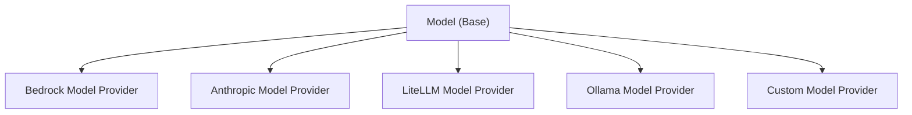

# Creating a Custom Model Provider

Strands Agents SDK provides an extensible interface for implementing custom model providers, allowing organizations to integrate their own LLM services while keeping implementation details private to their codebase.

## Model Provider Functionality

Custom model providers in Strands Agents support two primary interaction modes:

### Conversational Interaction
The standard conversational mode where agents exchange messages with the model. This is the default interaction pattern that is used when you call an agent directly:

```python
agent = Agent(model=your_custom_model)
response = agent("Hello, how can you help me today?")
```

This invokes the underlying model provided to the agent.

### Structured Output
A specialized mode that returns type-safe, validated responses using [Pydantic](https://docs.pydantic.dev/latest/concepts/models/) models instead of raw text. This enables reliable data extraction and processing:

```python
from pydantic import BaseModel

class PersonInfo(BaseModel):
    name: str
    age: int
    occupation: str

result = agent.structured_output(
    PersonInfo,
    "Extract info: John Smith is a 30-year-old software engineer"
)
# Returns a validated PersonInfo object
```

Both modes work through the same underlying model provider interface, with structured output using tool calling capabilities to ensure schema compliance.

## Model Provider Architecture

Strands Agents uses an abstract `Model` class that defines the standard interface all model providers must implement:



## Implementing a Custom Model Provider

### 1. Create Your Model Class

Create a new Python module in your private codebase that extends the Strands Agents `Model` class. In this case we also set up a `ModelConfig` to hold the configurations for invoking the model.

```python
# your_org/models/custom_model.py
import logging
import os
from typing import Any, Iterable, Optional, TypedDict
from typing_extensions import Unpack

from custom.model import CustomModelClient

from strands.models import Model
from strands.types.content import Messages
from strands.types.streaming import StreamEvent
from strands.types.tools import ToolSpec

logger = logging.getLogger(__name__)


class CustomModel(Model):
    """Your custom model provider implementation."""

    class ModelConfig(TypedDict):
        """
        Configuration your model.

        Attributes:
            model_id: ID of Custom model.
            params: Model parameters (e.g., max_tokens).
        """
        model_id: str
        params: Optional[dict[str, Any]]
        # Add any additional configuration parameters specific to your model

    def __init__(
        self,
        api_key: str,
        *,
        **model_config: Unpack[ModelConfig]
    ) -> None:
        """Initialize provider instance.

        Args:
            api_key: The API key for connecting to your Custom model.
            **model_config: Configuration options for Custom model.
        """
        self.config = CustomModel.ModelConfig(**model_config)
        logger.debug("config=<%s> | initializing", self.config)

        self.client = CustomModelClient(api_key)

    @override
    def update_config(self, **model_config: Unpack[ModelConfig]) -> None:
        """Update the Custom model configuration with the provided arguments.

        Can be invoked by tools to dynamically alter the model state for subsequent invocations by the agent.

        Args:
            **model_config: Configuration overrides.
        """
        self.config.update(model_config)


    @override
    def get_config(self) -> ModelConfig:
        """Get the Custom model configuration.

        Returns:
            The Custom model configuration.
        """
        return self.config

```

### 2. Implement the `stream` Method

The core of the model interface is the `stream` method that serves as the single entry point for all model interactions. This method handles request formatting, model invocation, and response streaming.

The `stream` method accepts three parameters directly:

- [`Messages`](../../../api-reference/types.md#strands.types.content.Messages): A list of Strands Agents messages, containing a [Role](../../../api-reference/types.md#strands.types.content.Role) and a list of [ContentBlocks](../../../api-reference/types.md#strands.types.content.ContentBlock).
- [`list[ToolSpec]`](../../../api-reference/types.md#strands.types.tools.ToolSpec): List of tool specifications that the model can decide to use.
- `SystemPrompt`: A system prompt string given to the Model to prompt it how to answer the user.

```python
    @override
    async def stream(
        self,
        messages: Messages,
        tool_specs: Optional[list[ToolSpec]] = None,
        system_prompt: Optional[str] = None
    ) -> AsyncIterable[StreamEvent]:
        """Stream responses from the Custom model.

        Args:
            messages: List of conversation messages
            tool_specs: Optional list of available tools
            system_prompt: Optional system prompt

        Returns:
            Iterator of StreamEvent objects
        """
        logger.debug("messages=<%s> tool_specs=<%s> system_prompt=<%s> | formatting request", 
                    messages, tool_specs, system_prompt)

        # Format the request for your model API
        request = {
            "messages": messages,
            "tools": tool_specs,
            "system_prompt": system_prompt,
            **self.config,  # Include model configuration
        }

        logger.debug("request=<%s> | invoking model", request)

        # Invoke your model
        try:
            response = await self.client(**request)
        except OverflowException as e:
            raise ContextWindowOverflowException() from e

        logger.debug("response received | processing stream")

        # Process and yield streaming events
        # If your model doesn't return a MessageStart event, create one
        yield {
            "messageStart": {
                "role": "assistant"
            }
        }

        # Process each chunk from your model's response
        async for chunk in response["stream"]:
            # Convert your model's event format to Strands Agents StreamEvent
            if chunk.get("type") == "text_delta":
                yield {
                    "contentBlockDelta": {
                        "delta": {
                            "text": chunk.get("text", "")
                        }
                    }
                }
            elif chunk.get("type") == "message_stop":
                yield {
                    "messageStop": {
                        "stopReason": "end_turn"
                    }
                }

        logger.debug("stream processing complete")
```

For more complex implementations, you may want to create helper methods to organize your code:

```python
    def _format_request(
        self,
        messages: Messages,
        tool_specs: Optional[list[ToolSpec]] = None,
        system_prompt: Optional[str] = None
    ) -> dict[str, Any]:
        """Optional helper method to format requests for your model API."""
        return {
            "messages": messages,
            "tools": tool_specs,
            "system_prompt": system_prompt,
            **self.config,
        }

    def _format_chunk(self, event: Any) -> Optional[StreamEvent]:
        """Optional helper method to format your model's response events."""
        if event.get("type") == "text_delta":
            return {
                "contentBlockDelta": {
                    "delta": {
                        "text": event.get("text", "")
                    }
                }
            }
        elif event.get("type") == "message_stop":
            return {
                "messageStop": {
                    "stopReason": "end_turn"
                }
            }
        return None
```

> Note, `stream` must be implemented async. If your client does not support async invocation, you may consider wrapping the relevant calls in a thread so as not to block the async event loop. For an example on how to achieve this, you can check out the [BedrockModel](https://github.com/strands-agents/sdk-python/blob/main/src/strands/models/bedrock.py) provider implementation.

### 3. Understanding StreamEvent Types

Your custom model provider needs to convert model's response events to Strands Agents [StreamEvent](../../../api-reference/types.md#strands.types.streaming.StreamEvent) format. The StreamEvent type supports these event types:

* [`messageStart`](../../../api-reference/types.md#strands.types.streaming.MessageStartEvent): Event signaling the start of a message in a streaming response. This should have the `role`: `assistant`
```python
{
    "messageStart": {
        "role": "assistant"
    }
}
```
* [`contentBlockStart`](../../../api-reference/types.md#strands.types.streaming.ContentBlockStartEvent): Event signaling the start of a content block. If this is the first event of a tool use request, then set the `toolUse` key to have the value [ContentBlockStartToolUse](../../../api-reference/types.md#strands.types.content.ContentBlockStartToolUse)
```python
{
    "contentBlockStart": {
        "start": {
            "name": "someToolName", # Only include name and toolUseId if this is the start of a ToolUseContentBlock
            "toolUseId": "uniqueToolUseId"
        }
    }
}
```
* [`contentBlockDelta`](../../../api-reference/types.md#strands.types.streaming.ContentBlockDeltaEvent): Event continuing a content block. This event can be sent several times, and each piece of content will be appended to the previously sent content.
```python
{
    "contentBlockDelta": {
        "delta": { # Only include one of the following keys in each event
            "text": "Some text", # String response from a model
            "reasoningContent": { # Dictionary representing the reasoning of a model.
                "redactedContent": b"Some encrypted bytes",
                "signature": "verification token",
                "text": "Some reasoning text"
            },
            "toolUse": { # Dictionary representing a toolUse request. This is a partial json string.
                "input": "Partial json serialized response"
            }
        }
    }
}
```
* [`contentBlockStop`](../../../api-reference/types.md#strands.types.streaming.ContentBlockStopEvent): Event marking the end of a content block. Once this event is sent, all previous events between the previous [ContentBlockStartEvent](../../../api-reference/types.md#strands.types.streaming.ContentBlockStartEvent) and this one can be combined to create a [ContentBlock](../../../api-reference/types.md#strands.types.content.ContentBlock)
```python
{
    "contentBlockStop": {}
}
```
* [`messageStop`](../../../api-reference/types.md#strands.types.streaming.MessageStopEvent): Event marking the end of a streamed response, and the [StopReason](../../../api-reference/types.md#strands.types.event_loop.StopReason). No more content block events are expected after this event is returned.
```python
{
    "messageStop": {
        "stopReason": "end_turn"
    }
}
```
* [`metadata`](../../../api-reference/types.md#strands.types.streaming.MetadataEvent): Event representing the metadata of the response. This contains the input, output, and total token count, along with the latency of the request.
```python
{
    "metrics": {
        "latencyMs": 123 # Latency of the model request in milliseconds.
    },
    "usage": {
        "inputTokens": 234, # Number of tokens sent in the request to the model.
        "outputTokens": 234, # Number of tokens that the model generated for the request.
        "totalTokens": 468 # Total number of tokens (input + output).
    }
}
```
* [`redactContent`](../../../api-reference/types.md#strands.types.streaming.RedactContentEvent): Event that is used to redact the users input message, or the generated response of a model. This is useful for redacting content if a guardrail gets triggered.
```python
{
    "redactContent": {
        "redactUserContentMessage": "User input Redacted",
        "redactAssistantContentMessage": "Assistant output Redacted"
    }
}
```

### 4. Structured Output Support

To support structured output in your custom model provider, you need to implement a `structured_output()` method that invokes your model and yields a JSON output. This method leverages the unified `stream` interface with tool specifications.

```python
T = TypeVar('T', bound=BaseModel)

@override
async def structured_output(
    self, output_model: Type[T], prompt: Messages
) -> Generator[dict[str, Union[T, Any]], None, None]:
    """Get structured output using tool calling."""

    # Convert Pydantic model to tool specification
    tool_spec = convert_pydantic_to_tool_spec(output_model)

    # Use the stream method with tool specification
    response = await self.stream(messages=prompt, tool_specs=[tool_spec])

    # Process streaming response
    async for event in process_stream(response, prompt):
        yield event  # Passed to callback handler configured in Agent instance

    stop_reason, messages, _, _ = event["stop"]

    # Validate tool use response
    if stop_reason != "tool_use":
        raise ValueError("No valid tool use found in the model response.")

    # Extract tool use output
    content = messages["content"]
    for block in content:
        if block.get("toolUse") and block["toolUse"]["name"] == tool_spec["name"]:
            yield {"output": output_model(**block["toolUse"]["input"])}
            return

    raise ValueError("No valid tool use input found in the response.")
```

**Implementation Suggestions:**

1. **Tool Integration**: Use the `stream()` method with tool specifications to invoke your model
2. **Response Validation**: Use `output_model(**data)` to validate the response
3. **Error Handling**: Provide clear error messages for parsing and validation failures

For detailed structured output usage patterns, see the [Structured Output documentation](../agents/structured-output.md).

> Note, similar to the `stream` method, `structured_output` must be implemented async. If your client does not support async invocation, you may consider wrapping the relevant calls in a thread so as not to block the async event loop. Again, for an example on how to achieve this, you can check out the [BedrockModel](https://github.com/strands-agents/sdk-python/blob/main/src/strands/models/bedrock.py) provider implementation.

### 5. Use Your Custom Model Provider

Once implemented, you can use your custom model provider in your applications for regular agent invocation:

```python
from strands import Agent
from your_org.models.custom_model import CustomModel

# Initialize your custom model provider
custom_model = CustomModel(
    api_key="your-api-key",
    model_id="your-model-id",
    params={
        "max_tokens": 2000,
        "temperature": 0.7,
    },
)

# Create a Strands agent using your model
agent = Agent(model=custom_model)

# Use the agent as usual
response = agent("Hello, how are you today?")
```

Or you can use the `structured_output` feature to generate structured output:

```python
from strands import Agent
from your_org.models.custom_model import CustomModel
from pydantic import BaseModel, Field

class PersonInfo(BaseModel):
    name: str = Field(description="Full name")
    age: int = Field(description="Age in years")
    occupation: str = Field(description="Job title")

model = CustomModel(api_key="key", model_id="model")

agent = Agent(model=model)

result = agent.structured_output(PersonInfo, "John Smith is a 30-year-old engineer.")

print(f"Name: {result.name}")
print(f"Age: {result.age}")
print(f"Occupation: {result.occupation}")
```

## Key Implementation Considerations

### 1. Stream Interface

The model interface centers around a single `stream` method that:

- Accepts `messages`, `tool_specs`, and `system_prompt` directly as parameters
- Handles request formatting, model invocation, and response processing internally
- Provides debug logging for better observability

### 2. Message Formatting

Strands Agents' internal `Message`, `ToolSpec`, and `SystemPrompt` types must be converted to your model API's expected format:

- Strands Agents uses a structured message format with role and content fields
- Your model API might expect a different structure
- Handle the message content conversion in your `stream()` method

### 3. Streaming Response Handling

Strands Agents expects streaming responses to be formatted according to its `StreamEvent` protocol:

- `messageStart`: Indicates the start of a response message
- `contentBlockStart`: Indicates the start of a content block
- `contentBlockDelta`: Contains incremental content updates
- `contentBlockStop`: Indicates the end of a content block
- `messageStop`: Indicates the end of the response message with a stop reason
- `metadata`: Indicates information about the response like input_token count, output_token count, and latency
- `redactContent`: Used to redact either the user's input, or the model's response

Convert your API's streaming format to match these expectations in your `stream()` method.

### 4. Tool Support

If your model API supports tools or function calling:

- Format tool specifications appropriately in `stream()`
- Handle tool-related events in response processing
- Ensure proper message formatting for tool calls and results

### 5. Error Handling

Implement robust error handling for API communication:

- Context window overflows
- Connection errors
- Authentication failures
- Rate limits and quotas
- Malformed responses

### 6. Configuration Management

The built-in `get_config` and `update_config` methods allow for the model's configuration to be changed at runtime:

- `get_config` exposes the current model config
- `update_config` allows for at-runtime updates to the model config
  - For example, changing model_id with a tool call
