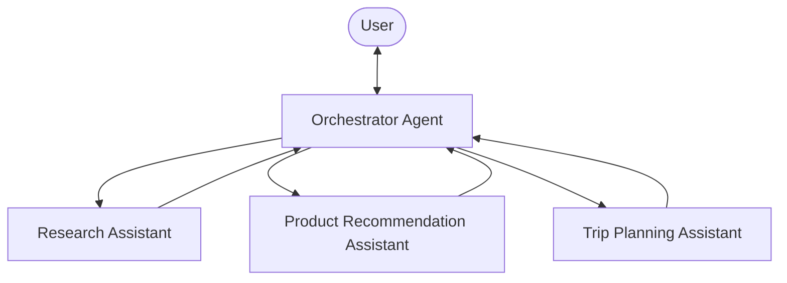

# Agents as Tools with Strands Agents SDK

## The Concept: Agents as Tools

"Agents as Tools" is an architectural pattern in AI systems where specialized AI agents are wrapped as callable functions (tools) that can be used by other agents. This creates a hierarchical structure where:

1. **A primary "orchestrator" agent** handles user interaction and determines which specialized agent to call
2. **Specialized "tool agents"** perform domain-specific tasks when called by the orchestrator

This approach mimics human team dynamics, where a manager coordinates specialists, each bringing unique expertise to solve complex problems. Rather than a single agent trying to handle everything, tasks are delegated to the most appropriate specialized agent.

## Key Benefits and Core Principles

The "Agents as Tools" pattern offers several advantages:

- **Separation of concerns**: Each agent has a focused area of responsibility, making the system easier to understand and maintain
- **Hierarchical delegation**: The orchestrator decides which specialist to invoke, creating a clear chain of command
- **Modular architecture**: Specialists can be added, removed, or modified independently without affecting the entire system
- **Improved performance**: Each agent can have tailored system prompts and tools optimized for its specific task

## Strands Agents SDK Best Practices for Agent Tools

When implementing the "Agents as Tools" pattern with Strands Agents SDK:

1. **Clear tool documentation**: Write descriptive docstrings that explain the agent's expertise
2. **Focused system prompts**: Keep each specialized agent tightly focused on its domain
3. **Proper response handling**: Use consistent patterns to extract and format responses
4. **Tool selection guidance**: Give the orchestrator clear criteria for when to use each specialized agent

## Implementing Agents as Tools with Strands Agents SDK

Strands Agents SDK provides a powerful framework for implementing the "Agents as Tools" pattern through its `@tool` decorator. This allows you to transform specialized agents into callable functions that can be used by an orchestrator agent.



### Creating Specialized Tool Agents

First, define specialized agents as tool functions using Strands Agents SDK's `@tool` decorator:

```python
from strands import Agent, tool
from strands_tools import retrieve, http_request

# Define a specialized system prompt
RESEARCH_ASSISTANT_PROMPT = """
You are a specialized research assistant. Focus only on providing
factual, well-sourced information in response to research questions.
Always cite your sources when possible.
"""

@tool
def research_assistant(query: str) -> str:
    """
    Process and respond to research-related queries.
    
    Args:
        query: A research question requiring factual information
        
    Returns:
        A detailed research answer with citations
    """
    try:
        # Strands Agents SDK makes it easy to create a specialized agent
        research_agent = Agent(
            system_prompt=RESEARCH_ASSISTANT_PROMPT,
            tools=[retrieve, http_request]  # Research-specific tools
        )
        
        # Call the agent and return its response
        response = research_agent(query)
        return str(response)
    except Exception as e:
        return f"Error in research assistant: {str(e)}"
```

You can create multiple specialized agents following the same pattern:

```python
@tool
def product_recommendation_assistant(query: str) -> str:
    """
    Handle product recommendation queries by suggesting appropriate products.
    
    Args:
        query: A product inquiry with user preferences
        
    Returns:
        Personalized product recommendations with reasoning
    """
    try:
        product_agent = Agent(
            system_prompt="""You are a specialized product recommendation assistant.
            Provide personalized product suggestions based on user preferences.""",
            tools=[retrieve, http_request, dialog],  # Tools for getting product data
        )
        # Implementation with response handling
        # ...
        return processed_response
    except Exception as e:
        return f"Error in product recommendation: {str(e)}"

@tool
def trip_planning_assistant(query: str) -> str:
    """
    Create travel itineraries and provide travel advice.
    
    Args:
        query: A travel planning request with destination and preferences
        
    Returns:
        A detailed travel itinerary or travel advice
    """
    try:
        travel_agent = Agent(
            system_prompt="""You are a specialized travel planning assistant.
            Create detailed travel itineraries based on user preferences.""",
            tools=[retrieve, http_request],  # Travel information tools
        )
        # Implementation with response handling
        # ...
        return processed_response
    except Exception as e:
        return f"Error in trip planning: {str(e)}"
```

### Creating the Orchestrator Agent

Next, create an orchestrator agent that has access to all specialized agents as tools:

```python
from strands import Agent
from .specialized_agents import research_assistant, product_recommendation_assistant, trip_planning_assistant

# Define the orchestrator system prompt with clear tool selection guidance
MAIN_SYSTEM_PROMPT = """
You are an assistant that routes queries to specialized agents:
- For research questions and factual information → Use the research_assistant tool
- For product recommendations and shopping advice → Use the product_recommendation_assistant tool
- For travel planning and itineraries → Use the trip_planning_assistant tool
- For simple questions not requiring specialized knowledge → Answer directly

Always select the most appropriate tool based on the user's query.
"""

# Strands Agents SDK allows easy integration of agent tools
orchestrator = Agent(
    system_prompt=MAIN_SYSTEM_PROMPT,
    callback_handler=None,
    tools=[research_assistant, product_recommendation_assistant, trip_planning_assistant]
)
```

### Real-World Example Scenario

Here's how this multi-agent system might handle a complex user query:

```python
# Example: E-commerce Customer Service System
customer_query = "I'm looking for hiking boots for a trip to Patagonia next month"

# The orchestrator automatically determines that this requires multiple specialized agents
response = orchestrator(customer_query)

# Behind the scenes, the orchestrator will:
# 1. First call the trip_planning_assistant to understand travel requirements for Patagonia
#    - Weather conditions in the region next month
#    - Typical terrain and hiking conditions
# 2. Then call product_recommendation_assistant with this context to suggest appropriate boots
#    - Waterproof options for potential rain
#    - Proper ankle support for uneven terrain
#    - Brands known for durability in harsh conditions
# 3. Combine these specialized responses into a cohesive answer that addresses both the
#    travel planning and product recommendation aspects of the query
```

This example demonstrates how Strands Agents SDK enables specialized experts to collaborate on complex queries requiring multiple domains of knowledge. The orchestrator intelligently routes different aspects of the query to the appropriate specialized agents, then synthesizes their responses into a comprehensive answer. By following the best practices outlined earlier and leveraging Strands Agents SDK's capabilities, you can build sophisticated multi-agent systems that handle complex tasks through specialized expertise and coordinated collaboration.

## Complete Working Example

For a fully implemented example of the "Agents as Tools" pattern, check out the ["Teacher's Assistant"](https://github.com/strands-agents/docs/blob/main/docs/examples/python/multi_agent_example/multi_agent_example.md) example in our repository. This example demonstrates a practical implementation of the concepts discussed in this document, showing how multiple specialized agents can work together to provide comprehensive assistance in an educational context.
