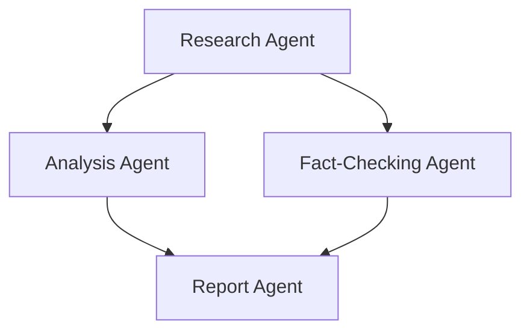
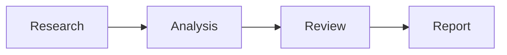
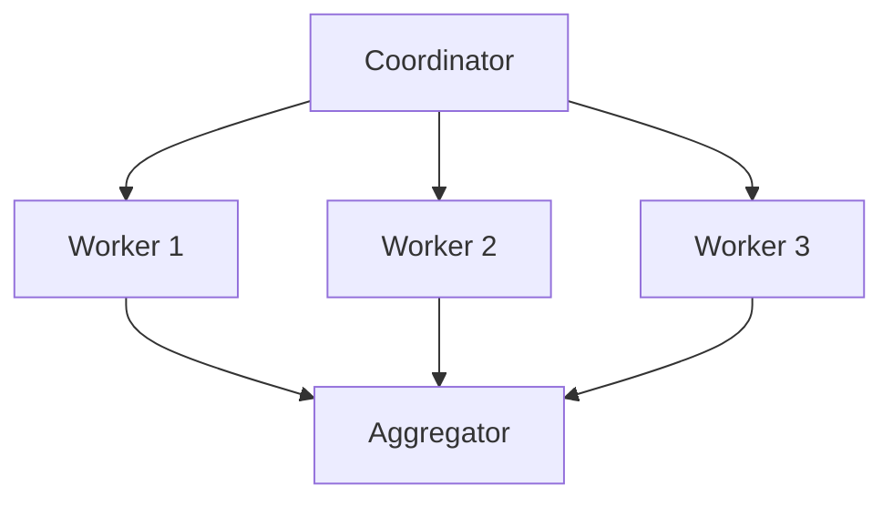
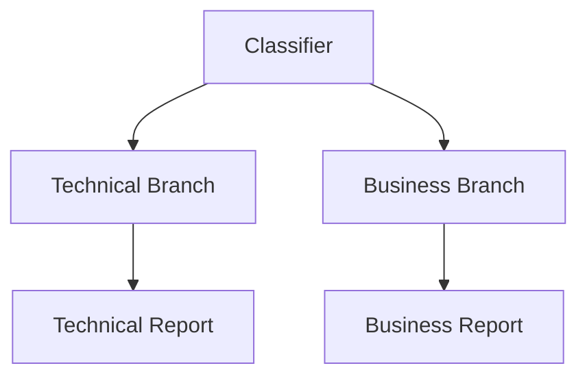
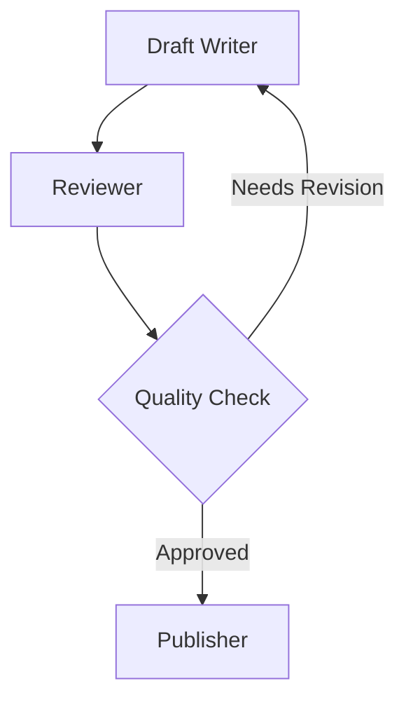

# Graph Multi-Agent Pattern

A Graph is a deterministic directed graph based agent orchestration system where agents, custom nodes, or other multi-agent systems (like [Swarm](./swarm.md) or nested Graphs) are nodes in a graph. Nodes are executed according to edge dependencies, with output from one node passed as input to connected nodes. The Graph pattern supports both acyclic (DAG) and cyclic topologies, enabling feedback loops and iterative refinement workflows.

- **Deterministic execution order** based on graph structure
- **Output propagation** along edges between nodes
- **Clear dependency management** between agents
- **Supports nested patterns** (Graph as a node in another Graph)
- **Custom node types** for deterministic business logic and hybrid workflows
- **Conditional edge traversal** for dynamic workflows
- **Cyclic graph support** with execution limits and state management
- **Multi-modal input support** for handling text, images, and other content types

## How Graphs Work

The Graph pattern operates on the principle of structured, deterministic workflows where:

1. Nodes represent agents, custom nodes, or multi-agent systems
2. Edges define dependencies and information flow between nodes
3. Execution follows the graph structure, respecting dependencies
    1. When multiple nodes have edges to a target node, the target executes as soon as **any one** dependency completes. To enable more complex traversal use cases, see the [Conditional Edges](#conditional-edges) section.
4. Output from one node becomes input for dependent nodes
5. Entry points receive the original task as input
6. Nodes can be revisited in cyclic patterns with proper exit conditions



## Graph Components

### 1. GraphNode

A [`GraphNode`](../../../api-reference/python/multiagent/graph.md#strands.multiagent.graph.GraphNode) represents a node in the graph with:

- **node_id**: Unique identifier for the node
- **executor**: The Agent or MultiAgentBase instance to execute
- **dependencies**: Set of nodes this node depends on
- **execution_status**: Current status (PENDING, EXECUTING, COMPLETED, FAILED)
- **result**: The NodeResult after execution
- **execution_time**: Time taken to execute the node in milliseconds

### 2. GraphEdge

A [`GraphEdge`](../../../api-reference/python/multiagent/graph.md#strands.multiagent.graph.GraphEdge) represents a connection between nodes with:

- **from_node**: Source node
- **to_node**: Target node
- **condition**: Optional function that determines if the edge should be traversed

### 3. GraphBuilder

The [`GraphBuilder`](../../../api-reference/python/multiagent/graph.md#strands.multiagent.graph.GraphBuilder) provides a simple interface for constructing graphs:

- **add_node()**: Add an agent or multi-agent system as a node
- **add_edge()**: Create a dependency between nodes
- **set_entry_point()**: Define starting nodes for execution
- **set_max_node_executions()**: Limit total node executions (useful for cyclic graphs)
- **set_execution_timeout()**: Set maximum execution time
- **set_node_timeout()**: Set timeout for individual nodes
- **reset_on_revisit()**: Control whether nodes reset state when revisited
- **build()**: Validate and create the Graph instance

## Creating a Graph

To create a [`Graph`](../../../api-reference/python/multiagent/graph.md#strands.multiagent.graph.Graph), you use the [`GraphBuilder`](../../../api-reference/python/multiagent/graph.md#strands.multiagent.graph.GraphBuilder) to define nodes, edges, and entry points:

```python
import logging
from strands import Agent
from strands.multiagent import GraphBuilder

# Enable debug logs and print them to stderr
logging.getLogger("strands.multiagent").setLevel(logging.DEBUG)
logging.basicConfig(
    format="%(levelname)s | %(name)s | %(message)s",
    handlers=[logging.StreamHandler()]
)

# Create specialized agents
researcher = Agent(name="researcher", system_prompt="You are a research specialist...")
analyst = Agent(name="analyst", system_prompt="You are a data analysis specialist...")
fact_checker = Agent(name="fact_checker", system_prompt="You are a fact checking specialist...")
report_writer = Agent(name="report_writer", system_prompt="You are a report writing specialist...")

# Build the graph
builder = GraphBuilder()

# Add nodes
builder.add_node(researcher, "research")
builder.add_node(analyst, "analysis")
builder.add_node(fact_checker, "fact_check")
builder.add_node(report_writer, "report")

# Add edges (dependencies)
builder.add_edge("research", "analysis")
builder.add_edge("research", "fact_check")
builder.add_edge("analysis", "report")
builder.add_edge("fact_check", "report")

# Set entry points (optional - will be auto-detected if not specified)
builder.set_entry_point("research")

# Optional: Configure execution limits for safety
builder.set_execution_timeout(600)   # 10 minute timeout

# Build the graph
graph = builder.build()

# Execute the graph on a task
result = graph("Research the impact of AI on healthcare and create a comprehensive report")

# Access the results
print(f"\nStatus: {result.status}")
print(f"Execution order: {[node.node_id for node in result.execution_order]}")
```

## Conditional Edges

You can add conditional logic to edges to create dynamic workflows:

```python
def only_if_research_successful(state):
    """Only traverse if research was successful."""
    research_node = state.results.get("research")
    if not research_node:
        return False
    
    # Check if research result contains success indicator
    result_text = str(research_node.result)
    return "successful" in result_text.lower()

# Add conditional edge
builder.add_edge("research", "analysis", condition=only_if_research_successful)
```

### Waiting for All Dependencies

By default, when multiple nodes have edges to a target node, the target executes as soon as any one dependency completes. To wait for all dependencies to complete, use conditional edges that check all required nodes:

```python
from strands.multiagent.graph import GraphState
from strands.multiagent.base import Status

def all_dependencies_complete(required_nodes: list[str]):
    """Factory function to create AND condition for multiple dependencies."""
    def check_all_complete(state: GraphState) -> bool:
        return all(
            node_id in state.results and state.results[node_id].status == Status.COMPLETED
            for node_id in required_nodes
        )
    return check_all_complete

# Z will only execute when A AND B AND C have all completed
builder.add_edge("A", "Z", condition=all_dependencies_complete(["A", "B", "C"]))
builder.add_edge("B", "Z", condition=all_dependencies_complete(["A", "B", "C"]))
builder.add_edge("C", "Z", condition=all_dependencies_complete(["A", "B", "C"]))
```

## Nested Multi-Agent Patterns

You can use a [`Graph`](../../../api-reference/python/multiagent/graph.md#strands.multiagent.graph.Graph) or [`Swarm`](../../../api-reference/python/multiagent/swarm.md#strands.multiagent.swarm.Swarm) as a node within another Graph:

```python
from strands import Agent
from strands.multiagent import GraphBuilder, Swarm

# Create a swarm of research agents
research_agents = [
    Agent(name="medical_researcher", system_prompt="You are a medical research specialist..."),
    Agent(name="technology_researcher", system_prompt="You are a technology research specialist..."),
    Agent(name="economic_researcher", system_prompt="You are an economic research specialist...")
]
research_swarm = Swarm(research_agents)

# Create a single agent node too
analyst = Agent(system_prompt="Analyze the provided research.")

# Create a graph with the swarm as a node
builder = GraphBuilder()
builder.add_node(research_swarm, "research_team")
builder.add_node(analyst, "analysis")
builder.add_edge("research_team", "analysis")

graph = builder.build()

result = graph("Research the impact of AI on healthcare and create a comprehensive report")

# Access the results
print(f"\n{result}")
```

## Custom Node Types

You can create custom node types by extending [`MultiAgentBase`](../../../api-reference/python/multiagent/base.md#strands.multiagent.base.MultiAgentBase) to implement deterministic business logic, data processing pipelines, and hybrid workflows.

```python
from strands.multiagent.base import MultiAgentBase, NodeResult, Status, MultiAgentResult
from strands.agent.agent_result import AgentResult
from strands.types.content import ContentBlock, Message

class FunctionNode(MultiAgentBase):
    """Execute deterministic Python functions as graph nodes."""
    
    def __init__(self, func, name: str = None):
        super().__init__()
        self.func = func
        self.name = name or func.__name__
        
    async def invoke_async(self, task, invocation_state, **kwargs):
        # Execute function and create AgentResult
        result = self.func(task if isinstance(task, str) else str(task))
        
        agent_result = AgentResult(
            stop_reason="end_turn",
            message=Message(role="assistant", content=[ContentBlock(text=str(result))]),
            # ... metrics and state
        )
        
        # Return wrapped in MultiAgentResult
        return MultiAgentResult(
            status=Status.COMPLETED,
            results={self.name: NodeResult(result=agent_result, ...)},
            # ... execution details
        )

# Usage example
def validate_data(data):
    if not data.strip():
        raise ValueError("Empty input")
    return f"✅ Validated: {data[:50]}..."

validator = FunctionNode(func=validate_data, name="validator")
builder.add_node(validator, "validator")
```

Custom nodes enable:

- **Deterministic processing**: Guaranteed execution for business logic
- **Performance optimization**: Skip LLM calls for deterministic operations  
- **Hybrid workflows**: Combine AI creativity with deterministic control
- **Business rules**: Implement complex business logic as graph nodes

## Multi-Modal Input Support

Graphs support multi-modal inputs like text and images using [`ContentBlocks`](../../../api-reference/python/types/content.md#strands.types.content.ContentBlock):

```python
from strands import Agent
from strands.multiagent import GraphBuilder
from strands.types.content import ContentBlock

# Create agents for image processing workflow
image_analyzer = Agent(system_prompt="You are an image analysis expert...")
summarizer = Agent(system_prompt="You are a summarization expert...")

# Build the graph
builder = GraphBuilder()
builder.add_node(image_analyzer, "image_analyzer")
builder.add_node(summarizer, "summarizer")
builder.add_edge("image_analyzer", "summarizer")
builder.set_entry_point("image_analyzer")

graph = builder.build()

# Create content blocks with text and image
content_blocks = [
    ContentBlock(text="Analyze this image and describe what you see:"),
    ContentBlock(image={"format": "png", "source": {"bytes": image_bytes}}),
]

# Execute the graph with multi-modal input
result = graph(content_blocks)
```

## Asynchronous Execution

You can also execute a Graph asynchronously by calling the [`invoke_async`](../../../api-reference/python/multiagent/graph.md#strands.multiagent.graph.Graph.invoke_async) function:

```python
import asyncio

async def run_graph():
    result = await graph.invoke_async("Research and analyze market trends...")
    return result

result = asyncio.run(run_graph())
```

## Streaming Events

Graphs support real-time streaming of events during execution using [`stream_async`](../../../api-reference/python/multiagent/graph.md#strands.multiagent.graph.Graph.stream_async). This provides visibility into node execution, parallel processing, and nested multi-agent systems.

```python
from strands import Agent
from strands.multiagent import GraphBuilder

# Create specialized agents
researcher = Agent(name="researcher", system_prompt="You are a research specialist...")
analyst = Agent(name="analyst", system_prompt="You are an analysis specialist...")

# Build the graph
builder = GraphBuilder()
builder.add_node(researcher, "research")
builder.add_node(analyst, "analysis")
builder.add_edge("research", "analysis")
builder.set_entry_point("research")
graph = builder.build()

# Stream events during execution
async for event in graph.stream_async("Research and analyze market trends"):
    # Track node execution
    if event.get("type") == "multiagent_node_start":
        print(f"🔄 Node {event['node_id']} starting")
    
    # Monitor agent events within nodes
    elif event.get("type") == "multiagent_node_stream":
        inner_event = event["event"]
        if "data" in inner_event:
            print(inner_event["data"], end="")
    
    # Track node completion
    elif event.get("type") == "multiagent_node_stop":
        node_result = event["node_result"]
        print(f"\n✅ Node {event['node_id']} completed in {node_result.execution_time}ms")
    
    # Get final result
    elif event.get("type") == "multiagent_result":
        result = event["result"]
        print(f"Graph completed: {result.status}")
```

See the [streaming overview](../streaming/index.md#multi-agent-events) for details on all multi-agent event types.

## Graph Results

When a Graph completes execution, it returns a [`GraphResult`](../../../api-reference/python/multiagent/graph.md#strands.multiagent.graph.GraphResult) object with detailed information:

```python
result = graph("Research and analyze...")

# Check execution status
print(f"Status: {result.status}")  # COMPLETED, FAILED, etc.

# See which nodes were executed and in what order
for node in result.execution_order:
    print(f"Executed: {node.node_id}")

# Get results from specific nodes
analysis_result = result.results["analysis"].result
print(f"Analysis: {analysis_result}")

# Get performance metrics
print(f"Total nodes: {result.total_nodes}")
print(f"Completed nodes: {result.completed_nodes}")
print(f"Failed nodes: {result.failed_nodes}")
print(f"Execution time: {result.execution_time}ms")
print(f"Token usage: {result.accumulated_usage}")
```

## Input Propagation

The Graph automatically builds input for each node based on its dependencies:

1. **Entry point nodes** receive the original task as input
2. **Dependent nodes** receive a combined input that includes:
   - The original task
   - Results from all dependency nodes that have completed execution

This ensures each node has access to both the original context and the outputs from its dependencies.

The formatted input for dependent nodes looks like:

```
Original Task: [The original task text]

Inputs from previous nodes:

From [node_id]:
  - [Agent name]: [Result text]
  - [Agent name]: [Another result text]

From [another_node_id]:
  - [Agent name]: [Result text]
```

## Shared State

Graphs support passing shared state to all agents through the `invocation_state` parameter. This enables sharing context and configuration across agents without exposing it to the LLM.

For detailed information about shared state, including examples and best practices, see [Shared State Across Multi-Agent Patterns](./multi-agent-patterns.md#shared-state-across-multi-agent-patterns).

## Graphs as a Tool

Agents can dynamically create and orchestrate graphs by using the `graph` tool available in the [Strands tools package](../tools/community-tools-package.md).

```python
from strands import Agent
from strands_tools import graph

agent = Agent(tools=[graph], system_prompt="Create a graph of agents to solve the user's query.")

agent("Design a TypeScript REST API and then write the code for it")
```

In this example:

1. The agent uses the `graph` tool to dynamically create nodes and edges in a graph. These nodes might be architect, coder, and reviewer agents with edges defined as architect -> coder -> reviewer
2. Next the agent executes the graph
3. The agent analyzes the graph results and then decides to either create another graph and execute it, or answer the user's query

## Common Graph Topologies

### 1. Sequential Pipeline



```python
builder = GraphBuilder()
builder.add_node(researcher, "research")
builder.add_node(analyst, "analysis")
builder.add_node(reviewer, "review")
builder.add_node(report_writer, "report")

builder.add_edge("research", "analysis")
builder.add_edge("analysis", "review")
builder.add_edge("review", "report")
```

### 2. Parallel Processing with Aggregation



```python
builder = GraphBuilder()
builder.add_node(coordinator, "coordinator")
builder.add_node(worker1, "worker1")
builder.add_node(worker2, "worker2")
builder.add_node(worker3, "worker3")
builder.add_node(aggregator, "aggregator")

builder.add_edge("coordinator", "worker1")
builder.add_edge("coordinator", "worker2")
builder.add_edge("coordinator", "worker3")
builder.add_edge("worker1", "aggregator")
builder.add_edge("worker2", "aggregator")
builder.add_edge("worker3", "aggregator")
```

### 3. Branching Logic



```python
def is_technical(state):
    classifier_result = state.results.get("classifier")
    if not classifier_result:
        return False
    result_text = str(classifier_result.result)
    return "technical" in result_text.lower()

def is_business(state):
    classifier_result = state.results.get("classifier")
    if not classifier_result:
        return False
    result_text = str(classifier_result.result)
    return "business" in result_text.lower()

builder = GraphBuilder()
builder.add_node(classifier, "classifier")
builder.add_node(tech_specialist, "tech_specialist")
builder.add_node(business_specialist, "business_specialist")
builder.add_node(tech_report, "tech_report")
builder.add_node(business_report, "business_report")

builder.add_edge("classifier", "tech_specialist", condition=is_technical)
builder.add_edge("classifier", "business_specialist", condition=is_business)
builder.add_edge("tech_specialist", "tech_report")
builder.add_edge("business_specialist", "business_report")
```

### 4. Feedback Loop



```python
def needs_revision(state):
    review_result = state.results.get("reviewer")
    if not review_result:
        return False
    result_text = str(review_result.result)
    return "revision needed" in result_text.lower()

def is_approved(state):
    review_result = state.results.get("reviewer")
    if not review_result:
        return False
    result_text = str(review_result.result)
    return "approved" in result_text.lower()

builder = GraphBuilder()
builder.add_node(draft_writer, "draft_writer")
builder.add_node(reviewer, "reviewer")
builder.add_node(publisher, "publisher")

builder.add_edge("draft_writer", "reviewer")
builder.add_edge("reviewer", "draft_writer", condition=needs_revision)
builder.add_edge("reviewer", "publisher", condition=is_approved)

# Set execution limits to prevent infinite loops
builder.set_max_node_executions(10)  # Maximum 10 node executions total
builder.set_execution_timeout(300)   # 5 minute timeout
builder.reset_on_revisit(True)       # Reset node state when revisiting

graph = builder.build()
```

## Best Practices

1. **Use meaningful node IDs**: Choose descriptive names for nodes
2. **Validate graph structure**: The builder will validate entry points and warn about potential issues
3. **Handle node failures**: Consider how failures in one node affect the overall workflow
4. **Use conditional edges**: For dynamic workflows based on intermediate results
5. **Consider parallelism**: Independent branches can execute concurrently
6. **Nest multi-agent patterns**: Use Swarms within Graphs for complex workflows
7. **Leverage multi-modal inputs**: Use ContentBlocks for rich inputs including images
8. **Create custom nodes for deterministic logic**: Use `MultiAgentBase` for business rules and data processing
9. **Use `reset_on_revisit` for iterative workflows**: Enable state reset when nodes are revisited in cycles
10. **Set execution limits for cyclic graphs**: Use `set_max_node_executions()` and `set_execution_timeout()` to prevent infinite loops
