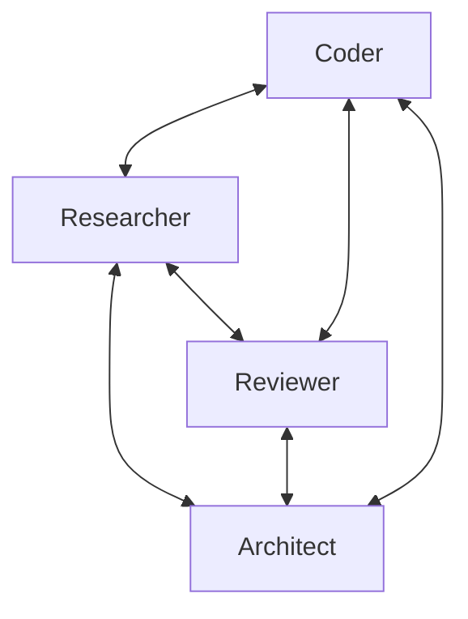

# Swarm Multi-Agent Pattern

A Swarm is a collaborative agent orchestration system where multiple agents work together as a team to solve complex tasks. Unlike traditional sequential or hierarchical multi-agent systems, a Swarm enables autonomous coordination between agents with shared context and working memory.

- **Self-organizing agent teams** with shared working memory
- **Tool-based coordination** between agents
- **Autonomous agent collaboration** without central control
- **Dynamic task distribution** based on agent capabilities
- **Collective intelligence** through shared context
- **Multi-modal input support** for handling text, images, and other content types

## How Swarms Work

Swarms operate on the principle of emergent intelligence - the idea that a group of specialized agents working together can solve problems more effectively than a single agent. Each agent in a Swarm:

1. Has access to the full task context
2. Can see the history of which agents have worked on the task
3. Can access shared knowledge contributed by other agents
4. Can decide when to hand off to another agent with different expertise



## Creating a Swarm

To create a Swarm, you need to define a collection of agents with different specializations. By default, the first agent in the list will receive the initial user request, but you can specify any agent as the entry point using the `entry_point` parameter:

```python
import logging
from strands import Agent
from strands.multiagent import Swarm

# Enable debug logs and print them to stderr
logging.getLogger("strands.multiagent").setLevel(logging.DEBUG)
logging.basicConfig(
    format="%(levelname)s | %(name)s | %(message)s",
    handlers=[logging.StreamHandler()]
)

# Create specialized agents
researcher = Agent(name="researcher", system_prompt="You are a research specialist...")
coder = Agent(name="coder", system_prompt="You are a coding specialist...")
reviewer = Agent(name="reviewer", system_prompt="You are a code review specialist...")
architect = Agent(name="architect", system_prompt="You are a system architecture specialist...")

# Create a swarm with these agents, starting with the researcher
swarm = Swarm(
    [coder, researcher, reviewer, architect],
    entry_point=researcher,  # Start with the researcher
    max_handoffs=20,
    max_iterations=20,
    execution_timeout=900.0,  # 15 minutes
    node_timeout=300.0,       # 5 minutes per agent
    repetitive_handoff_detection_window=8,  # There must be >= 3 unique agents in the last 8 handoffs
    repetitive_handoff_min_unique_agents=3
)

# Execute the swarm on a task
result = swarm("Design and implement a simple REST API for a todo app")

# Access the final result
print(f"Status: {result.status}")
print(f"Node history: {[node.node_id for node in result.node_history]}")
```

In this example:

1. The `researcher` receives the initial request and might start by handing off to the `architect`
2. The `architect` designs an API and system architecture
3. Handoff to the `coder` to implement the API and architecture
4. The `coder` writes the code
5. Handoff to the `reviewer` for code review
6. Finally, the `reviewer` provides the final result

## Swarm Configuration

The [`Swarm`](../../../api-reference/python/multiagent/swarm.md#strands.multiagent.swarm.Swarm) constructor allows you to control the behavior and safety parameters:

| Parameter | Description | Default |
|-----------|-------------|---------|
| `entry_point` | The agent instance to start with | None (uses first agent) |
| `max_handoffs` | Maximum number of agent handoffs allowed | 20 |
| `max_iterations` | Maximum total iterations across all agents | 20 |
| `execution_timeout` | Total execution timeout in seconds | 900.0 (15 min) |
| `node_timeout` | Individual agent timeout in seconds | 300.0 (5 min) |
| `repetitive_handoff_detection_window` | Number of recent nodes to check for ping-pong behavior | 0 (disabled) |
| `repetitive_handoff_min_unique_agents` | Minimum unique nodes required in recent sequence | 0 (disabled) |

## Multi-Modal Input Support

Swarms support multi-modal inputs like text and images using [`ContentBlocks`](../../../api-reference/python/types/content.md#strands.types.content.ContentBlock):

```python
from strands import Agent
from strands.multiagent import Swarm
from strands.types.content import ContentBlock

# Create agents for image processing workflow
image_analyzer = Agent(name="image_analyzer", system_prompt="You are an image analysis expert...")
report_writer = Agent(name="report_writer", system_prompt="You are a report writing expert...")

# Create the swarm
swarm = Swarm([image_analyzer, report_writer])

# Create content blocks with text and image
content_blocks = [
    ContentBlock(text="Analyze this image and create a report about what you see:"),
    ContentBlock(image={"format": "png", "source": {"bytes": image_bytes}}),
]

# Execute the swarm with multi-modal input
result = swarm(content_blocks)
```

## Swarm Coordination Tools

When you create a Swarm, each agent is automatically equipped with special tools for coordination:

### Handoff Tool

Agents can transfer control to another agent when they need specialized help:

```python
# Handoff Tool Description: Transfer control to another agent in the swarm for specialized help.
handoff_to_agent(
    agent_name="coder",
    message="I need help implementing this algorithm in Python",
    context={"algorithm_details": "..."}
)
```

## Shared Context

The Swarm maintains a shared context that all agents can access. This includes:

- The original task description
- History of which agents have worked on the task
- Knowledge contributed by previous agents
- List of available agents for collaboration

The formatted context for each agent looks like:

```
Handoff Message: The user needs help with Python debugging - I've identified the issue but need someone with more expertise to fix it.

User Request: My Python script is throwing a KeyError when processing JSON data from an API

Previous agents who worked on this: data_analyst → code_reviewer

Shared knowledge from previous agents:
• data_analyst: {"issue_location": "line 42", "error_type": "missing key validation", "suggested_fix": "add key existence check"}
• code_reviewer: {"code_quality": "good overall structure", "security_notes": "API key should be in environment variable"}

Other agents available for collaboration:
Agent name: data_analyst. Agent description: Analyzes data and provides deeper insights
Agent name: code_reviewer.
Agent name: security_specialist. Agent description: Focuses on secure coding practices and vulnerability assessment

You have access to swarm coordination tools if you need help from other agents.
```

## Shared State

Swarms support passing shared state to all agents through the `invocation_state` parameter. This enables sharing context and configuration across agents without exposing them to the LLM, keeping them separate from the shared context used for collaboration.

For detailed information about shared state, including examples and best practices, see [Shared State Across Multi-Agent Patterns](./multi-agent-patterns.md#shared-state-across-multi-agent-patterns).

## Asynchronous Execution

You can also execute a Swarm asynchronously by calling the [`invoke_async`](../../../api-reference/python/multiagent/swarm.md#strands.multiagent.swarm.Swarm.invoke_async) function:

```python
import asyncio

async def run_swarm():
    result = await swarm.invoke_async("Design and implement a complex system...")
    return result

result = asyncio.run(run_swarm())
```

## Streaming Events

Swarms support real-time streaming of events during execution using [`stream_async`](../../../api-reference/python/multiagent/swarm.md#strands.multiagent.swarm.Swarm.stream_async). This provides visibility into agent collaboration, handoffs, and autonomous coordination.

```python
from strands import Agent
from strands.multiagent import Swarm

# Create specialized agents
coordinator = Agent(name="coordinator", system_prompt="You coordinate tasks...")
specialist = Agent(name="specialist", system_prompt="You handle specialized work...")

# Create swarm
swarm = Swarm([coordinator, specialist])

# Stream events during execution
async for event in swarm.stream_async("Design and implement a REST API"):
    # Track node execution
    if event.get("type") == "multiagent_node_start":
        print(f"🔄 Agent {event['node_id']} taking control")
    
    # Monitor agent events
    elif event.get("type") == "multiagent_node_stream":
        inner_event = event["event"]
        if "data" in inner_event:
            print(inner_event["data"], end="")
    
    # Track handoffs
    elif event.get("type") == "multiagent_handoff":
        from_nodes = ", ".join(event['from_node_ids'])
        to_nodes = ", ".join(event['to_node_ids'])
        print(f"\n🔀 Handoff: {from_nodes} → {to_nodes}")
    
    # Get final result
    elif event.get("type") == "multiagent_result":
        result = event["result"]
        print(f"\nSwarm completed: {result.status}")
```

See the [streaming overview](../streaming/index.md#multi-agent-events) for details on all multi-agent event types.

## Swarm Results

When a Swarm completes execution, it returns a [`SwarmResult`](../../../api-reference/python/multiagent/swarm.md#strands.multiagent.swarm.SwarmResult) object with detailed information:

```python
result = swarm("Design a system architecture for...")

# Access the final result
print(f"Status: {result.status}")

# Check execution status
print(f"Status: {result.status}")  # COMPLETED, FAILED, etc.

# See which agents were involved
for node in result.node_history:
    print(f"Agent: {node.node_id}")

# Get results from specific nodes
analyst_result = result.results["analyst"].result
print(f"Analysis: {analyst_result}")

# Get performance metrics
print(f"Total iterations: {result.execution_count}")
print(f"Execution time: {result.execution_time}ms")
print(f"Token usage: {result.accumulated_usage}")
```

## Swarm as a Tool

Agents can dynamically create and orchestrate swarms by using the `swarm` tool available in the [Strands tools package](../tools/community-tools-package.md).

```python
from strands import Agent
from strands_tools import swarm

agent = Agent(tools=[swarm], system_prompt="Create a swarm of agents to solve the user's query.")

agent("Research, analyze, and summarize the latest advancements in quantum computing")
```

In this example:

1. The agent uses the `swarm` tool to dynamically create a team of specialized agents. These might include a researcher, an analyst, and a technical writer
2. Next the agent executes the swarm
3. The swarm agents collaborate autonomously, handing off to each other as needed
4. The agent analyzes the swarm results and provides a comprehensive response to the user

## Safety Mechanisms

Swarms include several safety mechanisms to prevent infinite loops and ensure reliable execution:

1. **Maximum handoffs**: Limits how many times control can be transferred between agents
2. **Maximum iterations**: Caps the total number of execution iterations
3. **Execution timeout**: Sets a maximum total runtime for the Swarm
4. **Node timeout**: Limits how long any single agent can run
5. **Repetitive handoff detection**: Prevents agents from endlessly passing control back and forth

## Best Practices

1. **Create specialized agents**: Define clear roles for each agent in your Swarm
2. **Use descriptive agent names**: Names should reflect the agent's specialty
3. **Set appropriate timeouts**: Adjust based on task complexity and expected runtime
4. **Enable repetitive handoff detection**: Set appropriate values for `repetitive_handoff_detection_window` and `repetitive_handoff_min_unique_agents` to prevent ping-pong behavior
5. **Include diverse expertise**: Ensure your Swarm has agents with complementary skills
6. **Provide agent descriptions**: Add descriptions to your agents to help other agents understand their capabilities
7. **Leverage multi-modal inputs**: Use ContentBlocks for rich inputs including images
