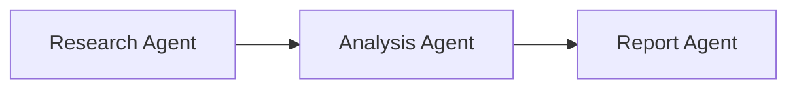

# Agent Workflows: Building Multi-Agent Systems with Strands Agents SDK

## Understanding Workflows

### What is an Agent Workflow?

An agent workflow is a structured coordination of tasks across multiple AI agents, where each agent performs specialized functions in a defined sequence or pattern. By breaking down complex problems into manageable components and distributing them to specialized agents, workflows provide explicit control over task execution order, dependencies, and information flow, ensuring reliable outcomes for processes that require specific execution patterns.

### Components of a Workflow Architecture

A workflow architecture consists of three key components:

#### 1. Task Definition and Distribution

- **Task Specification**: Clear description of what each agent needs to accomplish
- **Agent Assignment**: Matching tasks to agents with appropriate capabilities
- **Priority Levels**: Determining which tasks should execute first when possible

#### 2. Dependency Management

- **Sequential Dependencies**: Tasks that must execute in a specific order
- **Parallel Execution**: Independent tasks that can run simultaneously
- **Join Points**: Where multiple parallel paths converge before continuing

#### 3. Information Flow

- **Input/Output Mapping**: Connecting one agent's output to another's input
- **Context Preservation**: Maintaining relevant information throughout the workflow
- **State Management**: Tracking the overall workflow progress

### When to Use a Workflow

Workflows excel in scenarios requiring structured execution and clear dependencies:

- **Complex Multi-Step Processes**: Tasks with distinct sequential stages
- **Specialized Agent Expertise**: Processes requiring different capabilities at each stage
- **Dependency-Heavy Tasks**: When certain tasks must wait for others to complete
- **Resource Optimization**: Running independent tasks in parallel while managing dependencies
- **Error Recovery**: Retrying specific failed steps without restarting the entire process
- **Long-Running Processes**: Tasks requiring monitoring, pausing, or resuming capabilities
- **Audit Requirements**: When detailed tracking of each step is necessary

Consider other approaches (swarms, agent graphs) for simple tasks, highly collaborative problems, or situations requiring extensive agent-to-agent communication.

## Implementing Workflow Architectures

### Creating Workflows with Strands Agents

Strands Agents SDK allows you to create workflows using existing Agent objects, even when they use different model providers or have different configurations.

#### Sequential Workflow Architecture



In a sequential workflow, agents process tasks in a defined order, with each agent's output becoming the input for the next:

```python
from strands import Agent

# Create specialized agents
researcher = Agent(system_prompt="You are a research specialist. Find key information.", callback_handler=None)
analyst = Agent(system_prompt="You analyze research data and extract insights.", callback_handler=None)
writer = Agent(system_prompt="You create polished reports based on analysis.")

# Sequential workflow processing
def process_workflow(topic):
    # Step 1: Research
    research_results = researcher(f"Research the latest developments in {topic}")
    
    # Step 2: Analysis
    analysis = analyst(f"Analyze these research findings: {research_results}")
    
    # Step 3: Report writing
    final_report = writer(f"Create a report based on this analysis: {analysis}")
    
    return final_report
```

This sequential workflow creates a pipeline where each agent's output becomes the input for the next agent, allowing for specialized processing at each stage.
For a functional example of sequential workflow implementation, see the [agents_workflows.md](https://github.com/strands-agents/docs/blob/main/docs/examples/python/agents_workflows.md) example in the Strands Agents SDK documentation.


## Quick Start with the Workflow Tool

The Strands Agents SDK provides a built-in workflow tool that simplifies multi-agent workflow implementation by handling task creation, dependency resolution, parallel execution, and information flow automatically.

### Using the Workflow Tool

```python
from strands import Agent
from strands_tools import workflow

# Create an agent with workflow capability
agent = Agent(tools=[workflow])

# Create a multi-agent workflow
agent.tool.workflow(
    action="create",
    workflow_id="data_analysis",
    tasks=[
        {
            "task_id": "data_extraction",
            "description": "Extract key financial data from the quarterly report",
            "system_prompt": "You extract and structure financial data from reports.",
            "priority": 5
        },
        {
            "task_id": "trend_analysis",
            "description": "Analyze trends in the data compared to previous quarters",
            "dependencies": ["data_extraction"],
            "system_prompt": "You identify trends in financial time series.",
            "priority": 3
        },
        {
            "task_id": "report_generation",
            "description": "Generate a comprehensive analysis report",
            "dependencies": ["trend_analysis"],
            "system_prompt": "You create clear financial analysis reports.",
            "priority": 2
        }
    ]
)

# Execute workflow (parallel processing where possible)
agent.tool.workflow(action="start", workflow_id="data_analysis")

# Check results
status = agent.tool.workflow(action="status", workflow_id="data_analysis")
```

The full implementation of the workflow tool can be found in the [Strands Tools repository](https://github.com/strands-agents/tools/blob/main/src/strands_tools/workflow.py).

### Key Parameters and Features

**Basic Parameters:**

- **action**: Operation to perform (create, start, status, list, delete)
- **workflow_id**: Unique identifier for the workflow
- **tasks**: List of tasks with properties like task_id, description, system_prompt, dependencies, and priority

**Advanced Features:**

1. **Persistent State Management**

    - Pause and resume workflows
    - Recover from failures automatically
    - Inspect intermediate results
   ```python
   # Pause and resume example
   agent.tool.workflow(action="pause", workflow_id="data_analysis")
   agent.tool.workflow(action="resume", workflow_id="data_analysis")
   ```

2. **Dynamic Resource Management**

    - Scales thread allocation based on available resources
    - Implements rate limiting with exponential backoff
    - Prioritizes tasks based on importance

3. **Error Handling and Monitoring**

    - Automatic retries for failed tasks
    - Detailed status reporting with progress percentage
    - Task-level metrics (status, execution time, dependencies)
   ```python
   # Get detailed status
   status = agent.tool.workflow(action="status", workflow_id="data_analysis")
   print(status["content"])
   ```

### Enhancing Workflow Architectures

While the sequential workflow example above demonstrates the basic concept, you may want to extend it to handle more complex scenarios. To build more robust and flexible workflow architectures based on this foundation, you can begin with two key components:

#### 1. Task Management and Dependency Resolution

Task management provides a structured way to define, track, and execute tasks based on their dependencies:

```python
# Task management example
tasks = {
    "data_extraction": {
        "description": "Extract key financial data from the quarterly report",
        "status": "pending",
        "agent": financial_agent,
        "dependencies": []
    },
    "trend_analysis": {
        "description": "Analyze trends in the extracted data",
        "status": "pending",
        "agent": analyst_agent,
        "dependencies": ["data_extraction"]
    }
}

def get_ready_tasks(tasks, completed_tasks):
    """Find tasks that are ready to execute (dependencies satisfied)"""
    ready_tasks = []
    for task_id, task in tasks.items():
        if task["status"] == "pending":
            deps = task.get("dependencies", [])
            if all(dep in completed_tasks for dep in deps):
                ready_tasks.append(task_id)
    return ready_tasks
```

**Benefits of Task Management:**

- **Centralized Task Tracking**: Maintains a single source of truth for all tasks
- **Dynamic Execution Order**: Determines the optimal execution sequence based on dependencies
- **Status Monitoring**: Tracks which tasks are pending, running, or completed
- **Parallel Optimization**: Identifies which tasks can safely run simultaneously

#### 2. Context Passing Between Tasks

Context passing ensures that information flows smoothly between tasks, allowing each agent to build upon previous work:

```python
def build_task_context(task_id, tasks, results):
    """Build context from dependent tasks"""
    context = []
    for dep_id in tasks[task_id].get("dependencies", []):
        if dep_id in results:
            context.append(f"Results from {dep_id}: {results[dep_id]}")
    
    prompt = tasks[task_id]["description"]
    if context:
        prompt = "Previous task results:\n" + "\n\n".join(context) + "\n\nTask:\n" + prompt
    
    return prompt
```

**Benefits of Context Passing:**

- **Knowledge Continuity**: Ensures insights from earlier tasks inform later ones
- **Reduced Redundancy**: Prevents agents from repeating work already done
- **Coherent Outputs**: Creates a consistent narrative across multiple agents
- **Contextual Awareness**: Gives each agent the background needed for its specific task

## Conclusion

Multi-agent workflows provide a structured approach to complex tasks by coordinating specialized agents in defined sequences with clear dependencies. The Strands Agents SDK supports both custom workflow implementations and a built-in workflow tool with advanced features for state management, resource optimization, and monitoring. By choosing the right workflow architecture for your needs, you can create efficient, reliable, and maintainable multi-agent systems that handle complex processes with clarity and control.
