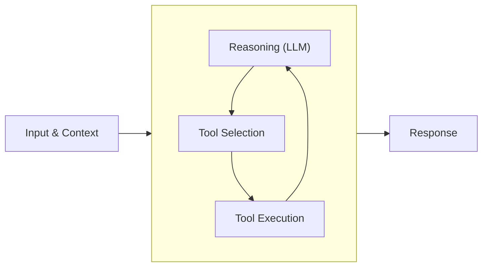

This quickstart guide shows you how to create your first basic Strands agent, add built-in and custom tools to your agent, use different model providers, emit debug logs, and run the agent locally.

After completing this guide you can integrate your agent with a web server, implement concepts like multi-agent, evaluate and improve your agent, along with deploying to production and running at scale.

## Install the SDK

First, ensure that you have Python 3.10+ installed.

We'll create a virtual environment to install the Strands Agents SDK and its dependencies in to.

```bash
python -m venv .venv
```

And activate the virtual environment:

* macOS / Linux: `source .venv/bin/activate`
* Windows (CMD): `.venv\Scripts\activate.bat`
* Windows (PowerShell): `.venv\Scripts\Activate.ps1`

Next we'll install the `strands-agents` SDK package:

```bash
pip install strands-agents
```

The Strands Agents SDK additionally offers the [`strands-agents-tools`]({{ tools_pypi }}) ([GitHub]({{ tools_repo_home }})) and [`strands-agents-builder`]({{ agent_builder_pypi }}) ([GitHub]({{ agent_builder_repo_home }})) packages for development. The [`strands-agents-tools`]({{ tools_pypi }}) package provides many example tools that give your agents powerful abilities. The [`strands-agents-builder`]({{ agent_builder_pypi }}) package provides an agent that helps you to build your own Strands agents and tools.


Let's install those development packages too:

```bash
pip install strands-agents-tools strands-agents-builder
```

## Configuring Credentials

Strands supports many different model providers. By default, agents use the Amazon Bedrock model provider with the Claude 3.7 model.

To use the examples in this guide, you'll need to configure your environment with AWS credentials that have permissions to invoke the Claude 3.7 model. You can set up your credentials in several ways:

1. **Environment variables**: Set `AWS_ACCESS_KEY_ID`, `AWS_SECRET_ACCESS_KEY`, and optionally `AWS_SESSION_TOKEN`
2. **AWS credentials file**: Configure credentials using `aws configure` CLI command
3. **IAM roles**: If running on AWS services like EC2, ECS, or Lambda, use IAM roles

Make sure your AWS credentials have the necessary permissions to access Amazon Bedrock and invoke the Claude 3.7 model. You'll need to enable model access in the Amazon Bedrock console following the [AWS documentation](https://docs.aws.amazon.com/bedrock/latest/userguide/model-access-modify.html).

## Project Setup

Now we'll create our Python project where our agent will reside. We'll use this directory structure:

```
my_agent/
├── __init__.py
├── agent.py
└── requirements.txt
```

Create the directory: `mkdir my_agent`

Now create `my_agent/requirements.txt` to include the `strands-agents` and `strands-agents-tools` packages as dependencies:

```
strands-agents>=0.1.0
strands-agents-tools>=0.1.0
```

Create the `my_agent/__init__.py` file:

```python
from . import agent
```

And finally our `agent.py` file where the goodies are:

```python
from strands import Agent, tool
from strands_tools import calculator, current_time, python_repl

# Define a custom tool as a Python function using the @tool decorator
@tool
def letter_counter(word: str, letter: str) -> int:
    """
    Count occurrences of a specific letter in a word.
    
    Args:
        word (str): The input word to search in
        letter (str): The specific letter to count
        
    Returns:
        int: The number of occurrences of the letter in the word
    """
    if not isinstance(word, str) or not isinstance(letter, str):
        return 0
    
    if len(letter) != 1:
        raise ValueError("The 'letter' parameter must be a single character")
    
    return word.lower().count(letter.lower())

# Create an agent with tools from the strands-tools example tools package
# as well as our custom letter_counter tool
agent = Agent(tools=[calculator, current_time, python_repl, letter_counter])

# Ask the agent a question that uses the available tools
message = """
I have 4 requests:

1. What is the time right now?
2. Calculate 3111696 / 74088
3. Tell me how many letter R's are in the word "strawberry" 🍓
4. Output a script that does what we just spoke about!
   Use your python tools to confirm that the script works before outputting it
"""
agent(message)
```

This basic quickstart agent can perform mathematical calculations, get the current time, run Python code, and count letters in words. The agent automatically determines when to use tools based on the input query and context.



More details can be found in the [Agent Loop](concepts/agents/agent-loop.md) documentation.

## Running Agents

Our agent is just Python, so we can run it using any mechanism for running Python!

To test our agent we can simply run:
```bash
python -u my_agent/agent.py
```

And that's it! We now have a running agent with powerful tools and abilities in just a few lines of code 🥳.

## Debug Logs

To enable debug logs in our agent, configure the `strands` logger:

```python
import logging
from strands import Agent

# Enables Strands debug log level
logging.getLogger("strands").setLevel(logging.DEBUG)

# Sets the logging format and streams logs to stderr
logging.basicConfig(
    format="%(levelname)s | %(name)s | %(message)s",
    handlers=[logging.StreamHandler()]
)

agent = Agent()

agent("Hello!")
```

## Model Providers

### Identifying a configured model 

Strands defaults to the Bedrock model provider using Claude 3.7 Sonnet. The model your agent is using can be retrieved by accessing [`model.config`](../api-reference/types.md#strands.types.models.Model.get_config):

```python
from strands import Agent

agent = Agent()

print(agent.model.config)
# {'model_id': 'us.anthropic.claude-3-7-sonnet-20250219-v1:0'}
```

You can specify a different model in two ways:

1. By passing a string model ID directly to the Agent constructor
2. By creating a model provider instance with specific configurations

### Using a String Model ID

The simplest way to specify a model is to pass the model ID string directly:

```python
from strands import Agent

# Create an agent with a specific model by passing the model ID string
agent = Agent(model="us.anthropic.claude-3-7-sonnet-20250219-v1:0")
```

### Amazon Bedrock (Default)

For more control over model configuration, you can create a model provider instance:

```python
import boto3
from strands import Agent
from strands.models import BedrockModel

# Create a BedrockModel
bedrock_model = BedrockModel(
    model_id="us.anthropic.claude-3-7-sonnet-20250219-v1:0",
    region_name='us-west-2',
    temperature=0.3,
)

agent = Agent(model=bedrock_model)
```

For the Amazon Bedrock model provider, see the [Boto3 documentation](https://boto3.amazonaws.com/v1/documentation/api/latest/guide/credentials.html) to configure credentials for your environment. For development, AWS credentials are typically defined in `AWS_` prefixed environment variables or configured with the `aws configure` CLI command.

You will also need to enable model access in Amazon Bedrock for the models that you choose to use with your agents, following the [AWS documentation](https://docs.aws.amazon.com/bedrock/latest/userguide/model-access-modify.html) to enable access.

More details in the [Amazon Bedrock Model Provider](concepts/model-providers/amazon-bedrock.md) documentation.

### Additional Model Providers

Strands Agents supports several other model providers beyond Amazon Bedrock:

- **[Anthropic](concepts/model-providers/anthropic.md)** - Direct API access to Claude models
- **[LiteLLM](concepts/model-providers/litellm.md)** - Unified interface for OpenAI, Mistral, and other providers
- **[Llama API](concepts/model-providers/llamaapi.md)** - Access to Meta's Llama models
- **[Ollama](concepts/model-providers/ollama.md)** - Run models locally for privacy or offline use
- **[OpenAI](concepts/model-providers/openai.md)** - Direct API access to OpenAI or OpenAI-compatible models
- **[Custom Providers](concepts/model-providers/custom_model_provider.md)** - Build your own provider for specialized needs

## Capturing Streamed Data & Events

Strands provides two main approaches to capture streaming events from an agent: async iterators and callback functions.

### Async Iterators

For asynchronous applications (like web servers or APIs), Strands provides an async iterator approach using `stream_async()`. This is particularly useful with async frameworks like FastAPI or Django Channels.

```python
import asyncio
from strands import Agent
from strands_tools import calculator

# Initialize our agent without a callback handler
agent = Agent(
    tools=[calculator],
    callback_handler=None  # Disable default callback handler
)

# Async function that iterates over streamed agent events
async def process_streaming_response():
    query = "What is 25 * 48 and explain the calculation"
    
    # Get an async iterator for the agent's response stream
    agent_stream = agent.stream_async(query)
    
    # Process events as they arrive
    async for event in agent_stream:
        if "data" in event:
            # Print text chunks as they're generated
            print(event["data"], end="", flush=True)
        elif "current_tool_use" in event and event["current_tool_use"].get("name"):
            # Print tool usage information
            print(f"\n[Tool use delta for: {event['current_tool_use']['name']}]")

# Run the agent with the async event processing
asyncio.run(process_streaming_response())
```

The async iterator yields the same event types as the callback handler callbacks, including text generation events, tool events, and lifecycle events. This approach is ideal for integrating Strands agents with async web frameworks.

See the [Async Iterators](concepts/streaming/async-iterators.md) documentation for full details.

### Callback Handlers (Callbacks)

We can create a custom callback function (named a [callback handler](concepts/streaming/callback-handlers.md)) that is invoked at various points throughout an agent's lifecycle.

Here is an example that captures streamed data from the agent and logs it instead of printing:

```python
import logging
from strands import Agent
from strands_tools import shell

logger = logging.getLogger("my_agent")

# Define a simple callback handler that logs instead of printing
tool_use_ids = []
def callback_handler(**kwargs):
    if "data" in kwargs:
        # Log the streamed data chunks
        logger.info(kwargs["data"], end="")
    elif "current_tool_use" in kwargs:
        tool = kwargs["current_tool_use"]
        if tool["toolUseId"] not in tool_use_ids:
            # Log the tool use
            logger.info(f"\n[Using tool: {tool.get('name')}]")
            tool_use_ids.append(tool["toolUseId"])

# Create an agent with the callback handler
agent = Agent(
    tools=[shell],
    callback_handler=callback_handler
)

# Ask the agent a question
result = agent("What operating system am I using?")

# Print only the last response
print(result.message)
```

The callback handler is called in real-time as the agent thinks, uses tools, and responds.

See the [Callback Handlers](concepts/streaming/callback-handlers.md) documentation for full details.

## Next Steps

Ready to learn more? Check out these resources:

- [Examples](../examples/README.md) - Examples for many use cases, multi-agent systems, autonomous agents, and more
- [Example Built-in Tools](concepts/tools/example-tools-package.md) - The `strands-agents-tools` package provides many powerful example tools for your agents to use during development
- [Strands Agent Builder]({{ agent_builder_repo_home }}) - Use the accompanying `strands-agents-builder` agent builder to harness the power of LLMs to generate your own tools and agents
- [Agent Loop](concepts/agents/agent-loop.md) - Learn how Strands agents work under the hood
- [Sessions & State](concepts/agents/sessions-state.md) - Understand how agents maintain context and state across a conversation or workflow
- [Multi-agent](concepts/multi-agent/agents-as-tools.md) - Orchestrate multiple agents together as one system, with each agent completing specialized tasks
- [Observability & Evaluation](observability-evaluation/observability.md) - Understand how agents make decisions and improve them with data
- [Operating Agents in Production](deploy/operating-agents-in-production.md) - Taking agents from development to production, operating them responsibly at scale
