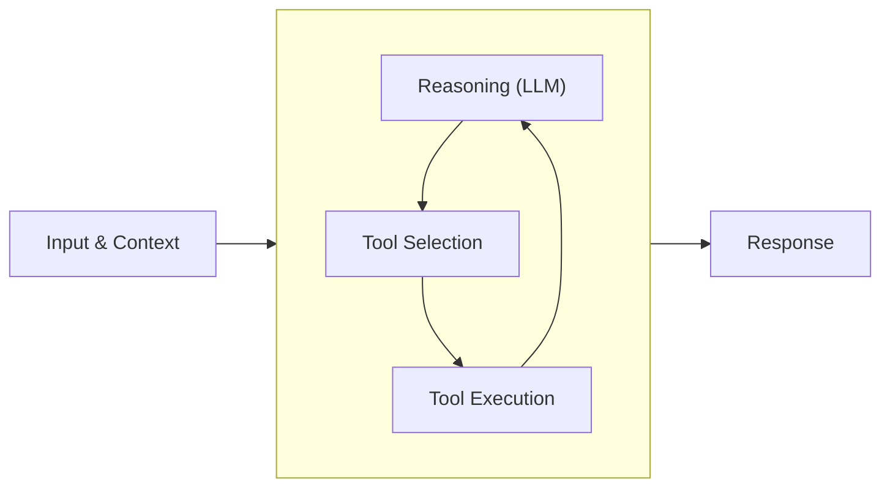

# TypeScript Quickstart

!!! warning "Experimental SDK"
    The TypeScript SDK is currently experimental. It does not yet support all features available in the Python SDK, and breaking changes are expected as development continues. Use with caution in production environments.

This quickstart guide shows you how to create your first basic Strands agent with TypeScript, add built-in and custom tools to your agent, use different model providers, emit debug logs, and run the agent locally.

After completing this guide you can integrate your agent with a web server or browser, evaluate and improve your agent, along with deploying to production and running at scale.

## Install the SDK

First, ensure that you have Node.js 20+ and npm installed. See the [npm documentation](https://docs.npmjs.com/downloading-and-installing-node-js-and-npm) for installation instructions.

Create a new directory for your project and initialize it:

```bash
mkdir my-agent
cd my-agent
npm init -y
```

Learn more about the [npm init command](https://docs.npmjs.com/cli/v8/commands/npm-init) and its options.

Next, install the `@strands-agents/sdk` package:

```bash
npm install @strands-agents/sdk
```

The Strands Agents SDK includes optional vended tools that are built-in and production-ready for your agents to use. These tools can be imported directly as follows:

```typescript
import { bash } from '@strands-agents/sdk/vended_tools/bash'
```


## Configuring Credentials

Strands supports many different model providers. By default, agents use the Amazon Bedrock model provider with the Claude 4 model.

To use the examples in this guide, you'll need to configure your environment with AWS credentials that have permissions to invoke the Claude 4 model. You can set up your credentials in several ways:

1. **Environment variables**: Set `AWS_ACCESS_KEY_ID`, `AWS_SECRET_ACCESS_KEY`, and optionally `AWS_SESSION_TOKEN`
2. **AWS credentials file**: Configure credentials using `aws configure` CLI command
3. **IAM roles**: If running on AWS services like EC2, ECS, or Lambda, use IAM roles
4. **Bedrock API keys**: Set the `AWS_BEARER_TOKEN_BEDROCK` environment variable

Make sure your AWS credentials have the necessary permissions to access Amazon Bedrock and invoke the Claude 4 model.

## Project Setup

Now we'll continuing building out the nodejs project by adding TypeScript to the project where our agent will reside. We'll use this directory structure:

```
my-agent/
├── src/
│   └── agent.ts
├── package.json
└── README.md
```

Create the directory: `mkdir src`

Install the dev dependencies:

```bash
npm install --save-dev @types/node typescript
```

And finally our `src/agent.ts` file where the goodies are:


```typescript
--8<-- "user-guide/quickstart/typescript.ts:custom-tool"

--8<-- "user-guide/quickstart/typescript.ts:create-agent"

--8<-- "user-guide/quickstart/typescript.ts:invoke-agent"
```

This basic quickstart agent can now count letters in words. The agent automatically determines when to use tools based on the input query and context.



More details can be found in the [Agent Loop](../concepts/agents/agent-loop.md) documentation.

## Running Agents

Our agent is just TypeScript, so we can run it using Node.js, Bun, Deno, or any TypeScript runtime!

To test our agent, we'll use [`tsx`](https://tsx.is/) to run the file on Node.js:

```bash
npx tsx src/agent.ts
```

And that's it! We now have a running agent with powerful tools and abilities in just a few lines of code 🥳.

## Understanding What Agents Did

After running an agent, you can understand what happened during execution by examining the agent's messages and through traces and metrics. Every agent invocation returns an `AgentResult` object that contains the data the agent used along with (comming soon) comprehensive observability data.


```typescript
--8<-- "user-guide/quickstart/typescript.ts:agentMessages"
```


## Console Output

Agents display their reasoning and responses in real-time to the console by default. You can disable this output by setting `printer: false` when creating your agent:


```typescript
--8<-- "user-guide/quickstart/typescript.ts:disable-console"
```

## Model Providers

### Identifying a configured model

Strands defaults to the Bedrock model provider using Claude 4 Sonnet. The model your agent is using can be retrieved by accessing `model.config`:


```typescript
--8<-- "user-guide/quickstart/typescript.ts:model-config"
```

You can specify a different model by creating a model provider instance with specific configurations

### Amazon Bedrock (Default)

For more control over model configuration, you can create a model provider instance:


```typescript
--8<-- "user-guide/quickstart/typescript.ts:bedrock-model"
```

For the Amazon Bedrock model provider, AWS credentials are typically defined in `AWS_` prefixed environment variables or configured with the `aws configure` CLI command.

You will also need to enable model access in Amazon Bedrock for the models that you choose to use with your agents, following the [AWS documentation](https://docs.aws.amazon.com/bedrock/latest/userguide/model-access-modify.html) to enable access.

More details in the [Amazon Bedrock Model Provider](../concepts/model-providers/amazon-bedrock.md) documentation.

### Additional Model Providers

Strands Agents supports several other model providers beyond Amazon Bedrock:

- **[OpenAI](../concepts/model-providers/openai.md)** - Access to OpenAI or OpenAI-compatible models

## Capturing Streamed Data & Events

Strands provides two main approaches to capture streaming events from an agent: async iterators and callback functions.

### Async Iterators

For asynchronous applications (like web servers or APIs), Strands provides an async iterator approach using `stream()`. This is particularly useful with async frameworks like Express, Fastify, or NestJS.


```typescript
--8<-- "user-guide/quickstart/typescript.ts:streaming-async"
```

The async iterator yields the same event types as the callback handler callbacks, including text generation events, tool events, and lifecycle events. This approach is ideal for integrating Strands agents with async web frameworks.

See the [Async Iterators](../concepts/streaming/async-iterators.md) documentation for full details.


## Next Steps

Ready to learn more? Check out these resources:

- [Examples](../../examples/README.md) - Examples for many use cases
- [TypeScript SDK Repository]({{ ts_sdk_repo_home }}) - Explore the TypeScript SDK source code and contribute
- [Agent Loop](../concepts/agents/agent-loop.md) - Learn how Strands agents work under the hood
- [State](../concepts/agents/state.md) - Understand how agents maintain context and state across a conversation
- [Operating Agents in Production](../deploy/operating-agents-in-production.md) - Taking agents from development to production, operating them responsibly at scale
