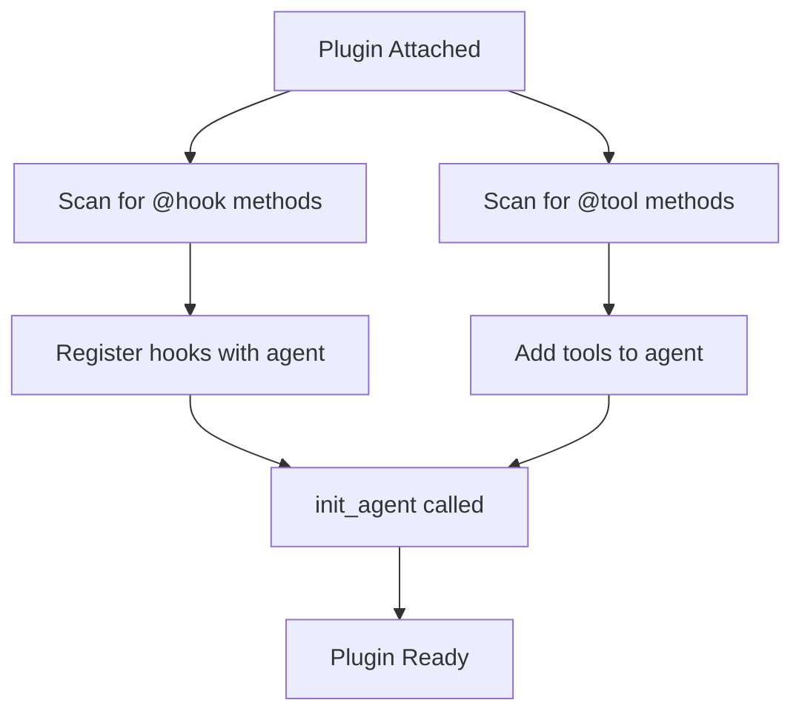

Plugins allow you to change the typical behavior of an agent. They enable you to introduce concepts like [Skills](https://agentskills.io/specification), [steering](./steering), or other behavioral modifications into the agentic loop. Plugins work by taking advantage of the low-level primitives exposed by the Agent class—`model`, `system_prompt`, `messages`, `tools`, and `hooks`—and executing logic to improve an agent's behavior.

The Strands SDK provides built-in plugins that you can use out of the box:

- **[Skills](./skills.mdx)** - On-demand, modular instructions that agents discover and activate at runtime following the [Agent Skills specification](https://agentskills.io/specification)
- **[Steering](./steering)** - Modular prompting for complex agent tasks through context-aware guidance

You can also build and distribute your own plugins to extend agent functionality. See [Get Featured](/docs/community/get-featured) to share your plugins with the community.

## Using Plugins

Plugins are passed to agents during initialization via the `plugins` parameter:

<Tabs>
<Tab label="Python">

```python
from strands import Agent
from strands.vended_plugins.steering import LLMSteeringHandler

# Create an agent with plugins
agent = Agent(
    tools=[my_tool],
    plugins=[LLMSteeringHandler(system_prompt="Guide the agent...")]
)
```
</Tab>
<Tab label="TypeScript">

```ts
// Plugins are not yet available in TypeScript SDK
```
</Tab>
</Tabs>

## Building Plugins

This section walks through how to build a custom plugin step by step.

### Basic Plugin Structure

A plugin is a class that extends the `Plugin` base class and defines a `name` property. For example, a simple logging plugin would look like this:

<Tabs>
<Tab label="Python">

```python
from strands import Agent, tool
from strands.plugins import Plugin, hook
from strands.hooks import BeforeToolCallEvent, AfterToolCallEvent

class LoggingPlugin(Plugin):
    """A plugin that logs all tool calls and provides a utility tool."""

    name = "logging-plugin"

    @hook
    def log_before_tool(self, event: BeforeToolCallEvent) -> None:
        """Called before each tool execution."""
        print(f"[LOG] Calling tool: {event.tool_use['name']}")
        print(f"[LOG] Input: {event.tool_use['input']}")

    @hook
    def log_after_tool(self, event: AfterToolCallEvent) -> None:
        """Called after each tool execution."""
        print(f"[LOG] Tool completed: {event.tool_use['name']}")

    @tool
    def debug_print(self, message: str) -> str:
        """Print a debug message.

        Args:
            message: The message to print
        """
        print(f"[DEBUG] {message}")
        return f"Printed: {message}"

# Using the plugin
agent = Agent(plugins=[LoggingPlugin()])
agent("Calculate 2 + 2 and print the result")
```
</Tab>
<Tab label="TypeScript">

```ts
// Plugins are not yet available in TypeScript SDK
```
</Tab>
</Tabs>

### How It Works Under the Hood

When you attach a plugin to an agent, the following happens:

1. **Discovery**: The `Plugin` base class scans for methods decorated with `@hook` and `@tool`
2. **Hook Registration**: Each `@hook` method is registered with the agent's hook registry based on its event type hint
3. **Tool Registration**: Each `@tool` method is added to the agent's tools list
4. **Initialization**: The `init_agent(agent)` method is called for any custom setup



### The `@hook` Decorator

The `@hook` decorator marks methods as hook callbacks. The event type is automatically inferred from the type hint:

<Tabs>
<Tab label="Python">

```python
from strands.plugins import Plugin, hook
from strands.hooks import BeforeModelCallEvent, AfterModelCallEvent

class ModelMonitorPlugin(Plugin):
    name = "model-monitor"

    @hook
    def before_model(self, event: BeforeModelCallEvent) -> None:
        """Event type inferred from type hint."""
        print("Model call starting...")

    @hook
    def on_model_event(self, event: BeforeModelCallEvent | AfterModelCallEvent) -> None:
        """Handle multiple event types with a union."""
        print(f"Model event: {type(event).__name__}")
```
</Tab>
<Tab label="TypeScript">

```ts
// Plugins are not yet available in TypeScript SDK
```
</Tab>
</Tabs>

### Manual Hook and Tool Registration

For more control, you can manually register hooks and tools in the `init_agent` method:

<Tabs>
<Tab label="Python">

```python
from strands.plugins import Plugin
from strands.hooks import BeforeToolCallEvent

class ManualPlugin(Plugin):
    name = "manual-plugin"

    def __init__(self, verbose: bool = False):
        super().__init__()
        self.verbose = verbose

    def init_agent(self, agent: "Agent") -> None:
        # Conditionally register additional hooks
        if self.verbose:
            agent.add_hook(self.verbose_log, BeforeToolCallEvent)

        # Access agent properties
        print(f"Attached to agent with {len(agent.tool_names)} tools")

    def verbose_log(self, event: BeforeToolCallEvent) -> None:
        print(f"[VERBOSE] {event.tool_use}")
```
</Tab>
<Tab label="TypeScript">

```ts
// Plugins are not yet available in TypeScript SDK
```
</Tab>
</Tabs>

### Managing Plugin State

Plugins can maintain state that persists across agent invocations. For state that needs to be serialized or shared, use the [Agent State](../agents/state.mdx) mechanism:

<Tabs>
<Tab label="Python">

```python
from strands import Agent
from strands.plugins import Plugin, hook
from strands.hooks import BeforeToolCallEvent, AfterToolCallEvent

class MetricsPlugin(Plugin):
    """Track tool execution metrics using agent state."""

    name = "metrics-plugin"

    def init_agent(self, agent: "Agent") -> None:
        # Initialize state values if not present
        if "metrics_call_count" not in agent.state:
            agent.state.set("metrics_call_count", 0)

    @hook
    def count_calls(self, event: BeforeToolCallEvent) -> None:
        current = event.agent.state.get("metrics_call_count", 0)
        event.agent.state.set("metrics_call_count", current + 1)

# Usage
agent = Agent(plugins=[MetricsPlugin()])
agent("Do some work")
print(f"Tool calls: {agent.state.get('metrics_call_count')}")
```
</Tab>
<Tab label="TypeScript">

```ts
// Plugins are not yet available in TypeScript SDK
```
</Tab>
</Tabs>

See [Agent State](../agents/state.mdx) for more information on state management.

### Async Plugin Initialization

Plugins can perform asynchronous initialization:

<Tabs>
<Tab label="Python">

```python
import asyncio
from strands.plugins import Plugin, hook
from strands.hooks import BeforeToolCallEvent

class AsyncConfigPlugin(Plugin):
    name = "async-config"

    async def init_agent(self, agent: "Agent") -> None:
        # Async initialization
        self.config = await self.load_config()

    async def load_config(self) -> dict:
        await asyncio.sleep(0.1)  # Simulate async operation
        return {"setting": "value"}

    @hook
    def use_config(self, event: BeforeToolCallEvent) -> None:
        print(f"Config: {self.config}")
```
</Tab>
<Tab label="TypeScript">

```ts
// Plugins are not yet available in TypeScript SDK
```
</Tab>
</Tabs>

## Next Steps

- [Hooks](../agents/hooks.mdx) - Learn about the underlying hook system
- [Steering](./steering) - Explore the built-in steering plugin
- [Get Featured](/docs/community/get-featured) - Share your plugins with the community
